# Product Requirement Document Manajemen Perusahaan & Unit Usaha

**Group:** D
**Dibuat oleh:** SS Shania Saraswati
**Diperbarui Oleh:** Dimas Sul'ulum
**Terakhir Diperbarui:** Thu, 16 Apr 2026, 14:13

---

## Table of Contents

- [Problem Statement Epik](#problem-statement-epik)
- [Goal Epik](#goal-epik)
- [In Scope Epik](#in-scope-epik)
- [Out of Scope Epik](#out-of-scope-epik)
- [Indikator Keberhasilan Epic](#indikator-keberhasilan-epic)
- [Role Access Matrix](#role-access-matrix)
- [Informasi Tambahan](#informasi-tambahan)
- [Planned Features](#planned-features)
- [Peta Flow Awal](#peta-flow-awal)
- [Requirement Fitur](#requirement-fitur)
  - [Fitur: Onboarding](#fitur-onboarding)
  - [Fitur: Tambah Ruang Kerja](#fitur-tambah-ruang-kerja)
  - [Fitur: Daftar Ruang Kerja](#fitur-daftar-ruang-kerja)
  - [Fitur: Edit Ruang Kerja](#fitur-edit-ruang-kerja)
  - [Fitur: hapus ruang kerja](#fitur-hapus-ruang-kerja)
  - [Fitur: Tambah Perusahaan](#fitur-tambah-perusahaan)
  - [Fitur: Lihat Daftar Semua Perusahaan](#fitur-lihat-daftar-semua-perusahaan)
  - [Fitur: Lihat Detail Perusahaan](#fitur-lihat-detail-perusahaan)
  - [Fitur: Edit Data Perusahaan](#fitur-edit-data-perusahaan)
  - [Fitur: hapus perusahaan](#fitur-hapus-perusahaan)
  - [Fitur: Tambah Unit Usaha](#fitur-tambah-unit-usaha)
  - [Fitur: Lihat Daftar Unit Usaha](#fitur-lihat-daftar-unit-usaha)
  - [Fitur: Lihat Detail Unit Usaha](#fitur-lihat-detail-unit-usaha)
  - [Fitur: Edit Unit Usaha](#fitur-edit-unit-usaha)
  - [Fitur: hapus unit usaha](#fitur-hapus-unit-usaha)
  - [Fitur: Aktif & Nonaktif Unit usaha](#fitur-aktif--nonaktif-unit-usaha)

---

## Problem Statement Epik

### Konteks

Belum tersedia

### Pain Point

Belum tersedia

### Dampak

Belum tersedia

### Validasi

Belum tersedia

## Goal Epik


## In Scope Epik


## Out of Scope Epik


## Indikator Keberhasilan Epic

| Kategori | Nama Indikator | Deskripsi | Cara Pengukuran | Waktu Pengukuran | Target | Penanggung Jawab |
|----------|----------------|-----------|-----------------|------------------|--------|------------------|
| Keandalan | Ketersediaan Data Perusahaan & Unit Usaha | Memastikan data Perusahaan dan Unit Usaha dapat ditampilkan dengan baik tanpa gangguan sistem. | Dilihat dari persentase permintaan data yang berhasil ditampilkan selama pengujian. | Bulanan saat fase Beta | ≥ 99% berhasil ditampilkan | QA (uji tampilan & fungsi) |
| Keamanan | Akses Perusahaan & Unit Usaha Sesuai Hak | Memastikan pengguna tidak dapat mengakses Perusahaan atau Unit Usaha yang tidak sesuai dengan perannya. | QA melakukan pengujian akses untuk memastikan pembatasan berjalan dengan benar. | Setiap 2 minggu saat fase Beta | 0 kasus akses tidak sesuai | QA (uji akses) DEV (dukungan teknis bila ada temuan) |
| Fungsionalitas | Keberhasilan Pembuatan Perusahaan & Unit Usaha | Mengukur persentase pembuatan Perusahaan atau Unit Usaha yang berhasil tanpa kendala. | Dilihat dari jumlah percobaan pembuatan dibandingkan dengan yang berhasil tersimpan dengan baik di sistem. | Bulanan saat fase Beta | ≥ 95% berhasil | DEV (menyediakan data hasil penyimpanan) QA (melakukan pengujian) |
| Kemudahan | Durasi Onboarding Perusahaan Pertama | Mengukur rata-rata waktu yang dibutuhkan pengguna dari mulai proses hingga perusahaan pertama berhasil dibuat. | Sistem mencatat waktu mulai dan selesai proses pembuatan perusahaan pertama, lalu dihitung rata-ratanya. | Setiap 2 minggu saat fase Beta | ≤ 1 menit | DEV (menyediakan data waktu) UIUX (menganalisis alur dan kemudahan) |
| Fungsionalitas | Keberhasilan Onboarding Perusahaan Pertama | Mengukur persentase pengguna yang berhasil menyelesaikan proses pembuatan perusahaan pertama melalui alur yang tersedia. | Sistem mencatat jumlah pengguna yang memulai dan berhasil menyelesaikan pembuatan perusahaan pertama, lalu dihitung persentasenya. | Setiap 2 minggu saat fase Beta | ≥ 95% berhasil | DEV (menyediakan data) QA (menganalisis hasil) |
| Keamanan | Akses Ruang Kerja Sesuai Hak | Memastikan pengguna hanya dapat melihat atau mengakses Ruang Kerja yang memang diberikan kepadanya. | Dilakukan pengujian akses oleh QA untuk memastikan tidak ada pengguna yang bisa membuka Ruang Kerja yang bukan miliknya. | Setiap 2 minggu saat fase Beta | 0 kasus akses tidak sesuai | QA (uji akses) DEV (menyediakan catatan akses bila diperlukan) |
| Kemudahan | Durasi Pembuatan Ruang Kerja | Mengukur rata-rata waktu yang dibutuhkan pengguna untuk menyelesaikan proses pembuatan Ruang Kerja. | Sistem mencatat waktu mulai dan waktu selesai pembuatan Ruang Kerja, lalu dihitung rata-ratanya. | Setiap 2 minggu saat fase Beta | ≤ 1 menit | DEV (menyediakan data waktu) UIUX (menganalisis kemudahan alur) |
| Fungsionalitas | Keberhasilan Pembuatan Ruang Kerja | Mengukur persentase pengguna yang berhasil membuat Ruang Kerja tanpa kendala. | Sistem mencatat jumlah pengguna yang memulai dan berhasil menyelesaikan pembuatan Ruang Kerja, lalu dihitung persentase keberhasilannya. | Setiap 2 minggu saat fase Beta | ≥ 95% berhasil | DEV (menyediakan data) QA (mengecek dan menganalisis hasil) |

## Role Access Matrix

| Fitur | Pemilik Usaha | Administrator Perusahaan | Admin Keuangan | Admin Pengadaan | Kasir |
|-------|:-------------:|:------------------------:|:--------------:|:---------------:|:-----:|
| hapus ruang kerja | ✓ | ✓ | ✓ | ✓ | ✓ |
| hapus perusahaan | ✓ | ✓ | - | - | - |
| hapus unit usaha | ✓ | ✓ | - | - | - |
| Aktif & Nonaktif Unit usaha | ✓ | ✓ | - | - | - |
| Edit Unit Usaha | ✓ | ✓ | - | - | - |
| Lihat Detail Unit Usaha | ✓ | ✓ | ✓ | ✓ | ✓ |
| Lihat Daftar Unit Usaha | ✓ | ✓ | ✓ | ✓ | ✓ |
| Tambah Unit Usaha | ✓ | ✓ | - | - | - |
| Edit Data Perusahaan | ✓ | ✓ | - | - | - |
| Lihat Detail Perusahaan | ✓ | ✓ | ✓ | ✓ | ✓ |
| Lihat Daftar Semua Perusahaan | ✓ | ✓ | ✓ | ✓ | ✓ |
| Tambah Perusahaan | ✓ | ✓ | - | - | - |
| Edit Ruang Kerja | ✓ | ✓ | ✓ | ✓ | ✓ |
| Onboarding | ✓ | ✓ | - | - | - |
| Tambah Ruang Kerja | ✓ | ✓ | ✓ | ✓ | ✓ |
| Lihat Detail Ruang Kerja | ✓ | ✓ | ✓ | ✓ | ✓ |
| Lihat Daftar Unit Usaha | ✓ | ✓ | ✓ | ✓ | ✓ |

## Informasi Tambahan


## Planned Features

| Fitur | Deskripsi | Timeline |
|-------|-----------|----------|
| Onboarding untuk Pengguna Undangan ( Invitation ) | Implementasi Onboarding proses untuk Pengguna yang mendapatkan Invitation ke Sistem GroApp | belum ditentukan |
| Integrasi IAM ↔ modul ERP untuk operasi lanjutan | ERP dapat membaca perusahaan/unit dari IAM dan menambah “setup lanjutan perusahaan” sesuai kebutuhan aplikasi. | Akan dikerjakan saat mengembangkan aplikasi-aplikasi ERP lainnya.  |
| Multi-country / multi-currency / timezone | Mendukung konfigurasi perusahaan internasional (negara, mata uang utama, zona waktu). | Perubahan muncul di fase lanjutan ketika ERP memerlukan informasi tambahan untuk operasi lintas negara. Misal : Fitur Multicurrency pada Aplikasi Akuntansi |
| Penambahan Perusahaan & Unit Usaha secara Massal | Membuat banyak perusahaan & unit usaha sekaligus   | belum ditentukan |
| Multi-level unit | Menambahkan hierarki unit usaha (unit → sub-unit → sub-sub-unit) untuk perusahaan menengah/besar. | belum ditentukan |
| Multi-level perusahaan (holding/sub-company) | Mendukung struktur perusahaan bertingkat (misal: induk → anak perusahaan). | belum ditentukan |
| Status aktif/nonaktif perusahaan  | Mengubah status  Unit Usaha menjadi Aktif atau Nonaktif. Perusahaan dengan status Nonaktif tidak dapat digunakan untuk transaksi baru, namun tetap dapat diakses untuk melihat histori dan laporan yang sudah ada. | belum ditentukan |
| Membagikan Ruang Kerja kepada pengguna lain  | memberikan akses kepada karyawan dengan role tertentu | Masuk kedalam epik Management User & Role |
| Transfer Ownership | Memungkinkan perpindahan kepemilikan Ruang Kerja, Perusahaan, atau Unit Usaha kepada pengguna lain. Fitur ini dirancang untuk mengakomodasi kebutuhan bisnis seperti perubahan pemilik atau restrukturisasi organisasi. | belum ditentukan |
| Persentase Kepemilikan Saham | Fitur pencatatan porsi saham di tiap perusahaan sebagai data dasar untuk kebutuhan laporan manajemen ke depannya. | belum ditentukan |
| Dashboard Laporan per Perusahaan & Seluruh perusahaan | Halaman ringkasan performa untuk memantau kondisi kesehatan masing-masing perusahaan atau keseluruhan perusahaan yang dimiliki owner secara cepat. | belum ditentukan |
| Pencatatan & Referensi Kurs | Wadah untuk menyimpan data nilai tukar mata uang guna memudahkan pemantauan jika ada perusahaan yang menggunakan mata uang berbeda. | belum ditentukan |
| Base Currency per Perusahaan | Pengaturan mata uang utama untuk tiap perusahaan  | belum ditentukan |
| Deterministic Guided Setup Wizard (Alternative) | Wizard deterministik berbasis template industri & decision-tree (tanpa AI) untuk membangun Company+Units. | belum ditentukan |
| AI Organization Setup Copilot | Input natural language untuk “buat struktur bisnis” → AI buat draft Company+Units → user review → create (human-in-the-loop). | belum ditentukan |
| Entity Template & Cloning Engine | Menyediakan template dan cloning konfigurasi Unit (atau default dari Company) saat tambah Unit Usaha. | belum ditentukan |
| Change Preview & Audit Ledger | Menyediakan “preview perubahan” sebelum simpan + audit trail standar dengan optional “alasan perubahan”. | belum ditentukan |

## Peta Flow Awal

*Diagram workflow utama untuk pengelolaan Ruang Kerja, Perusahaan, dan Unit Usaha*

### Flow 1: Pengelolaan Entitas Bisnis

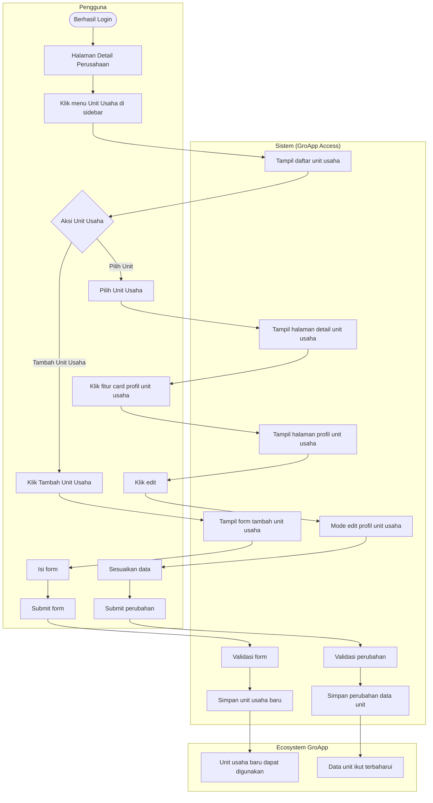

### Flow 2: Pengelolaan Entitas Bisnis

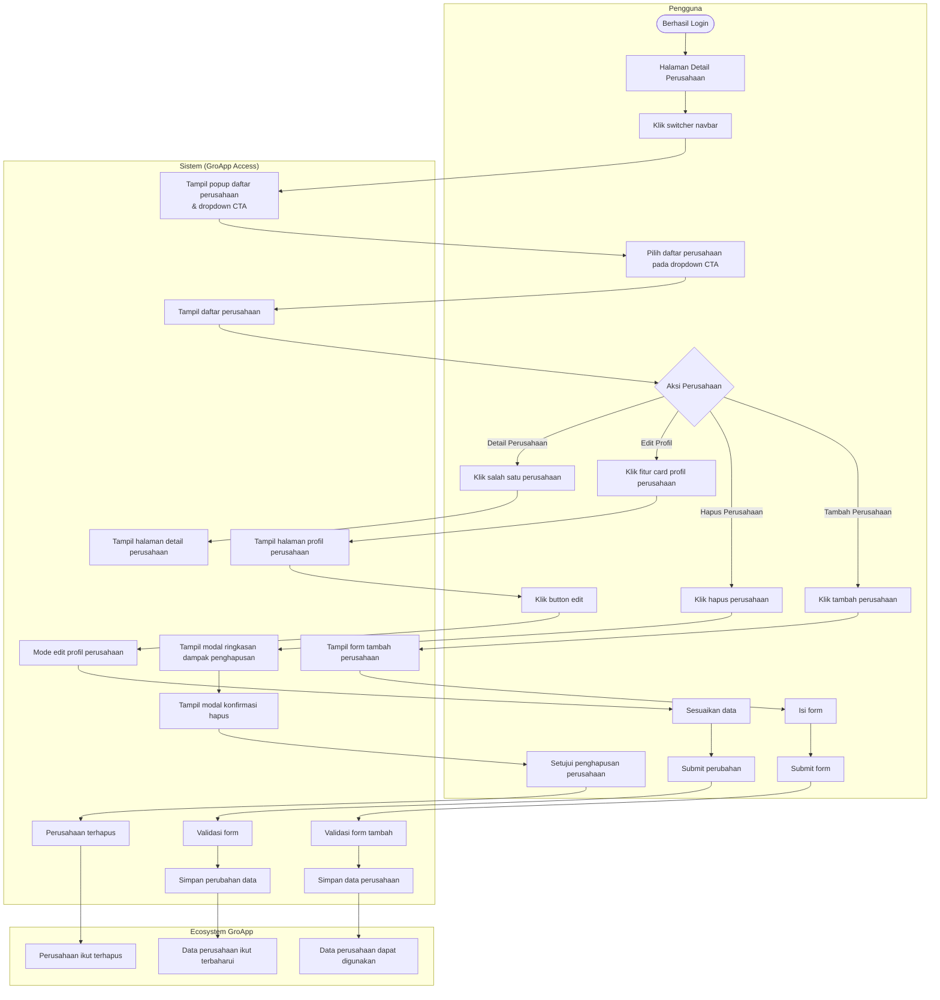

### Flow 3: Pengelolaan Entitas Bisnis

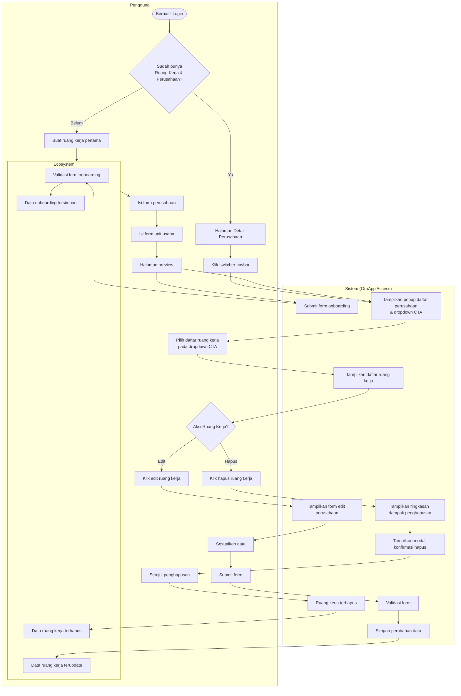


---

# Requirement Fitur

## Fitur: Onboarding

### Problem Statement Fitur

Groapp Access adalah pintu masuk dan sumber kebenaran data bisnis untuk seluruh ekosistem Groapp. Karena pengguna memiliki skala dan struktur bisnis yang beragam, onboarding dirancang dengan struktur bertingkat yang membentuk fondasi sistem sejak awal: Ruang Kerja → Perusahaan → Unit Usaha.
Data yang dibuat di sini langsung digunakan modul lain (seperti Groapp Accounting) tanpa pengisian ulang, sehingga konsistensi data sejak onboarding sangat krusial.

### Goal Fitur

Membantu pengguna memahami & membangun struktur bisnisnya secara bertahap dengan hambatan minimal:
Ruang Kerja → wadah pengelompokan tingkat atas. Wajib.
Perusahaan → konteks bisnis utama yang mengaktifkan modul lanjutan. Wajib.
Unit Usaha → representasi operasional (cabang, outlet, divisi, dll). Opsional — tersedia sejak onboarding untuk memberi awareness, tapi tidak dipaksakan agar tidak menghambat completion.

### In Scope Fitur

1. Pengguna dapat membuat Ruang Kerja baru saat onboarding
2. Pengguna dapat menambahkan perusahaan ke dalam Ruang Kerja
3. Pengguna mengisi data inti perusahaan yang dibutuhkan sebagai fondasi integrasi Groapp
4. Sistem melakukan validasi dasar terhadap input data perusahaan

### Case Flow

**CF-NG-ONBRDG: Negative Flow – Onboarding – Gagal pada Validasi Bertahap & Error Teknis Saat Penyimpanan** (Negative Flow)

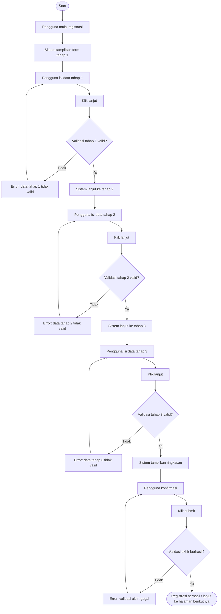

---

**CF-HP-ONBRDG: Happy Flow – Onboarding – Pengguna berhasil membuat ruang kerja, perusahaan, dan unit usaha pertama kali** (Happy Flow)

```mermaid
flowchart TD
    START([Start]):::start
    A["**(Pengguna)**\nberhasil login pertamakali"]:::pengguna
    B["**(Sistem)**\nMenampilkan screen 1\nwelcome screen"]:::sistem
    C["**(Pengguna)**\nKlik lanjutkan"]:::pengguna
    D["**(Sistem)**\nMenampilkan Intro Screen 2\nKenali Hierarki"]:::sistem
    E["**(Pengguna)**\nKlik lanjutkan"]:::pengguna
    F["**(Sistem)**\nMenampilkan Intro Screen 3\nSiap Mulai"]:::sistem
    G["**(Pengguna)**\nKlik Mulai Onboarding"]:::pengguna
    H["**(Sistem)**\nMenampilkan form ruang kerja"]:::sistem
    I["**(Pengguna)**\nIsi nama Ruang Kerja"]:::userStory
    J["**(Pengguna)**\nKlik button Lanjutkan"]:::userStory
    K["**(Pengguna)**\nMengisi data perusahaan"]:::userStory
    L["**(Pengguna)**\nKlik Lanjutkan"]:::userStory
    M["**(Pengguna)**\nMengisi data Unit Usaha"]:::userStory
    N["**(Pengguna)**\nKlik Lanjutkan"]:::userStory
    O["**(Sistem)**\nMenampilkan halaman preview\nentitas yang telah dibuat"]:::sistem
    P["**(Pengguna)**\nKlik Simpan"]:::userStory
    Q["**(Sistem)**\nMenampilkan notifikasi sukses"]:::userStory
    END_NODE(["**(Sistem)**\nMenampilkan halaman\ndetail perusahaan"]):::endNode
    START --> A --> B --> C --> D --> E --> F --> G --> H --> I --> J --> K --> L --> M --> N --> O --> P --> Q --> END_NODE
```

---

### Supporting Information

*Belum tersedia*

### Constraint and Consideration

**10.1.1. Analisis Security & Compliance**

- Kontrol Akses Data (UU PDP & ISO 27001) → Data onboarding hanya boleh diakses oleh pengguna yang memiliki hak (berdasarkan akun & role). Tidak boleh terlihat oleh pengguna lain.
- Kepemilikan & Tujuan Penggunaan Data (UU PDP & GDPR – Purpose Limitation) → Data yang diinput hanya digunakan untuk pengelolaan bisnis milik pengguna tersebut di dalam GroApp.
- Validasi & Integritas Data (PP 71/2019 & OWASP) → Semua input wajib divalidasi agar tidak ada data kosong
- tidak valid
- atau berbahaya yang masuk ke sistem.
- Konsistensi Data Lintas Modul (ISO 27001 – Data Integrity) → Data onboarding menjadi sumber utama dan harus tetap konsisten saat digunakan di modul lain.
- Perlindungan dari Akses Tidak Sah (UU PDP & OWASP) → Sistem harus mencegah data diakses atau diubah oleh pihak yang tidak berwenang.
- Perlindungan Struktur Bisnis (Best Practice Data Classification) → Informasi struktur bisnis (unit usaha) hanya boleh diakses dalam konteks perusahaan yang sama.
- Isolasi Data Antar Pengguna (UU PDP & GDPR) → Data dengan nama yang sama (misalnya nama perusahaan atau workspace) tetap harus dipisahkan antar akun pengguna.

**10.1.2. Sensitivitas Data & Perlakuan**

- Nama Ruang Kerja
- Nama Perusahaan
- Nama Unit Usaha
- Jenis Usaha
- Negara
- Mata Uang
- Workspace ID
- Company ID
- Unit Usaha ID

**10.2.1. Dampak ke Data/Fitur Lain**

Tidak Ada

**10.2.2. Dampak ke Notifikasi**

Fitur Onboarding tidak memicu notifikasi ke user. Seluruh feedback atas keberhasilan maupun kegagalan proses disampaikan melalui UI secara langsung.

**10.3.1. NFR (Non-Functional Requirements)**

- Sistem tidak boleh menampilkan identifier internal (User ID
- ID Ruang Kerja) di UI.
- Sistem harus memastikan seluruh akses data onboarding (workspace
- perusahaan
- unit) hanya dapat dilakukan oleh pengguna yang memiliki hak akses (permission) yang sesuai
- Perpindahan antar langkah onboarding cepat ( tanpa delay yang terasa )
- Proses penyimpanan data onboarding harus cepat dan stabil (target ≤ 3 detik untuk mayoritas pengguna)
- Jika terjadi kegagalan saat penyimpanan
- sistem harus memberikan pesan yang jelas dan memungkinkan user mencoba kembali tanpa kehilangan data
- Sistem harus mencatat event penting dalam onboarding (mulai
- submit
- berhasil
- gagal)
- Sistem harus tetap dapat menangani banyak proses onboarding secara bersamaan tanpa error
- Proses onboarding harus dapat diselesaikan dengan mudah dalam waktu singkat (±5 menit)

**10.4. Asumsi dan Risiko**

- User memahami struktur Ruang Kerja → Perusahaan → Unit Usaha
- User mampu mengisi data perusahaan dengan benar (self-declared)
- User menyelesaikan onboarding sampai selesai
- Sistem penyimpanan data selalu berhasil
- Data onboarding langsung bisa dipakai lintas modul
- Tidak ada verifikasi legal (KYC) saat onboarding
- Dropdown/input yang tersedia sudah cukup
- User hanya membuat 1 struktur awal (tidak kompleks)

#### Success Metrics Fitur

**Indikator keberhasilan untuk fitur ini:**

| Kategori | Indikator | Alasan / Urgensi |
|----------|-----------|------------------|
| Adoption  | ≥40–60% pengguna mengisi Unit Usaha saat onboarding | Karena tidak wajib, ini mengukur apakah pengguna memahami manfaat fitur tambahan tanpa dipaksa. |
| Data Quality | ≥95% data yang disimpan (Ruang Kerja & Perusahaan) valid dan bisa langsung digunakan | Data ini akan dipakai di Aplikasi lain dalam ekosistem Groapp. Jika salah dari awal, akan menimbulkan masalah di penggunaan berikutnya. |
| Adoption (Entry Point) | ≥70% pengguna yang melihat onboarding memulai proses (klik “Mulai sekarang”) | Ini menunjukkan apakah pengguna memahami dan tertarik untuk memulai onboarding. |
| Efficiency | Waktu rata-rata penyelesaian onboarding (dari welcome hingga simpan) ≤5 menit | Proses yang terlalu lama membuat pengguna cepat lelah dan berpotensi tidak menyelesaikan onboarding. |
| Drop-off | ≤20% pengguna berhenti di salah satu langkah sebelum tombol Simpan | Ini membantu melihat di langkah mana pengguna merasa bingung atau terhambat, sehingga bisa diperbaiki. |
| Completion | ≥70–85% pengguna menyelesaikan seluruh onboarding hingga menekan tombol Simpan / Selesai | Completion menunjukkan user mencapai moment of value awal. Jika rendah, user gagal masuk ke konteks kerja dan tidak dapat melanjutkan penggunaan produk. |

### User Stories

**User Stories dalam fitur ini:**

1. [US-ONBRD-ERRSIS](#user-story-1-us-onbrd-errsis)
2. [US-ONBRD-RKPU](#user-story-2-us-onbrd-rkpu)

##### User Story 1: US-ONBRD-ERRSIS

**Sebagai pengguna, saya ingin mendapatkan informasi yang jelas jika terjadi Error teknis pada sistem saat proses Onboarding berlangsung**

**Scenario GWT:**

| Kode | Given | When | Then |
|------|-------|------|------|
| SC-2549 | User telah klik button Simpan pada Review Page<br>page sesuai dengan Then di SC-2596 | Sistem mendapatkan response gagal dengan code yang ada dalam list [#_tuClTm_K](https://coda.io/d/_dbPKbwDmpud#_tuClTm_K) *(Coda table reference)*<br>- | Tampilkan error message ke user sesuai dengan Deskripsi pada [#_tuClTm_K](https://coda.io/d/_dbPKbwDmpud#_tuClTm_K) *(Coda table reference)* |
| SC-2597 |  | Sistem mendapatkan response gagal dengan code error yang Tidak Ada dalam list [#_tuClTm_K](https://coda.io/d/_dbPKbwDmpud#_tuClTm_K) *(Coda table reference)*<br>- | Tampilkan General Error message ke user, “Sistem sedang mengalami gangguan. coba lagi dalam beberapa saat” |

**Acceptance Criteria:**

- **US-ONBRD-NGRKPU-01**: Pesan kesalahan ditampilkan pada bagian input yang bermasalah sehingga pengguna dapat mengetahui bagian yang perlu diperbaiki.
Pengguna dapat memperbaiki data yang salah dan melanjutkan proses onboarding setelah data valid.

---

##### User Story 2: US-ONBRD-RKPU

**Sebagai pengguna, saya ingin memulai  onboarding agar saya bisa mulai mengelola usaha saya dalam konteks kerja yang jelas.**

**Scenario GWT:**

| Kode | Given | When | Then |
|------|-------|------|------|
| SC-2535 | Pengguna dalam proses memuat detail perusahaan setelah login pertama kali<br>tampilkan indikator loading | Pengguna terdeteksi belum pernah memiliki Ruang kerja <br>tampilkan indikator loading | Sistem Mengarahkan pengguna ke halaman Onboarding<br> indikator loading hilang<br> tampil halaman onboarding<br><br>Halaman Onboarding:<br>Intro Screen 1 - welcome screen. Isi screen :<br>Ilustrasi<br>Judul: Selamat datang di GroApp Access<br>Deskripsi:Di sini, Anda bisa mengelola seluruh identitas bisnis dengan lebih rapi. Mulai dari Ruang Kerja, Perusahaan, hingga Unit Usaha.<br>Tombol "Lanjutkan" (primary, kanan bawah) |
| SC-2537 | Pengguna telah melalui skenario US-ONBRD-RKPU-01<br>sama seperti US-ONBRD-RKPU-01 | Pengguna Klik tombol lanjutkan<br>button lanjutkan diklik | Sistem Menampilkan screen 2 pada halaman Onboarding<br>Intro Screen 2 - Kenali Hierarki. Isi screen:<br>Ilustrasi: diagram hierarki Ruang Kerja → Perusahaan → Unit Usaha<br>Judul: "Kenali Struktur Kerja Anda"<br>Deskripsi singkat per level:<br>Ruang Kerja: wadah pengelompokan utama bisnis Anda<br>Perusahaan: konteks bisnis yang mengaktifkan modul GroApp<br>Unit Usaha: representasi operasional (cabang, outlet, Pabrik)<br>Tombol "Lanjutkan" (primary, kanan bawah)<br>Tombol "Kembali" (secondary, kiri bawah) |
| SC-2538 |  | Pengguna Klik tombol lanjutkan<br>button lanjutkan diklik<br>button kembali enable | Sistem Menampilkan screen 3 pada halaman Onboarding<br><br>Intro Screen 3 - Siap Mulai. isi screen:<br>Ilustrasi: gambar celebratory/ready<br>Judul: "Siap untuk memulai?"<br>Deskripsi:<br>"Kami akan memandu Anda menyiapkan Ruang Kerja, Perusahaan, dan Unit Usaha pertama Anda dalam beberapa langkah."<br>Tombol "Mulai Onboarding" (primary, kanan bawah) → menuju Step 1 form<br>Tombol "Kembali" (secondary, kiri bawah) |
| SC-2539 |  | Pengguna Klik tombol Mulai Onboarding<br>button Mulain Onboarding diklik | Sistem Menampilkan Screen form input nama Ruang kerja.<br>Judul: Buat Ruang Kerja<br>Deskripsi: Ruang Kerja adalah wadah untuk mengelompokkan perusahaan Anda.<br>Label : Nama Ruang Kerja <br>field input Nama ruang kerja<br>tombol lanjutkan |
| SC-2540 |  | Pengguna mengisi nama Ruang kerja dengan nama “Ruang Kerja Saya”<br>field nama ruang kerja terisi Ruang Kerja Saya<br>Button lanjutkan enable | Sistem menampilkan nama ruang kerja di field<br>tidak ada inline error yang tampil<br>button lanjutkan enable |
| SC-2542 |  | pengguna klik button lanjutkan<br>button lanjutkan di klik <br>button kembali enable | sistem menampilkan form Tambah Perusahaan<br>Judul: Masukkan Data Perusahaan Anda<br>Deskripsi: Lengkapi data perusahaan sebagai fondasi integrasi GroApp.<br>field input data perusahaan:<br>Nama Perusahaan (free text)<br>jenis usaha. terdapat pilihan jasa,retail & manufaktur<br>Setiap jenis usaha ketika di klik jenis usahanya terdapat penjelasan setiap jenis usaha:<br><br>Jasa: Bisnis yang menjual keahlian atau tenaga, bukan barang. Contoh: salon rumahan, tukang servis HP, Laundry atau tukang jahit.<br><br>Retail: Bisnis yang membeli barang lalu dijual lagi ke pembeli. Contoh: warung sembako, Toko bahan bangunan atau reseller baju.<br><br>Manufaktur Bisnis yang membuat atau memproduksi barang sendiri. Contoh: produksi camilan rumahan, Catering atau Usaha mebel<br><br>Negara → dropdown pilihan hanya indonesia<br>Mata uang → dropdown pilihan hanya IDR<br>tombol lanjutkan disable<br>tombol kembali enable |
| SC-2543 |  | Pengguna klik Button lanjutkan<br>button lanjutkan di klik<br>tidak ada inline error yang tampil | Sistem tahapan form isi data Unit usaha <br>Judul: Masukkan Data Unit Usaha Anda<br>Deskripsi: Opsional — Jika Anda belum memiliki Unit usaha, anda dapat melewati step ini dan anda dapat menambahkan unit usaha nanti.<br>field input:<br>Nama Unit usaha → input text<br>Jenis Unit(dropdown) → (Cabang,otlet, pabrik). disamping label unit usaha tambahkan icon “i” untuk memberikan contoh dan informasi jenis unit usaha agar pengguna tidak salah pilih<br>tombol lanjutkan<br>tombol kembali |
| SC-2544 |  | Pengguna mengisi nama Unit usaha dengan data valid<br>Field input nama Unit usaha : Cafe Karya - Cabang Malang<br> jenis usaha : Cabang<br>penjelasan setiap jenis usaha:<br>Cabang : Tempat usaha yang menjalankan bisnis yang sama seperti pusat di lokasi yang berbeda-beda. contoh: Salon yang awalnya di rumah sendiri, lalu buka tempat baru di ruko sebelah pasar.<br><br>Outlet : titik jualan yang lebih kecil, biasanya hanya untuk melayani pembeli tanpa operasional lengkap. Contoh: Penjual minuman kekinian yang buka booth di food court mal atau stan di bazar.<br><br>Pabrik :  tempat khusus untuk membuat atau memproduksi barang, bukan untuk melayani pembeli. Contoh: Pemilik usaha kue yang punya dapur produksi terpisah dari tokonya.<br>button lanjutkan enable<br>button lewati enable | Sistem menampilkan data di tiap field sesuai dengan data yang diinputkan pengguna<br>tidak ada inline error yang tampil karena semua data valid<br>button lanjutkan enable |
| SC-2545 | Pengguna telah melalui skenario  SC-2543<br>sama seperti SC-2543 | Pengguna klik button Lanjutkan<br>button lanjutkan diklik | Sistem menampilkan layar preview entitas yang telah dibuat pengguna <br>tampilkan semua data yang telah di masukkan pengguna mulai dari ruang kerja dan perusahaan <br>button simpan enable<br>button kembali enable |
| SC-2550 |  | pengguna klik button simpan <br>button simpan diklik | sistem memproses penyimpanan data<br>screen overlay <br>indikator loading tampil di tengah screen |
| SC-2551 |  |  | Sistem berhasil menyimpan data onboarding. pengguna diarahkan ke halaman detail Perusahaan yang baru dibuat saat onboarding<br><br>cataan hifi:<br>pengguna diarahkan ke halaman detail ruang kerja<br>tampil pesan sukses:<br>judul : sukses <br>deskripsi : Selamat, ruang kerja dan perusahaan berhasil dibuat |
| SC-2596 |  | Pengguna mengisi nama Perusahaan dengan data valid<br>Field input nama perusahaan : PT KARYA ANAK BANGSA<br> jenis usaha :  Jasa<br>dropdown Negara(Indonesia only): Indonesia<br>dropdown Mata Uang(IDR only) : IDR | Sistem menampilkan data di tiap field sesuai dengan data yang diinputkan<br>tidak ada inline error yang tampil karena semua data valid<br>button lanjutkan enable<br>button kembali enable |
| SC-2598 |  | Pengguna klik button Lanjutkan <br>button lanjutkan diklik | Sistem menampilkan layar preview entitas yang telah dibuat pengguna <br>tampilkan semua data yang telah di masukkan pengguna mulai dari ruang kerja,perusahaan dan unit usaha<br>button simpan enable<br>button kembali enable |
| SC-2599 |  | pengguna klik button Simpan <br>button Lanjutkan Simpan diklik | Sistem memproses penyimpanan data onboarding<br>tampil indikator loading di tengah halaman<br>background overlay |
| SC-2600 |  |  | Sistem berhasil menyimpan data onboarding. pengguna ditampilkan page informasi kalau Onboarding telah berhasil dilakukan dan terdapat CTA untuk user masuk kedalam Detail Perusahaan<br><br>cataan hifi:<br>Sistem menampilkan Information Page dengan detail : <br>Information Title : Success<br>Body message : Ruang Kerja, Perusahaan, dan Unit Usaha berhasil dibuat. Anda sudah dapat mulai menggunakannya.<br>Terdapat Call to Action Masuk ke Detail Perusahaan untuk pengguna diarahkan masuk ke detail perusahaan <br>Final state onboarding adalah pengguna masuk ke Detail Perusahaan |
| SC-2603 | Pengguna telah menjalankan skenario SC-2539<br>sama seperti SC-2539 | Pengguna menginputkan Nama ruang kerja dengan nama “1”<br>field nama ruang kerja terisi dengan 1<br>button kembali enable<br>button lanjutkan disable | Sistem menampilkan pesan inlene error<br>field nama ruang kerja terisi dengan 1<br>inline error tampil dengan pesan : Nama Ruang Kerja minimal 3 karakter.<br>button kembali enable<br>button lanjutkan disable |

**Acceptance Criteria:**

- **US-ONBRD-RKPU-04**: Sistem menampilkan pesan inline error pada field yang wajib diisi apabila field tersebut masih kosong
Sistem menampilkan pesan inline error pada field apabila format yang dimasukkan tidak valid
Tombol Lanjutkan dalam kondisi disabled
- **US-ONBRD-RKPU-03**: User dapat melewati pengisian unit usaha jika belum ingin menambahkannya.
Setelah onboarding selesai, user diarahkan ke halaman Detail Perusahaan
- **US-ONBRD-RKPU-02**: User dapat memulai proses onboarding setelah masuk ke sistem.
Sistem menampilkan alur onboarding yang membantu user menyiapkan konteks kerja.
User dapat menyelesaikan langkah onboarding secara full (Ruang kerja - Perusahaan - Unit Usaha)
Setelah onboarding selesai, user diarahkan ke halaman Detail Perusahaan
- **US-ONBRD-RKPU-01**: Sistem menampilkan halaman onboarding ketika pengguna terdeteksi belum pernah memiliki ruang kerja

**Rekapitulasi Multibahasa:**

| Komponen | Bahasa Indonesia | English | Page |
|----------|------------------|---------|------|
|  |  |  |  |

---


## Fitur: Tambah Ruang Kerja

### Problem Statement Fitur

GroApp Access dikembangkan sebagai pusat pengelolaan data perusahaan dan unit usaha yang berperan sebagai one source of truth bagi seluruh modul ERP GroApp. Untuk memastikan struktur data yang rapi sejak awal, sistem mengarahkan pengguna pada proses onboarding untuk membuat Ruang Kerja pertama sebagai wadah awal sebelum pengguna dapat membuat perusahaan dan unit usaha di dalamnya.
Seiring penggunaan produk, banyak pengguna memiliki kebutuhan untuk mengelola lebih dari satu konteks bisnis, baik karena menjalankan berbagai jenis usaha, perbedaan kepemilikan, maupun pemisahan operasional tertentu. Dalam kondisi ini, satu ruang kerja tidak lagi cukup untuk merepresentasikan seluruh konteks bisnis pengguna secara jelas.
Tanpa kemampuan untuk menambah ruang kerja baru, pengguna berisiko kesulitan memahami konteks kerja yang sedang aktif, harus menelusuri struktur perusahaan yang semakin kompleks, dan berpotensi salah konteks saat mengelola data bisnisnya. Oleh karena itu, fitur Tambah Ruang Kerja diperlukan agar pengguna dapat membuat ruang kerja baru sesuai kebutuhan, sehingga satu pengguna dapat memiliki banyak ruang kerja untuk mengelola perusahaan dan unit usaha dalam konteks yang terpisah dan lebih mudah dipahami.

### Goal Fitur

Fitur Tambah Ruang Kerja bertujuan membantu pengguna yang memiliki lebih dari satu konteks bisnis untuk mengelola perusahaan dan unit usaha secara terpisah dan terstruktur. Dengan memungkinkan satu pengguna memiliki banyak ruang kerja, pengguna dapat dengan jelas memahami ruang kerja mana yang sedang dipilih dan digunakan sebagai konteks operasional saat ini, sehingga seluruh aktivitas pengelolaan perusahaan dan unit usaha dilakukan dalam konteks yang tepat. Hal ini membantu pengguna menemukan perusahaan yang relevan lebih cepat serta mengurangi kebingungan dan risiko salah konteks saat bekerja

### In Scope Fitur

1. Pengguna dapat menambahkan Ruang Kerja baru setelah onboarding selesai (di luar proses onboarding)
2. Pengguna dapat memiliki lebih dari satu Ruang Kerja
3. Setiap Ruang Kerja berfungsi sebagai konteks kerja untuk menampilkan dan mengelola daftar perusahaan
4. Pengguna dapat menambahkan perusahaan ke dalam Ruang Kerja yang sedang aktif
5. Sistem melakukan validasi saat penambahan Ruang Kerja
6. Penambahan Ruang Kerja tidak mengubah atau memindahkan data perusahaan dan unit usaha yang sudah ada

### Case Flow

**CF-NG-WRK: Negative Flow – Tambah Ruang Kerja – Pembuatan Ruang Kerja Gagal** (Negative Flow)

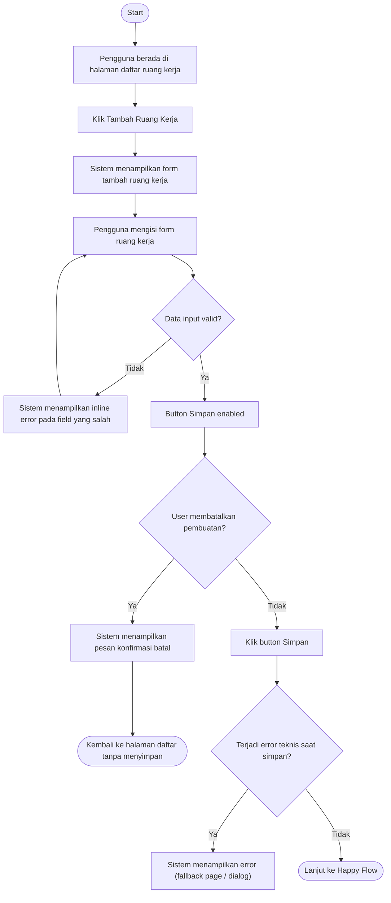

---

**CF-HP-WRK: Happy Flow – Tambah Ruang Kerja – Pengguna Berhasil Membuat Ruang Kerja Baru** (Happy Flow)

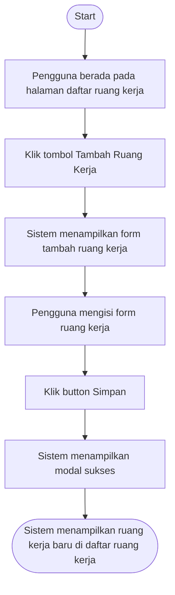

---

### Supporting Information

*Belum tersedia*

### Constraint and Consideration

**10.1.1. Analisis Security & Compliance**

- UU PDP No. 27/2022 — Data yang mengidentifikasi pengguna & relasi konteks kerjanya wajib dilindungi
- PP 71/2019 (PSTE) — Kerahasiaan
- integritas
- ketersediaan data elektronik
- GDPR / PDPA (baseline) — Relasi identitas ↔ konteks kerja tidak boleh digunakan di luar tujuan awal
- ISO/IEC 27001 (Access Control & Governance) — Perubahan konteks kerja harus terkontrol & dapat ditelusuri
- GroApp Security Baseline (IAM) — Semua aksi create harus berbasis identitas login sah & server-side

**10.1.2. Sensitivitas Data & Perlakuan**

- User ID
- ID Ruang Kerja
- Nama Ruang Kerja
- Relasi User ↔ Ruang Kerja
- Konteks Ruang Kerja Aktif
- Timestamp create/update

**10.2.1. Dampak ke Data/Fitur Lain**

Tidak ada fitur/data yang terdampak

**10.2.2. Dampak ke Notifikasi**

*Tidak ada*

**10.3.1. NFR (Non-Functional Requirements)**

- Sistem hanya mengizinkan pemilik akun untuk menambah dan mengubah Ruang Kerja
- Keberhasilan atau kegagalan penambahan Ruang Kerja ditentukan sepenuhnya oleh sistem (server-side)
- Nama Ruang Kerja harus unik dalam satu akun user
- Sistem harus mencegah pembuatan Ruang Kerja ganda akibat retry atau kegagalan sementara
- Sistem harus menjaga konsistensi Ruang Kerja aktif setelah penambahan Ruang Kerja
- Sistem mencatat pembuatan dan kegagalan pembuatan Ruang Kerja di log sistem
- Kegagalan penambahan Ruang Kerja ditampilkan dengan pesan yang jelas dan dapat ditindaklanjuti
- Proses penambahan Ruang Kerja harus terasa responsif bagi user

**10.4. Asumsi dan Risiko**

- User memahami bahwa Ruang Kerja adalah konteks kerja
- bukan perusahaan
- User menambah Ruang Kerja karena kebutuhan nyata (usaha baru / pemisahan konteks)
- User sudah memiliki mental model Ruang Kerja dari penggunaan sebelumnya
- Penambahan Ruang Kerja tidak memerlukan edukasi panjang
- Satu akun user adalah pemilik penuh Ruang Kerja
- Nama Ruang Kerja yang unik per akun cukup membedakan konteks
- User tidak memerlukan notifikasi eksternal saat menambah Ruang Kerja
- Audit trail cukup dicatat di level sistem (tidak ditampilkan ke user)
- Performa “terasa instan” cukup tanpa SLA numerik
- Tidak ada dependency eksternal langsung pada fitur Tambah Ruang Kerja

#### Success Metrics Fitur

**Indikator keberhasilan untuk fitur ini:**

| Kategori | Indikator | Alasan / Urgensi |
|----------|-----------|------------------|
| UX Clarity | ≥ 80% user dapat membedakan Ruang Kerja yang dimiliki berdasarkan nama yang mereka buat sendiri | Mengukur apakah penamaan dan konsep Ruang Kerja cukup membantu user memahami konteks tanpa bantuan tambahan dari sistem. |
| Behavioral Signal | Tidak muncul peningkatan kasus salah konteks pengelolaan perusahaan setelah penambahan Ruang Kerja | Salah konteks adalah risiko utama fitur ini. Jika tetap terjadi, berarti Ruang Kerja gagal berfungsi sebagai konteks kerja yang jelas. |
| Functional Accuracy | 100% Ruang Kerja baru berhasil dibuat tanpa mempengaruhi data perusahaan dan unit usaha yang sudah ada | Menjamin bahwa penambahan Ruang Kerja aman secara struktur data dan tidak menimbulkan risiko perubahan data eksisting. |
| Adoption | ≥ 50% user yang memiliki lebih dari satu perusahaan menggunakan lebih dari satu Ruang Kerja | Mengukur apakah Ruang Kerja benar-benar dipakai sebagai alat pengelompokan konteks bisnis, bukan hanya struktur tambahan. |
| Drop-off | ≤ 20% user keluar dari flow Tambah Ruang Kerja sebelum selesai | Drop-off tinggi menunjukkan user ragu, bingung, atau tidak melihat urgensi menambah Ruang Kerja pada saat itu. |
| Completion | ≥ 90% user yang memulai flow Tambah Ruang Kerja berhasil menyelesaikannya | Completion memastikan user dapat mencapai tujuan utama fitur tanpa hambatan signifikan. Angka rendah mengindikasikan friksi UX atau value yang tidak jelas. |
| Completion | ≥ 60% user yang sudah memiliki minimal 1 Ruang Kerja berhasil menambahkan Ruang Kerja baru | Menunjukkan bahwa fitur Tambah Ruang Kerja benar-benar digunakan untuk kebutuhan multi-konteks, bukan sekadar tersedia tapi tidak relevan. |

### User Stories

**User Stories dalam fitur ini:**

1. [US-ADDRK-ACCESS](#user-story-1-us-addrk-access)
2. [US-ADDRK-CANCEL](#user-story-2-us-addrk-cancel)
3. [US-ADDRK-INPUTFORM](#user-story-3-us-addrk-inputform)
4. [US-ADDRK-SUCCESS](#user-story-4-us-addrk-success)
5. [US-ADDRK-SYSERROR](#user-story-5-us-addrk-syserror)

##### User Story 1: US-ADDRK-ACCESS

**Sebagai pengguna, 
saya ingin mengetahui apakah saya memiliki akses untuk melakukan Tambah Ruang Kerja
sehingga saya bisa tahu batasan saya dalam bekerja**

**Scenario GWT:**

| Kode | Given | When | Then |
|------|-------|------|------|
| SC-2546 | pengguna berada di Daftar Perusahaan dan pengguna memiliki permission untuk Tambah Ruang Kerja<br>menampilkan halaman Daftar Perusahaan<br>terdapat CTA untuk masuk ke Daftar Ruang Kerja → dengan nama button Kelola Ruang Kerja | pengguna klik pada CTA Kelola Ruang Kerja | sistem mengarahkan masuk ke Halaman Daftar Ruang Kerja<br>sistem menampilkan button untuk Tambah Ruang Kerja<br><br>Catatan Hifi ;<br>menampilkan page Daftar Ruang Kerja<br>menampilkan List Ruang Kerja berupa table dengan data menampilkan Nama Ruang Kerja<br>menampilkan button untuk tambah ruang kerja dengan wording “+ Tambah Ruang Kerja”<br><br>Simulasi Wireframe |

**Acceptance Criteria:**

- **US-ADDRK-ACCESS-AC1**: Semua Role User dapat melakukan Tambah Ruang Kerja

---

##### User Story 2: US-ADDRK-CANCEL

**Sebagai user, 
saya ingin bisa membatalkan proses tambah Ruang Kerja jika saya berubah pikiran sebelum menyelesaikan form.
agar proses yang saya lakukan segera berhenti**

**Scenario GWT:**

| Kode | Given | When | Then |
|------|-------|------|------|
| SC-2221 | User telah klik tombol Tambah Ruang Kerja dan muncul form Tambah Ruang kerja | User tidak input apapun dan klik pada tombol Batal | Screen balik lagi ke Daftar Ruang Kerja<br>TIdak ada penambahan Ruang Kerja baru |
| SC-2222 | User telah klik tombol Tambah Ruang Kerja dan muncul form Tambah Ruang kerja | User input data Nama Ruang Kerja, tetapi kemudian klik pada tombol Batal | Screen balik lagi ke Daftar Ruang Kerja<br>TIdak ada penambahan Ruang Kerja baru<br>Form akan tereset, jadi jika di klik Tambah Ruang Kerja lagi, yang sebelumnya diinput tidak muncul |

**Acceptance Criteria:**

- **US-ADDRK-CANCEL-AC1**: Proses Tambah Ruang Kerja berhenti dan form Ter-reset
Nama Ruang Kerja yang dimasukkan tidak tercatat sebagai Ruang Kerja baru

---

##### User Story 3: US-ADDRK-INPUTFORM

**Sebagai Pengguna, 
saya ingin melihat Data apa saja yang dibutuhkan untuk melakukan Tambah Ruang Kerja baru 
sehingga saya dapat memberikan data yang sesuai dengan ketentuan sistem**

**Scenario GWT:**

| Kode | Given | When | Then |
|------|-------|------|------|
| SC-2527 | pengguna berada di halaman form Tambah Ruang Kerja<br>pengguna telah klik button tambah ruang kerja<br>Form dalam bentuk Modal<br>Judul form : “Tambah Ruang Kerja”<br>body form sesuai dengan form spesification<br>tombol : <br>Batal , untuk close modal dan kembali ke daftar Ruang Kerja<br>Simpan, untuk melanjutkan proses | pengguna mengisi field Nama Ruang Kerja dengan nama yang sudah digunakan pada user yang sama | sistem menampilkan pesan error bahwa Nama Ruang Kerja sudah digunakan di user yang sama<br>Error message berupa In-line Message<br>Wording error : “Nama Ruang Kerja telah terdaftar. Silakan gunakan nama yang berbeda” |
| SC-2528 |  | pengguna mengisi field Nama Ruang Kerja dengan nama yang belum pernah digunakan<br>contoh Nama ruang kerja yang di input : Ruang Kerja Kelima | Tombol Simpan akan enable dan pengguna dapat melanjutkan ke proses selanjutnya |
| SC-2529 | pengguna berada di halaman form Tambah Ruang Kerja<br>spesifikasi sama dengan SC-2527 | Pengguna belum melakukan input apapun<br>User belum menginputkan data apapun<br>Form masih menampilkan placeholder dengan wording “Contoh : Ruang Kerja Utama” | Sistem menampilkan form tambah ruang kerja dalam keadaan kosong.<br>Tombol Simpan masih Disable<br>Sistem tidak mengeluarkan error message<br>bentuk screen masih sama dengan state awal |
| SC-2530 | pengguna berada di halaman form Tambah Ruang Kerja dan field required field telah diisi oleh pengguna<br>required field telah terisikan value | pengguna menghapus semua isian pada field yang required<br>User menghapus inputan data sampai kosong<br>Field kembali memunculkan placeholder | Tombol Simpan kembali Disable<br>Sistem mengeluarkan error message berupa In-line message di setiap field required<br>menampilkan In-line Error message dibawah text-box, dengan wording “Nama Ruang Kerja wajib diisi” |
| SC-2531 | pengguna berada di halaman form Tambah Ruang Kerja<br>spesifikasi sama dengan SC-2527 | Pengguna mengisi Nama Ruang Kerja sesuai dengan ketentuan sistem<br>Nama Ruang Kerja terisikan value | Tombol Simpan sudah Enable dan siap digunakan untuk proses selanjutnya<br>Tombol Simpan state : Enable |
| SC-2532 | pengguna berada di halaman form Tambah Ruang Kerja<br>spesifikasi sama dengan SC-2527 | Pengguna input data sesuai dengan ketentuan pengisian data<br>field Nama Ruang Kerja dalam form diisikan value | Button Simpan akan Enable<br>pengguna dapat melanjutkan proses dengan klik tombol Simpan |
| SC-2533 |  | Pengguna mencoba input Nama Unit Usaha tetapi melebihi maximum karakter ( 60 Karakter ) dan berpindah ke field yang lain<br>field terisikan dengan value dan indikator karakternya menampilkan 60/60 | sistem akan mengeluarkan Informasi In-line message dengan wording “Jumlah karakter melebihi batas maksimal 60 karakter.”<br>Button Simpan tetap Disable<br>Informasi In-line akan muncul dibawah field Nama Unit Usaha |
| SC-2534 |  | Pengguna mencoba input Nama Unit Usaha tetapi kurang dari minimum karakter ( 3 Karakter ) dan berpindah ke field yang lain<br>field terisikan dengan value dan indikator karakternya menampilkan 2/60 | sistem akan mengeluarkan Error In-line message dengan wording error “Nama Ruang Kerja harus terdiri dari 3-60 karakter.”<br>Button Simpan tetap Disable |

**Acceptance Criteria:**

- **US-ADDRK-INPUTFORM-AC2**: Sistem Validasi Required parameter
- **US-ADDRK-INPUTFORM-AC3**: Sistem Validasi Kesesuaian data di setiap parameter yang diinputkan oleh user berdasarkan ketentuan pengisian
- **US-ADDRK-INPUTFORM-AC1**: Sistem Validasi Nama Ruang Kerja berdasarkan existing data Ruang Kerja

**Form Specification:**

| Kolom/Field | Tipe | Wajib Diisi | Unik | Max/Min Karakter | Placeholder | Catatan |
|-------------|------|-------------|------|------------------|-------------|---------|
| Nama Ruang Kerja | Text | Ya | Ya | 3-60 | Contoh : Ruang Kerja Utama | Aturan Penamaan Nama Unit Usaha:<br>Auto-Uppercase<br>Hanya boleh huruf, angka, spasi, titik, dan koma<br>Nama Ruang Kerja tidak boleh duplicate dalam 1 user yang sama<br>60 karakter  (include spasi) |

**Field Error Messages:**

| Field | Input | Respon Sistem | Deskripsi Error | Momen Validasi | Catatan |
|-------|-------|---------------|-----------------|----------------|---------|
| Nama Ruang Kerja | Kurang dari 3 karakter | Inline Field Error | Nama Ruang Kerja minimal 3 karakter. | On Blur |  |
| Nama Ruang Kerja | Lebih dari 60 karakter | Inline Field Error | Nama Ruang Kerja maksimal 60 karakter. | On Blur | ketika user typing di karakter ke 60 inline error tampil & user gak bisa typing lagi |
| Nama Ruang Kerja | Mengandung karakter selain huruf, angka, titik, atau koma | Inline Field Error | Nama Ruang Kerja hanya boleh berisi huruf, angka, titik, dan koma. | On Blur |  |
| Nama Ruang Kerja | Nama Ruang Kerja sudah terdaftar dalam 1 user | Inline Field Error | Nama Ruang Kerja telah terdaftar. Silakan gunakan nama yang berbeda | On Blur | Cek unique dalam 1 user |
| Nama Ruang Kerja | Kosong | Inline Field Error | Nama Ruang Kerja wajib diisi. | On Blur |  |

**Rekapitulasi Multibahasa:**

| Komponen | Bahasa Indonesia | English | Page |
|----------|------------------|---------|------|
| Label | Nama Ruang kerja | Workspace Name | Tambah Ruang Kerja |
| Placeholder | Contoh: Ruang Kerja Utama | Example: Ruang Kerja Utama | Tambah Ruang Kerja |
| Page Title | Tambah Ruang kerja | Add Workspace | Tambah Ruang Kerja |

---

##### User Story 4: US-ADDRK-SUCCESS

**Sebagai user yang sudah memiliki minimal satu Ruang Kerja, 
saya ingin menambahkan Ruang Kerja baru setelah onboarding 
sehingga saya dapat memisahkan konteks bisnis lain yang saya kelola.**

**Scenario GWT:**

| Kode | Given | When | Then |
|------|-------|------|------|
| SC-2217 | User telah masuk ke form Pembuatan Ruang Kerja baru<br>form yang sama dengan SC-2527 | User memasukkan data Nama Ruang Kerja yang sesuai dengan policy dan validasi sistem dan klik tombol Simpan<br>text-box untuk Nama Ruang Kerja diisikan value data yang sesuai<br>tombol Simpan Enable setelah diisi data yang sesuai format policy | Sistem berhasil membuat Ruang Kerja baru<br>Ruang Kerja baru muncul di daftar ruang kerja dengan detail : <br>Card baru memunculkan indicator title “New”. Indicator ini akan hilang dalam beberapa waktu atau jika user telah membuka detail workspace tersebut<br>tampil toast sukses:<br>judul → Sukses!<br>deskripsi: Ruang Kerja berhasil didaftarkan<br>User diredirect ke Daftar Ruang Kerja<br>User diperlihatkan Card baru dengan detail Nama Ruang Kerja yang baru diinputkan beserta indikator New pada Card yang baru dibentuk |

**Acceptance Criteria:**

- **US-ADDRK-SUCCESS-AC1**: Sistem menampilkan form tambah Ruang Kerja- Nama Ruang Kerja wajib diisi
Ruang Kerja berhasil dibuat dan muncul di daftar Ruang Kerja

**Rekapitulasi Multibahasa:**

| Komponen | Bahasa Indonesia | English | Page |
|----------|------------------|---------|------|
| Button | Batal | Cancel | Tambah Ruang Kerja |
| Button | Simpan | Save | Tambah Ruang Kerja |
| Label | Nama Ruang Kerja | New Workspace | Tambah Ruang Kerja |
| Placeholder | Masukkan Nama Ruang Kerja | Input New Workspace | Tambah Ruang Kerja |
| Page Title | Tambah Ruang Kerja | Add New Workspace | Tambah Ruang Kerja |

---

##### User Story 5: US-ADDRK-SYSERROR

**Sebagai user, 
saya ingin mendapatkan informasi yang jelas jika terjadi kegagalan saat menambah Ruang Kerja 
agar saya tahu apa yang harus dilakukan selanjutnya.**

**Scenario GWT:**

| Kode | Given | When | Then |
|------|-------|------|------|
| SC-2223 | User telah klik button simpan pada form tambah ruang kerja | Sistem mendapatkan response gagal dengan code yang ada dalam list [#_tuClTm_K](https://coda.io/d/_dbPKbwDmpud#_tuClTm_K) *(Coda table reference)*<br>Loading state | Sistem gagal saat memproses Request. Sistem menampilkan pesan error teknis sesuai GenSpec <br>loading indikator hilang<br>Tampil Error teknis sesuai GenSpec |
| SC-2709 | User telah klik button simpan pada form tambah ruang kerja | Sistem mendapatkan response gagal yang tidak tercover [#_tuClTm_K](https://coda.io/d/_dbPKbwDmpud#_tuClTm_K) *(Coda table reference)*<br>Loading state | Tampilkan General Error message ke user, “Sistem sedang mengalami gangguan. coba lagi dalam beberapa saat” |

**Acceptance Criteria:**

- **US-ADDRK-SYSERROR-AC1**: Ketika sistem mengalami kegagalan saat proses Tambah User, sistem menampilkan error message sesuai dengan Gen-spec yang ditentukan : [#_tuClTm_K](https://coda.io/d/_dbPKbwDmpud#_tuClTm_K) *(Coda table reference)*
Jika kegagalan sistem tidak termasuk dalam list, tampilkan general error message

---


## Fitur: Daftar Ruang Kerja

### Problem Statement Fitur

Seiring penggunaan fitur Ruang Kerja, pengguna dapat memiliki banyak ruang kerja dengan konteks yang berbeda. Pemilihan ruang kerja menentukan konteks data aktif, termasuk daftar perusahaan dan unit usaha yang ditampilkan.
Ketika jumlah ruang kerja bertambah, pengguna membutuhkan cara yang jelas untuk melihat dan memilih ruang kerja yang sedang aktif sebelum melanjutkan aktivitas. Tanpa Daftar Ruang Kerja yang menampilkan seluruh ruang kerja milik pengguna, pengguna dapat mengalami kebingungan konteks dan kelelahan kognitif karena harus terus memastikan apakah daftar perusahaan yang muncul sudah sesuai dengan konteks kerja yang diinginkan.
Oleh karena itu, Daftar Ruang Kerja dibutuhkan sebagai fitur lanjutan untuk membantu pengguna memahami dan mengontrol konteks kerjanya secara sadar.

### Goal Fitur

Fitur Daftar Ruang Kerja bertujuan membantu pengguna memahami dan menetapkan konteks kerja yang sedang aktif dengan cara menampilkan seluruh ruang kerja yang dimiliki pengguna dalam satu tempat. Dengan memilih satu ruang kerja sebagai konteks aktif, pengguna dapat bekerja dalam batas konteks yang jelas, di mana hanya perusahaan dan unit usaha yang relevan dengan ruang kerja tersebut yang ditampilkan. Hal ini membantu pengguna berpindah konteks secara sadar, menjaga fokus kerja, dan mengurangi beban mental saat mengelola banyak usaha.

### In Scope Fitur

1. Menampilkan daftar seluruh Ruang Kerja yang dimiliki pengguna
Menampilkan identitas Ruang Kerja secara jelas (mis
2. nama Ruang Kerja)
3. Menyediakan halaman khusus Daftar Ruang Kerja yang terpisah dari beranda
4. Mendukung kondisi user memiliki satu atau lebih ruang kerja, atau nol Ruang Kerja
5. Menampilkan empty state yang informatif ketika user belum memiliki Ruang Kerja
6. Data yang ditampilkan terbatas pada kepemilikan Ruang Kerja user

### Case Flow

**CF-AL-WRL: Negative Flow – Daftar Ruang Kerja – Terjadi Error Saat Membuka Daftar Ruang Kerja** (Alternative Flow)

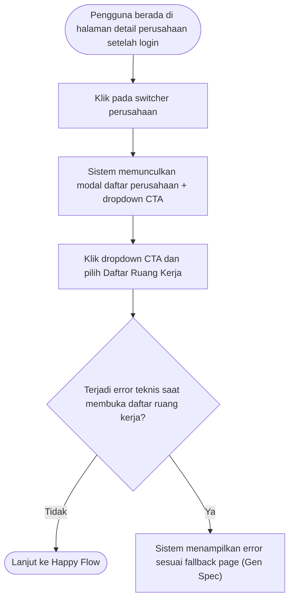

---

**CF-HP-WRL: Happy Flow – Daftar Ruang Kerja – Pengguna Melihat Daftar Ruang Kerja** (Happy Flow)

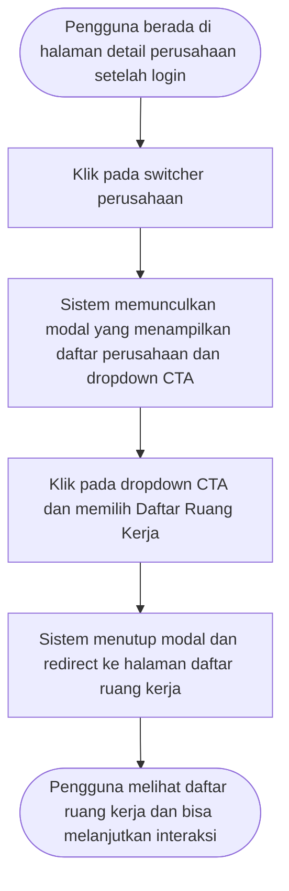

---

### Supporting Information

*Belum tersedia*

### Constraint and Consideration

**10.1.1. Analisis Security & Compliance**

- UU PDP No. 27/2022 — Data pribadi hanya boleh ditampilkan kepada subjek data yang berhak.
- UU PDP — Pembatasan akses data berdasarkan kepemilikan (ownership).
- PP 71/2019 (PSTE) — Sistem wajib menjamin keamanan akses & mencegah kebocoran data lintas pengguna.
- GDPR / PDPA (Baseline Regional) — Prinsip data minimization: hanya tampilkan data minimum yang relevan dengan tujuan fitur.
- GroApp Security Baseline (IAM) — Semua akses data berbasis autentikasi; halaman hanya dapat diakses oleh user login.
- OWASP Top 10 (Access Control) — Tidak boleh ada IDOR (akses Ruang Kerja milik user lain).

**10.1.2. Sensitivitas Data & Perlakuan**

- User ID
- ID Ruang Kerja
- Nama Ruang Kerja
- Relasi User ↔ Ruang Kerja
- Session / Status Login

**10.2.1. Dampak ke Data/Fitur Lain**

Tidak ada

**10.2.2. Dampak ke Notifikasi**

*Tidak ada*

**10.3.1. NFR (Non-Functional Requirements)**

- Sistem hanya menampilkan Ruang Kerja yang dimiliki oleh user
- Sistem tidak menampilkan identifier internal (User ID
- ID Ruang Kerja) di UI
- User dapat memahami bahwa halaman ini hanya bersifat daftar (bukan switch atau pengelolaan)
- Sistem harus menampilkan halaman Daftar Ruang Kerja dalam waktu ≤2 detik untuk 90% permintaan pengguna (p90)
- Sistem mampu menampilkan banyak Ruang Kerja tanpa perubahan perilaku

**10.4. Asumsi dan Risiko**

- User memahami bahwa Daftar Ruang Kerja hanya bersifat melihat (read-only)
- User memahami perbedaan antara Ruang Kerja dan Perusahaan
- User hanya dapat melihat Ruang Kerja miliknya sendiri
- Menampilkan daftar Ruang Kerja sudah cukup memberi awareness konteks
- Jumlah Ruang Kerja per user masih dalam batas wajar
- Tidak diperlukan notifikasi atau audit trail untuk fitur ini
- Akses ke halaman Daftar Ruang Kerja tidak mempengaruhi konteks aktif

#### Success Metrics Fitur

**Indikator keberhasilan untuk fitur ini:**

| Kategori | Indikator | Alasan / Urgensi |
|----------|-----------|------------------|
| Empty State Effectiveness | ≥ 90% user tanpa Ruang Kerja memahami status “belum memiliki Ruang Kerja” (survey/feedback cepat) | Empty state adalah satu-satunya “hasil” bagi user tanpa Ruang Kerja. Jika tidak dipahami, fitur gagal memberi kejelasan konteks meski secara teknis benar. |
| Data Quality / Functional Accuracy | 100% item Ruang Kerja yang ditampilkan sesuai kepemilikan user | Kesalahan data (workspace salah/tidak relevan) merusak trust. Untuk fitur awareness, akurasi kepemilikan adalah syarat mutlak keberhasilan. |
| User Satisfaction (Happiness) | ≥ 80% user menilai halaman “mudah dipahami” (survey in-app singkat) | Menguji kualitas kejelasan identitas Ruang Kerja secara subjektif. Jika user tidak paham konteks meski daftar tampil, maka peluang “Kejelasan Identitas” belum tercapai. |
| Efficiency (Time-to-Content) | Median waktu konten tampil ≤ 2 detik | Awareness hanya efektif jika cepat. Waktu tampil yang lama mengurangi persepsi kejelasan dan meningkatkan potensi drop-off, meski fiturnya sederhana. |
| Drop-off | ≤ 10% user keluar (<5 detik) dari halaman tanpa konten termuat | Drop-off dini menandakan kebingungan, loading bermasalah, atau ekspektasi user tidak terpenuhi. Penting untuk mendeteksi friksi awal pada halaman read-only ini. |
| Activation / Completion | ≥ 95% user yang membuka halaman berhasil melihat daftar Ruang Kerja atau empty state tanpa error | Completion adalah indikator utama bahwa fungsi inti (menampilkan daftar/empty state) berjalan dan memberikan value dasar. Jika gagal, tujuan awareness tidak tercapai. |
| Adoption | ≥ 70% user login mengunjungi halaman Daftar Ruang Kerja minimal 1× dalam 7 hari | Mengukur apakah entry point & penamaan fitur cukup jelas sehingga user menyadari keberadaan daftar Ruang Kerja. Jika rendah, berarti awareness layer gagal ditemukan/dianggap tidak relevan. |

### User Stories

**User Stories dalam fitur ini:**

1. [US-LISTRK-EMPTY](#user-story-1-us-listrk-empty)
2. [US-LISTRK-SYSERROR](#user-story-2-us-listrk-syserror)
3. [US-LISTRK-VIEW](#user-story-3-us-listrk-view)

##### User Story 1: US-LISTRK-EMPTY

**Sebagai pengguna
saya ingin melihat tampilan List Ruang Kerja jika tidak ada data didalamnya
agar dapat menvisualisasikan kondisi kosong**

**Scenario GWT:**

| Kode | Given | When | Then |
|------|-------|------|------|
| SC-2559 | pengguna masuk ke Daftar Perusahaan dan pengguna memiliki permission untuk melihat Daftar Ruang Kerja<br>menampilkan halaman Daftar Perusahaan<br>terdapat CTA dengan nama Kelola Ruang Kerja untuk masuk ke Daftar Ruang Kerja | pengguna klik pada CTA Kelola Ruang Kerja dan pengguna tidak memiliki sama sekali Ruang Kerja | sistem mengarahkan masuk ke Halaman Daftar Ruang Kerja<br>sistem menampilkan Empty State pada Daftar Ruang Kerja<br><br>Catatan Hifi ;<br>pengguna sudah masuk ke screen Daftar Ruang Kerja<br>Title Body: Belum Ada Ruang Kerja<br>ditambahkan Headline dengan wording “Tidak ada ruang kerja saat ini. Buat ruang kerja baru untuk memulai.”<br>terdapat shorcut clickable ( button ) untuk user dapat melakukan pembuatan Ruang Kerja baru<br>button wording “Tambah Ruang Kerja” |

**Acceptance Criteria:**

- **US-LISTRK-EMPTY-AC1**: User ditampilkan screen dengan kondisi Empty State

---

##### User Story 2: US-LISTRK-SYSERROR

**Sebagai user, 
saya ingin mendapatkan informasi yang jelas jika terjadi kegagalan saat mengambil data List Ruang Kerja
agar saya tahu apa yang harus dilakukan selanjutnya.**

**Scenario GWT:**

| Kode | Given | When | Then |
|------|-------|------|------|
| SC-2232 | User telah memiliki data Ruang Kerja<br><br>catatn hifi:<br>tampil indikator loading memuat daftar ruang kerja | Sistem gagal get data karena kondisi tertentu<br>Loading state | Sistem gagal saat memproses Request. Sistem menampilkan pesan error teknis sesuai GenSpec <br>loading indikator hilang<br>Tampil Error teknis sesuai GenSpec |

**Acceptance Criteria:**

- **US-LISTRK-SYSERROR-AC1**: Sistem menampilkan pesan error sesuai dengan kondisi kegagalan
Sistem mengeluarkan notifikasi berdasarkan Genspec yang telah disepakati

---

##### User Story 3: US-LISTRK-VIEW

**Sebagai pengguna, 
saya ingin melihat identitas Ruang Kerja secara jelas 
agar dapat mengenali masing-masing Ruang Kerja yang terkoneksi dengan user saya**

**Scenario GWT:**

| Kode | Given | When | Then |
|------|-------|------|------|
| SC-2557 | pengguna masuk ke Daftar Perusahaan dan pengguna memiliki permission untuk melihat Daftar Ruang Kerja<br>menampilkan halaman Daftar Perusahaan<br>terdapat CTA untuk masuk ke Kelola Ruang Kerja | pengguna klik pada CTA Kelola Ruang Kerja<br>Button kelola ruang kerja di klik | sistem mengarahkan masuk ke Halaman Daftar Ruang Kerja<br>sistem daftar Ruang Kerja yang terintegrasi dengan akun milik pengguna<br><br>Catatan Hifi ;<br>pengguna sudah masuk ke screen Daftar Ruang Kerja<br>tampil daftar Ruang Kerja dengan button Edit dan Hapus di setiap datanya.<br>terdapat button untuk Tambah Ruang Kerja dengan wording “+ Tambah Ruang Kerja”<br><br>sample wireframe : |

**Acceptance Criteria:**

- **US-LISTRK-VIEW-AC1**: User ditampilkan list Ruang Kerja sesuai dengan data User
Setiap data Ruang Kerja menampilkan : Nama Ruang Kerja, Owned by - [nama user], Total perusahaan didalamnya dengan wording “?? Perusahaan”, Sample perusahaan, Tombol Lihat detail → untuk redirect ke Detail Ruang Kerja

**Rekapitulasi Multibahasa:**

| Komponen | Bahasa Indonesia | English | Page |
|----------|------------------|---------|------|
| Button | Lihat Detail | See Details | Daftar Ruang Kerja |
| Label | Perusahaan | Companies | Daftar Ruang Kerja |
| Page Title | Daftar Ruang Kerja | Workspace List | Daftar Ruang Kerja |

---


## Fitur: Edit Ruang Kerja

### Problem Statement Fitur

Pengguna GroApp yang memiliki banyak perusahaan atau unit usaha membutuhkan konteks kerja yang jelas agar memahami sedang bekerja di lingkungan usaha yang mana. Konsep Ruang Kerja digunakan untuk mengelompokkan perusahaan berdasarkan konteks yang relevan bagi pengguna. Namun, seiring perkembangan usaha—seperti bertambahnya jenis bisnis atau perubahan cara pengelompokan—nama Ruang Kerja yang ada dapat menjadi tidak lagi sesuai. 
Oleh karena itu, atas adanya kebutuhan tersebut, pengguna membutuhkan kemampuan untuk menyesuaikan nama Ruang Kerja secara mandiri agar tetap selaras dengan konteks usaha yang sedang dijalankan. Tanpa fleksibilitas ini, pengguna berpotensi mengalami kebingungan konteks kerja, ketergantungan pada bantuan Customer Service untuk perubahan yang bersifat sederhana, serta persepsi bahwa sistem kurang adaptif terhadap dinamika perkembangan usaha. Kebutuhan ini diasumsikan akan semakin relevan seiring bertambahnya kompleksitas dan jumlah usaha yang dikelola oleh pengguna GroApp.

### Goal Fitur

Fitur Edit Ruang Kerja bertujuan membantu pengguna GroApp untuk menyesuaikan konteks kerja mereka secara mandiri melalui penamaan Ruang Kerja yang relevan dengan kondisi kebutuhan terkini dari pengguna. Dengan kemampuan ini, pengguna GroApp dapat mengubah nama Ruang Kerja mereka kapan pun secara mandiri, tanpa harus bergantung pada bantuan Customer Service, sehingga pengguna dapat dengan mudah menyesuaikan konteks kerja sesuai perkembangan dan kebutuhan usahanya.

### In Scope Fitur

1. Owner dapat mengubah nama Ruang Kerja secara mandiri
2. Perubahan nama dilakukan di halaman Detail Ruang Kerja
3. Nama Ruang Kerja dapat diedit melalui ikon edit
4. Sistem menampilkan mode edit berupa field input nama
5. Sistem menyediakan tombol Simpan untuk menyimpan perubahan
6. Sistem hanya mengizinkan penyimpanan jika nama tidak duplikat
7. Sistem menampilkan notifikasi berhasil setelah perubahan nama disimpan
8. Setelah berhasil, sistem keluar dari mode edit dan menampilkan nama terbaru
9. Perubahan nama hanya mempengaruhi nama Ruang Kerja
10. Hak edit hanya dimiliki oleh role Owner
11. Riwayat / log perubahan nama Ruang Kerja dicatat di Backend

### Case Flow

**CF-NG-WRE: Negative Flow – Edit Ruang Kerja – Edit Nama Ruang Kerja Gagal** (Negative Flow)

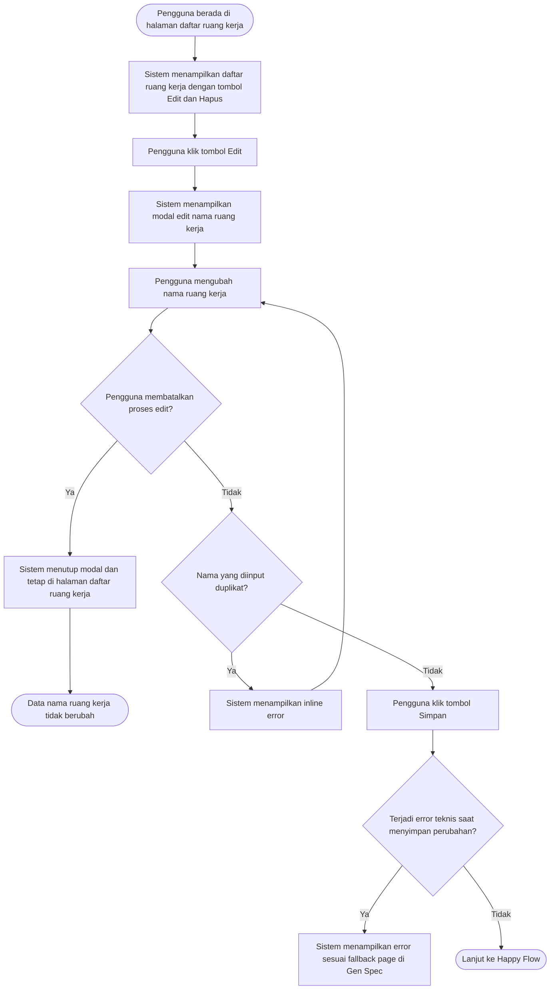

---

**CF-HP-WRE: Happy Flow – Edit Ruang Kerja – Pengguna Berhasil Mengedit Nama Ruang Kerja** (Happy Flow)

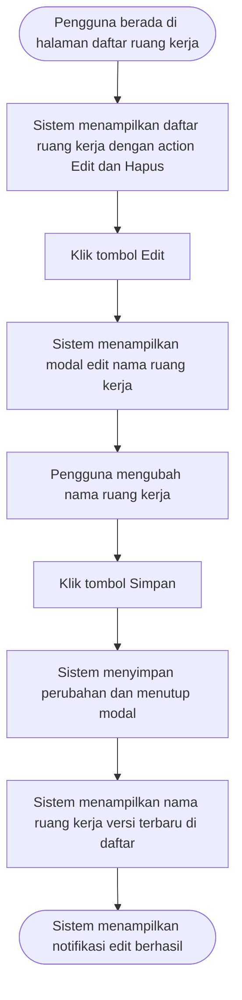

---

### Supporting Information

*Belum tersedia*

### Constraint and Consideration

**10.1.1. Analisis Security & Compliance**

- UU PDP (Perlindungan Data Pribadi) Data yang diinput user harus diproses dengan aman dan hanya oleh pihak yang berhak.
- PP 71/2019 (Keamanan Sistem Elektronik) Sistem harus mencegah perubahan data tanpa izin dan menjaga keutuhan data.
- Prinsip GDPR / PDPA (minim data & tujuan jelas) Perubahan hanya boleh sebatas kebutuhan fitur.
- OWASP – Kontrol Akses & Validasi Input Hanya user yang berhak boleh mengubah
- dan input harus tervalidasi.
- ISO 27001 – Audit & Akuntabilitas (level konsep) Perubahan penting harus bisa ditelusuri jika dibutuhkan.

**10.1.2. Sensitivitas Data & Perlakuan**

- Nama Ruang Kerja
- Nama Ruang Kerja hasil dibagikan
- Nama lama & nama baru
- Identitas user yang mengubah
- Peran user (Owner)
- Pesan error (nama duplikat)
- Waktu perubahan nama
- Daftar perusahaan & unit usaha

**10.2.1. Dampak ke Data/Fitur Lain**

Tidak ada

**10.2.2. Dampak ke Notifikasi**

*Tidak ada*

**10.3.1. NFR (Non-Functional Requirements)**

- Hanya user dengan peran Owner/Admin yang dapat mengedit nama Ruang Kerja.
- User dengan peran selain Owner/Admin tidak dapat melihat atau mengakses aksi edit nama Ruang Kerja.
- Perubahan nama Ruang Kerja tidak boleh memengaruhi data perusahaan
- unit usaha
- atau modul lain.
- Sistem harus memastikan hanya satu nama Ruang Kerja yang unik untuk Ruang Kerja milik sendiri dalam satu akun.
- Perubahan nama Ruang Kerja yang berhasil harus dicatat di sistem sebagai jejak perubahan.
- Kegagalan karena error sistem perlu tercatat sebagai catatan internal.
- User harus selalu mendapatkan kejelasan hasil aksi (berhasil atau gagal) saat mengedit nama Ruang Kerja.
- Proses simpan perubahan nama Ruang Kerja harus terasa cepat dan responsif.

**10.4. Asumsi dan Risiko**

- Hanya Owner yang memiliki kewenangan untuk mengedit nama Ruang Kerja
- Perubahan nama Ruang Kerja dipahami sebagai perubahan ringan dan tidak berdampak ke data lain
- User memahami perbedaan antara Ruang Kerja milik sendiri dan Ruang Kerja hasil dibagikan
- Feedback UI (berhasil / gagal) sudah cukup tanpa notifikasi tambahan
- Pencatatan audit trail di sistem/backend dianggap cukup meskipun belum ditampilkan di UI
- Error teknis jarang terjadi

#### Success Metrics Fitur

**Indikator keberhasilan untuk fitur ini:**

| Kategori | Indikator | Alasan / Urgensi |
|----------|-----------|------------------|
| User Experience | Jumlah laporan masalah atau tiket support terkait fitur Edit Ruang Kerja | Menilai apakah fitur mudah digunakan atau menimbulkan kebingungan bagi pengguna |
| Efficiency | Rata-rata waktu yang dibutuhkan pengguna dari membuka edit hingga berhasil menyimpan perubahan | Mengukur seberapa cepat dan efisien pengguna dapat melakukan perubahan pada ruang kerja |
| Error Monitoring | Persentase error saat proses penyimpanan perubahan ruang kerja | Mengidentifikasi masalah teknis yang dapat mengganggu pengalaman pengguna |
| System Reliability | Persentase keberhasilan penyimpanan perubahan (Edit Success Rate) | Menjamin proses penyimpanan perubahan berjalan stabil dan tidak sering gagal |
| Task Completion | Persentase pengguna yang berhasil menyimpan perubahan setelah membuka mode edit | Memastikan pengguna dapat menyelesaikan proses edit tanpa hambatan |
| Feature Adoption | Persentase Ruang Kerja yang melakukan edit dalam periode tertentu | Mengukur apakah fitur Edit Ruang Kerja benar-benar digunakan oleh pengguna setelah dirilis |

### User Stories

**User Stories dalam fitur ini:**

1. [US-EDITRK-ACCESS](#user-story-1-us-editrk-access)
2. [US-EDITRK-CANCEL](#user-story-2-us-editrk-cancel)
3. [US-EDITRK-INPUTFORM](#user-story-3-us-editrk-inputform)
4. [US-EDITRK-SUCCESS](#user-story-4-us-editrk-success)
5. [US-EDITRK-SYSERROR](#user-story-5-us-editrk-syserror)

##### User Story 1: US-EDITRK-ACCESS

**Sebagai pengguna, 
saya ingin mengetahui apakah saya memiliki akses untuk melakukan edit nama Ruang Kerja
sehingga saya bisa tahu batasan saya dalam bekerja**

**Scenario GWT:**

| Kode | Given | When | Then |
|------|-------|------|------|
| SC-2314 | Pengguna masuk ke Daftar Perusahaan dan memiliki akses untuk Edit Ruang Kerja | Pengguna klik pada Button Kelola Ruang Kerja<br>button kelola ruang kerja di klik | sistem menampilkan opsi untuk Edit nama Ruang Kerja<br>sistem menampilkan page Daftar Ruang Kerja<br>disetiap data Ruang Kerja terdapat button Edit dan button Delete<br>Button Edit Ruang Kerja tampil <br>Buton edit dan hapus  tampil dan enable untuk role owner |

**Acceptance Criteria:**

- **US-EDITRK-ACCESS**: Pengguna dapat melakukan Edit Nama Ruang Kerja (miliknya sendiri)
Jika user memiliki role yg sesuai, maka tombol edit akan Enable

---

##### User Story 2: US-EDITRK-CANCEL

**Sebagai pengguna, 
saya ingin untuk membatalkan proses Edit yang telah saya lakukan sebelumnya
sehingga data yang saya input tidak terproses oleh sistem**

**Scenario GWT:**

| Kode | Given | When | Then |
|------|-------|------|------|
| SC-2343 | pengguna berada di modal edit nama Ruang Kerja dan belum melakukan perubahan apapun pada data existing<br>sama seperti modal edit ruang kerja di proses sebelumnya | pengguna menekan tombol batal<br><br>catatn hifi:<br>Pengguna klik tombol batal | sistem tidak menyimpan perubahan nama Ruang Kerja<br>sistem menampilkan nama Ruang Kerja sebelumnya<br>Close Modal Edit Nama Ruang Kerja<br>Screen kembali ke Daftar Ruang Kerja |
| SC-2344 | pengguna berada di halaman edit nama Ruang Kerja dan telah memasukkan data Nama Ruang Kerja baru | pengguna menekan tombol batal<br><br>catatn hifi:<br>Pengguna klik tombol batal | sistem tidak menyimpan perubahan nama Ruang Kerja<br>sistem menampilkan nama Ruang Kerja sebelumnya<br>tampil pesan toast bahwa perubahan nama ruang kerja dibatalkan<br>Close Modal Edit Nama Ruang Kerja<br>Screen kembali ke Daftar Ruang Kerja<br>Title toast: Dibatalkan!<br>deskripsi toast : Perubahan nama ruang kerja dibatalkan |

**Acceptance Criteria:**

- **US-EDITRK-CANCEL-AC1**: Pengguna berhasil membatalkan proses Edit

---

##### User Story 3: US-EDITRK-INPUTFORM

**Sebagai Pengguna, 
saya ingin melakukan perubahan data Nama Ruang Kerja
agar informasi Ruang Kerja tetap akurat.**

**Scenario GWT:**

| Kode | Given | When | Then |
|------|-------|------|------|
| SC-2323 | pengguna berada pada Halaman Daftar Ruang Kerja<br>screen menampilkan page daftar Ruang Kerja | Pengguna klik pada button Edit Ruang Kerja pada salah satu ruang kerja<br>pengguna klik edit ruang kerja | Tampil modal edit nama ruang kerja<br>tampil modal ubah nama ruang kerja<br>pada label nama ruang kerja terdapat tanda * yang menandakan bahwa field tersebut wajib diisikan sesuatu : <br>Nama Ruang Kerja<br>muncul 2 tombol yaitu SIMPAN dan BATAL<br>SIMPAN, digunakan untuk melakukan proses update selanjutnya<br>BATAL, digunakan untuk keluar dari Edit Mode |
| SC-2324 |  | pengguna menghapus semua existing value dan membiarkan text box dengan value kosong | sistem melakukan validasi terhadap data yang dimasukkan<br>sistem menampilkan pesan validasi jika terdapat data yang tidak sesuai aturan<br>pesan validasi berupa In-Line Message dan tampil dibawah field Form yg tidak sesuai. <br>Message yang dimunculkan : “Nama Ruang Kerja harus diisi”<br>Button “Simpan” disable atau tidak bisa di klik |
| SC-2325 |  | seluruh data yang diinput telah memenuhi aturan validasi<br><br>catatn hifi:<br>field nama ruang kerja di isi dengan data yang valid | Tombol Simpan  enable <br>Modal Edit ruang kerja tampil dengan kondisi data valid<br>tidak ada inline error<br>button batal dan simpan enable |
| SC-2571 |  | pengguna mengganti data existing dengan value karakter kurang dari 3 Karakter | sistem melakukan validasi terhadap data yang dimasukkan<br>sistem menampilkan pesan validasi jika terdapat data yang tidak sesuai aturan<br>pesan validasi berupa In-Line Message dan tampil dibawah field Form yg tidak sesuai. <br>Message yang dimunculkan : “Nama Ruang Kerja harus berisikan 3-60 karakter”<br>Button “Simpan” disable atau tidak bisa di klik |
| SC-2572 |  | Pengguna mengganti data existing dengan value karakter lebih dari 60 Karakter<br><br>catatn hifi:<br>pengguna mulai memasukkan nama ruang kerja | sistem akan mengeluarkan Informasi In-line message dengan wording “Jumlah karakter melebihi batas maksimal 60 karakter.”<br>Button Simpan tetap Disable<br>Informasi In-line akan muncul dibawah field Nama Unit Usaha |

**Acceptance Criteria:**

- **US-EDITRK-VALIDATION**: Pengguna dapat melakukan edit nama ruang kerja
Pengguna dapat mengetahui hasil validasi dari data yang dimasukkan
Pengguna dapat melakukan Simpan data terbaru

**Form Specification:**

| Kolom/Field | Tipe | Wajib Diisi | Unik | Max/Min Karakter | Placeholder | Catatan |
|-------------|------|-------------|------|------------------|-------------|---------|
| Nama Ruang Kerja | Text | Ya | Ya | 3-60 |  | Aturan Penamaan Nama Unit Usaha:<br>Auto-Uppercase<br>Hanya boleh huruf, angka, spasi, titik, dan koma<br>Nama Ruang Kerja tidak boleh duplicate dalam 1 user yang sama<br>60 karakter  (include spasi) |

**Field Error Messages:**

| Field | Input | Respon Sistem | Deskripsi Error | Momen Validasi | Catatan |
|-------|-------|---------------|-----------------|----------------|---------|
| Nama Ruang Kerja | Kurang dari 3 karakter | Inline Field Error | Nama Ruang Kerja minimal 3 karakter. | On Blur |  |
| Nama Ruang Kerja | Lebih dari 60 karakter | Inline Field Error | Nama Ruang Kerja maksimal 60 karakter. | On Blur | ketika user typing di karakter ke 60 inline error tampil & user gak bisa typing lagi |
| Nama Ruang Kerja | Mengandung karakter selain huruf, angka, titik, atau koma | Inline Field Error | Nama Ruang Kerja hanya boleh berisi huruf, angka, titik, dan koma. | On Blur |  |
| Nama Ruang Kerja | Nama Ruang Kerja sudah terdaftar dalam 1 user | Inline Field Error | Nama Ruang Kerja telah terdaftar. Silakan gunakan nama yang berbeda | On Blur | Cek unique dalam 1 user |
| Nama Ruang Kerja | Kosong | Inline Field Error | Nama Ruang Kerja wajib diisi. | On Blur |  |

**Rekapitulasi Multibahasa:**

| Komponen | Bahasa Indonesia | English | Page |
|----------|------------------|---------|------|
| Label | Nama Ruang kerja | Workspace Name | Edit Ruang Kerja |
| Page Title | Ubah Ruang kerja | Edit Workspace | Edit Ruang Kerja |

---

##### User Story 4: US-EDITRK-SUCCESS

**Sebagai pengguna, 
saya ingin sukses dalam melakukan perubahan nama Ruang Kerja sesuai dengan yang saya inginkan
sehingga perubahan tersebut dapat diimplementasi untuk proses selanjutnya**

**Scenario GWT:**

| Kode | Given | When | Then |
|------|-------|------|------|
| SC-2319 | pengguna berada di halaman Daftar Ruang Kerja dan telah klik button Edit di salah satu Ruang Kerja yang dipilih<br>Tampil Form Edit Nama Ruang Kerja | pengguna memasukkan nama Ruang Kerja yang valid dan pengguna menekan tombol simpan<br>Nama ruang Kerja diubah menjadi value yang sesuai dengan ketentuan sistem | Sistem memproses perubahan nama ruang kerja<br>tampil indikator loading <br>background overlay |
| SC-2321 |  | sistem selesai memproses perubahan<br>sistem menyimpan perubahan nama Ruang Kerja<br>indikator loading hilang<br>tampilhalaman daftar ruang kerja tanpa toast sukses | sistem menampilkan nama Ruang Kerja yang baru<br>sistem menampilkan toast sukses mengubah nama ruang kerja baru<br>sistem mengarahkan kembali ke Daftar Ruang kerja<br>sistem menampilkan Nama Ruang Kerja yang baru<br>toast title : Sukses!<br>toast desc : Nama Ruang Kerja berhasil diperbaharui |

**Acceptance Criteria:**

- **US-EDITRK-SUCCESS-AC1**: Pengguna berhasil input data sesuai dengan aturan yang telah ditentukan
Pengguna berhasil simpan perubahan
Pengguna melihat hasil perubahan yang telah dilakukan sebelumnya

---

##### User Story 5: US-EDITRK-SYSERROR

**Sebagai pengguna, 
saya ingin diberikan notifikasi yang jelas jika terjadi kegagalan sistem dalam mengelola data perubahan
sehingga saya bisa mengetahui langkah selanjutnya yang akan dilakukan**

**Scenario GWT:**

| Kode | Given | When | Then |
|------|-------|------|------|
| SC-2346 | User telah melakukan submit untuk proses Edit Nama Perusahaan<br>tampil form edit ruang kerja<br>pengguna klik butoon simpan | Sistem gagal melakukan proses dikarenakan error system<br>- | Sistem gagal saat memproses Request. Sistem menampilkan pesan error teknis sesuai GenSpec <br>loading indikator hilang<br>Tampil Error teknis sesuai GenSpec |

**Acceptance Criteria:**

- **US-EDITRK-SYSERROR-AC1**: Sistem menampilkan pesan error sesuai dengan kondisi kegagalan
Sistem mengeluarkan notifikasi berdasarkan Genspec yang telah disepakati

---


## Fitur: hapus ruang kerja

### Problem Statement Fitur

Saat ini sistem belum menyediakan mekanisme bagi Admin atau Owner untuk menghapus Ruang Kerja yang sudah tidak digunakan. Akibatnya, ruang kerja yang tidak lagi relevan tetap tersimpan di dalam sistem dan dapat menimbulkan kebingungan bagi pengguna ketika mengelola atau memilih ruang kerja yang aktif.
Selain itu, keberadaan ruang kerja yang sudah tidak digunakan dapat menyebabkan data menjadi tidak terorganisir, meningkatkan risiko kesalahan dalam pengelolaan data, serta menyulitkan pengguna dalam menjaga kebersihan dan akurasi struktur ruang kerja di dalam sistem.
Oleh karena itu, diperlukan fitur hapus Ruang Kerja yang memungkinkan Admin atau Owner untuk menghapus ruang kerja yang sudah tidak diperlukan secara aman, sehingga data yang tersimpan di sistem tetap relevan, terkelola dengan baik, dan mudah digunakan oleh pengguna.

### Goal Fitur

Fitur hapus Ruang Kerja bertujuan untuk memberikan kemampuan kepada Admin atau Owner untuk menghapus ruang kerja yang sudah tidak lagi digunakan sehingga data yang tersimpan di sistem tetap relevan, terorganisir, dan mudah dikelola. Dengan adanya fitur ini, pengguna dapat menjaga kerapihan data serta mengurangi potensi kesalahan dalam pengelolaan atau pemilihan ruang kerja yang aktif. Selain itu, fitur ini juga memberikan kontrol yang lebih baik kepada Admin atau Owner dalam mengelola siklus hidup data ruang kerja, sekaligus memastikan proses penghapusan dilakukan secara aman melalui mekanisme konfirmasi untuk meminimalkan risiko penghapusan data yang tidak disengaja.

### In Scope Fitur

1. Admin atau Owner dapat menghapus Ruang Kerja dari halaman pengelolaan ruang kerja
2. Sistem menampilkan opsi hapus (delete) pada Ruang Kerja yang dapat dikelola oleh Admin atau Owner
3. Sistem menampilkan konfirmasi sebelum proses penghapusan dilakukan untuk mencegah kesalahan penghapusan
4. Setelah proses penghapusan berhasil, Ruang Kerja tidak lagi ditampilkan pada daftar Ruang Kerja di sistem
5. Sistem menampilkan notifikasi keberhasilan atau kegagalan setelah proses penghapusan dilakukan

### Case Flow

**CF-NG-WRD: Negative Flow – Hapus Ruang Kerja – Terjadi Error Saat Menghapus Ruang Kerja** (Negative Flow)

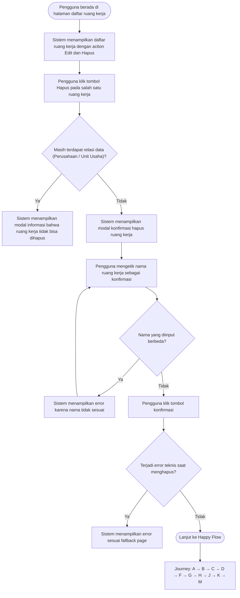

---

**CF-HP-WRD: Happy Flow – Hapus Ruang Kerja – Pengguna Berhasil Menghapus Ruang Kerja** (Happy Flow)

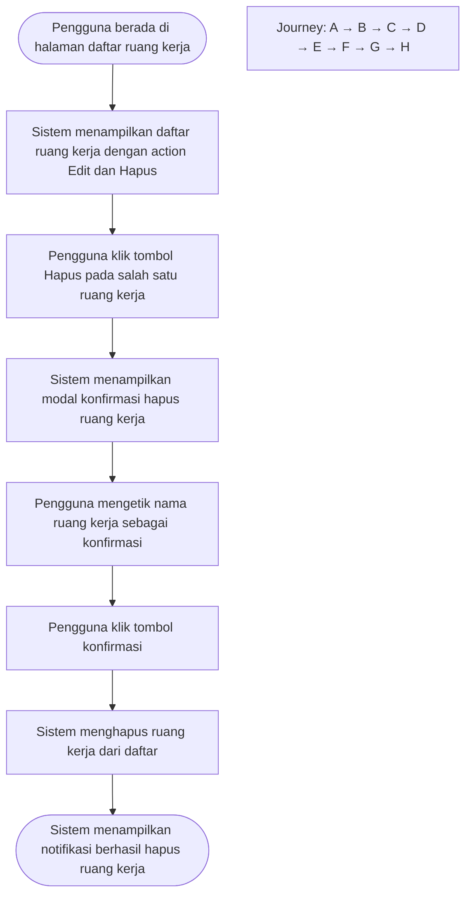

---

### Supporting Information

*Belum tersedia*

### Constraint and Consideration

**10.1.1. Analisis Security & Compliance**

- UU PDP (Perlindungan Data Pribadi) Data yang diinput user harus diproses dengan aman dan hanya oleh pihak yang berhak.
- PP 71/2019 (Keamanan Sistem Elektronik) Sistem harus mencegah perubahan data tanpa izin dan menjaga keutuhan data.
- Prinsip GDPR / PDPA (minim data & tujuan jelas) Perubahan hanya boleh sebatas kebutuhan fitur.
- OWASP – Kontrol Akses & Validasi Input Hanya user yang berhak boleh mengubah
- dan input harus tervalidasi.
- ISO 27001 – Audit & Akuntabilitas (level konsep) Perubahan penting harus bisa ditelusuri jika dibutuhkan.

**10.1.2. Sensitivitas Data & Perlakuan**

- Nama Ruang Kerja
- Nama Ruang Kerja hasil dibagikan

**10.2.1. Dampak ke Data/Fitur Lain**

Tidak ada

**10.2.2. Dampak ke Notifikasi**

*Tidak ada*

**10.3.1. NFR (Non-Functional Requirements)**

- Hanya pengguna dengan role Admin atau Owner yang dapat melakukan aksi hapus Ruang Kerja. Sistem harus memverifikasi autentikasi dan otorisasi sebelum mengeksekusi permintaan penghapusan.
- Sistem harus menampilkan dialog konfirmasi sebelum penghapusan dilakukan.
- Proses penghapusan Ruang Kerja harus memastikan konsistensi data
- terutama jika terdapat relasi dengan data lain di dalam sistem.
- Jika proses penghapusan gagal
- sistem harus mengembalikan kondisi data ke keadaan semula (tidak ada perubahan).
- Sistem harus memberikan feedback status operasi kepada pengguna (misalnya toast notification berhasil atau gagal).
- Sistem menampilkan pesan konfirmasi yang jelas sebelum penghapusan
- termasuk informasi bahwa data yang dihapus tidak dapat digunakan kembali.
- Proses penghapusan Ruang Kerja harus diproses dengan waktu respons yang cepat dan tidak mengganggu performa sistem secara keseluruhan.
- Setelah penghapusan berhasil
- sistem harus segera memperbarui tampilan daftar Ruang Kerja tanpa memerlukan refresh manual dari pengguna.

**10.4. Asumsi dan Risiko**

- Admin atau Owner memahami bahwa penghapusan Ruang Kerja akan menghilangkan akses terhadap ruang kerja tersebut di sistem.
- Ruang Kerja yang dihapus tidak sedang digunakan dalam proses operasional atau aktivitas aktif di sistem.
- Data yang terkait dengan Ruang Kerja telah dipastikan tidak lagi diperlukan sebelum proses penghapusan dilakukan.
- Pengguna yang melakukan penghapusan memiliki hak akses yang sesuai (Admin / Owner).
- Sistem mampu menangani relasi data yang terkait dengan Ruang Kerja secara konsisten.
- Sistem dapat memproses permintaan penghapusan tanpa gangguan teknis.

#### Success Metrics Fitur

**Indikator keberhasilan untuk fitur ini:**

| Kategori | Indikator | Alasan / Urgensi |
|----------|-----------|------------------|
| Performance | Waktu yang dibutuhkan sistem untuk menyelesaikan proses penghapusan ruang kerja | Memastikan pengalaman pengguna tetap responsif dan tidak terjadi keterlambatan saat proses penghapusan dilakukan |
| Usability | Persentase pengguna yang berhasil menyelesaikan proses penghapusan setelah membuka modal konfirmasi | Mengukur apakah alur penghapusan mudah dipahami dan tidak membingungkan bagi pengguna |
| Observability | Ketersediaan pesan sistem yang jelas setelah proses penghapusan (sukses atau gagal) | Membantu pengguna memahami hasil tindakan yang dilakukan serta memudahkan tim dalam melakukan monitoring jika terjadi error |
| Reliability | Persentase keberhasilan proses penghapusan ruang kerja | Memastikan sistem mampu menghapus ruang kerja secara konsisten tanpa kegagalan atau inkonsistensi data |
| Security | Penghapusan ruang kerja hanya dapat dilakukan oleh pengguna yang memiliki hak akses yang sesuai | Mencegah penghapusan ruang kerja oleh pihak yang tidak berwenang karena tindakan ini bersifat sensitif dan berdampak besar pada data |

### User Stories

**User Stories dalam fitur ini:**

1. [US-DELRK-ACCESS](#user-story-1-us-delrk-access)
2. [US-DELRK-CANCEL](#user-story-2-us-delrk-cancel)
3. [US-DELRK-CONFIRM](#user-story-3-us-delrk-confirm)
4. [US-DELRK-INFO](#user-story-4-us-delrk-info)
5. [US-DELRK-SUCCESS](#user-story-5-us-delrk-success)

##### User Story 1: US-DELRK-ACCESS

**Sebagai pengguna, 
saya ingin mengetahui apakah saya memiliki akses untuk melakukan Hapus Ruang Kerja
sehingga saya bisa tahu batasan saya dalam bekerja**

**Scenario GWT:**

| Kode | Given | When | Then |
|------|-------|------|------|
| SC-2359 | Pengguna masuk ke Daftar Perusahaan dan memiliki akses untuk Hapus Ruang Kerja | Pengguna klik pada Button Kelola Ruang Kerja | sistem menampilkan opsi untuk Edit nama Ruang Kerja<br>sistem menampilkan page Daftar Ruang Kerja<br>disetiap data Ruang Kerja terdapat button Edit dan button Hapus<br>Button Hapus Ruang Kerja dan edit Ruang kerja  Enable untuk pengguna dengan role owner. selain role tersebut button disable |

**Acceptance Criteria:**

- **US-DELRK-ACCESS-AC1**: Semua Role User dapat melakukan Hapus Nama Ruang Kerja
Jika user memiliki role yg sesuai, maka tombol Hapus akan Enable

---

##### User Story 2: US-DELRK-CANCEL

**Sebagai pengguna, 
saya ingin mendapatkan priviladge untuk membatalkan proses hapus sebelum submit konfirmasi
sehingga saya bisa membatalkan sesuai dengan resiko yang ada**

**Scenario GWT:**

| Kode | Given | When | Then |
|------|-------|------|------|
| SC-2386 | pengguna berada pada halaman konfirmasi penghapusan Ruang Kerja  dan belum mengisikan data apapun | Pengguna klik pada button Batal | sistem tidak melakukan perubahan apapun terhadap data Ruang Kerja<br>Pengguna diarahkan kembali ke screen Daftar Ruang Kerja |
| SC-2389 | pengguna berada pada halaman konfirmasi penghapusan Ruang Kerja  dan telah mengisikan data di Field Konfirmasi | Pengguna klik pada button Batal | sistem tidak melakukan perubahan apapun terhadap data Ruang Kerja<br>data yang telah diinput akan di reset dan tidak dimunculkan kembali saat mengulangi proses hapus kembali<br>Pengguna diarahkan kembali ke screen Daftar Ruang Kerja<br>tampil toast <br>title: Dibatalkan!<br>des: Penghapusan Ruang Kerja dibatalkan |

**Acceptance Criteria:**

- **US-DELRK-CANCEL-AC1**: Pengguna berhasil membatalkan proses untuk Hapus Ruang Kerja
Proses tidak dilanjutkan dan tidak ada perubahan apapun pada data existing
Pengguna kembali ke halaman Detail Ruang Kerja

---

##### User Story 3: US-DELRK-CONFIRM

**Sebagai pengguna, 
saya ingin mendapatkan informasi kembali untuk memastikan dan mengkonfirmasi proses penghapusan data
sehingga saya bisa yakin untuk melanjutkan proses selanjutnya**

**Scenario GWT:**

| Kode | Given | When | Then |
|------|-------|------|------|
| SC-2372 | Pengguna berada di state Konfirmasi Hapus<br>sistem memunculkan modal untuk melakukan konfirmasi Hapus Ruang Kerja<br>Detail Modal : <br>title : Konfirmasi Hapus Ruang Kerja<br>body : Apakah Anda yakin ingin menghapus Ruang Kerja ini ? Semua data terkait (Perusahaan, Unit Usaha) yang ada di dalamnya akan ikut terhapus dan tidak dapat dikembalikan.<br>Subteks/warning : Tindakan ini bersifat permanen dan tidak dapat dibatalkan<br>Konfirmasi Item : <br>text-box untuk user memasukkan data Nama Ruang Kerja yg akan di hapus.<br>pengguna wajib memasukkan data Nama Ruang Kerja terlebih dahulu sebelum proses data<br>Checkbox sebagai persetujuan Pengguna terkait proses hapus secara permanen dengan wording : “Saya menyetujui penghapusan Ruang Kerja ini dilakukan secara Permanen”<br>Tombol action : <br>Hapus, untuk masuk ke action selanjutnya<br>Batal, untuk kembali ke Detail Ruang Kerja | Pengguna menuliskan ulang data Text-box Konfirmasi Item sama persis dengan Nama Ruang Kerja existing | Tombol Hapus Enable untuk melanjutkan ke proses Hapus Ruang Kerja<br>Tombol Batal juga Enable untuk pengguna membatalkan proses Hapus Ruang Kerja |
| SC-2373 |  | Pengguna menuliskan ulang data Text-box Konfirmasi Item tidak sama dengan Nama Ruang Kerja existing | Tombol Hapus Disable <br>Menampilkan In-line message yang menginformasikan bahwa Nama Ruang Kerja yang diinputkan tidak sama dengan existing data<br>pengguna tidak bisa melanjutkan ke proses<br>Tombol Batal juga Enable untuk pengguna membatalkan proses Hapus Ruang Kerja<br>Untuk case ini, user diharapkan memasukkan data Nama Ruang Kerja yang sama<br>sistem menampilkan In-Line message dengan wording “Nama Ruang Kerja yang dimasukkan tidak sama dengan Existing data” |

**Acceptance Criteria:**

- **US-DELRK-CONFIRM-AC1**: Pengguna diberikan kebijakan untuk konfirmasi data terlebih dahulu sebelum melakukan Hapus data
Pengguna harus melakukan input data sebagai ketentuan Konfirmasi Hapus data

---

##### User Story 4: US-DELRK-INFO

**Sebagai pengguna, 
saya ingin mengetahui apa saja dampak jika saya melakukan proses Hapus Ruang Kerja
sehingga saya bisa mengetahui semua impact yang akan saya lakukan**

**Scenario GWT:**

| Kode | Given | When | Then |
|------|-------|------|------|
| SC-2363 | pengguna berada di halaman Daftar Ruang Kerja dan di Ruang Kerja tersebut tidak terdapat data Perusahaan dan Unit Usaha apapun<br>Sama dengan SC-2557 | Pengguna klik pada tombol Hapus Ruang Kerja | Sistem akan melanjutkan ke modal Konfirmasi<br>sistem memunculkan modal untuk melakukan konfirmasi Hapus Ruang Kerja<br>Detail Modal : <br>title : Konfirmasi Hapus Ruang Kerja<br>body : Apakah Anda yakin ingin menghapus Ruang Kerja ini ? Semua data terkait (Perusahaan, Unit Usaha) yang ada di dalamnya akan ikut terhapus dan tidak dapat dikembalikan.<br>Subteks/warning : Tindakan ini bersifat permanen dan tidak dapat dibatalkan<br>Konfirmasi Item : <br>text-box untuk user memasukkan data Nama Ruang Kerja yg akan di hapus.<br>pengguna wajib memasukkan data Nama Ruang Kerja terlebih dahulu sebelum proses data<br>Checkbox sebagai persetujuan Pengguna terkait proses hapus secara permanen dengan wording : “Saya menyetujui penghapusan Ruang Kerja ini dilakukan secara Permanen”<br>Tombol action : <br>Hapus, untuk masuk ke action selanjutnya<br>Batal, untuk kembali ke Detail Ruang Kerja |
| SC-2365 | pengguna berada di halaman detail Ruang Kerja dan di Ruang Kerja tersebut terdapat data Perusahaan dan Unit Usaha | Pengguna klik pada tombol Hapus Ruang Kerja | Sistem akan menampilkan modal yang berisikan beberapa informasi terkait hapus data yaitu : <br>sistem menampilkan jumlah Perusahaan yang ada di dalam Ruang Kerja tersebut<br>Sistem memberitahukan untuk Pengguna menghapus data Perusahaan dan Unit usaha terlebih dahulu sebelum Hapus Ruang Kerja<br>Tombol yang disediakan adalah tombol Batal untuk close Modal dan kembali ke halaman Detail Ruang Kerja<br>Sistem memunculkan modal untuk mendapatkan Informasi terkait existing kondisi<br>Detail Modal : <br>title : Ruang Kerja Tidak dapat Dihapus<br>body : <br>Ruang Kerja ini masih memiliki data terkait. Anda perlu menghapus seluruh data di dalamnya sebelum dapat menghapus Ruang Kerja.<br>Jumlah Perusahaan : {jumlah_perusahaan}<br>Subteks/Warning : Silakan hapus seluruh Perusahaan dan Unit Usaha terlebih dahulu, kemudian coba kembali menghapus Ruang Kerja ini.<br>Tombol Action :  Batal<br>Menutup Modal dan mengembalikan user ke detail ruang kerja<br>Tidak ada perubahan data<br>Tombol Action : Daftar Perusahaan<br>Menutup Modal<br>Redirect screen ke Daftar Perusahaan<br>Condition : <br>Modal muncul saat user mencoba menghapus Ruang Kerja yang masih memiliki dependensi data<br>Modal bersifat blocking (user tidak dapat melanjutkan proses hapus)<br>Tidak ada opsi konfirmasi hapus selama kondisi dependensi masih ada<br>Data jumlah Perusahaan harus real-time / latest state |

**Acceptance Criteria:**

- **US-DELRK-INFO-AC1**: Pengguna mendapatkan informasi terkait impact dari action Hapus Ruang Kerja
Pengguna mengetahui apa yang harus dilakukan untuk melanjutkan proses

**Rekapitulasi Multibahasa:**

| Komponen | Bahasa Indonesia | English | Page |
|----------|------------------|---------|------|
| Button | Daftar Perusahaan | Company List | Button |
| Button | Batal | Cancel | Button |
| Label | Ruang Kerja ini masih memiliki data terkait. Anda perlu menghapus seluruh data di dalamnya sebelum dapat menghapus Ruang Kerja | This Workspace still has associated data. You need to delete all the data in it before you can delete the Workspace. | Modal Body |
| Page Title | Ruang Kerja Tidak dapat Dihapus |  | Modal Title |

---

##### User Story 5: US-DELRK-SUCCESS

**Sebagai pengguna, 
saya ingin mendapatkan Informasi jika proses Hapus yang telah saya lakukan berhasil atau gagal
sehingga saya bisa mendapatkan informasi setiap prosesnya**

**Scenario GWT:**

| Kode | Given | When | Then |
|------|-------|------|------|
| SC-2378 | pengguna berada di state Konfirmasi Hapus Ruang Kerja dan telah mengisikan Nama Ruang Kerja dengan valid<br>tombol Hapus telah Enable | Pengguna klik pada tombol Hapus | Sistem akan memproses Hapus Ruang Kerja<br>Sistem akan delete permanen data Ruang Kerja yang dihapus<br>Data Ruang Kerja akan hilang dari Daftar Ruang Kerja<br>Setelah sukses Screen kembali ke Daftar Ruang Kerja<br>Ruang Kerja yang telah dihapus hilang dari Daftar |
| SC-2573 | User telah melakukan Konfirmasi untuk proses Submit Hapus Ruang Kerja | Sistem gagal melakukan proses dikarenakan error system | Sistem gagal saat memproses Request. Sistem menampilkan pesan error teknis sesuai GenSpec <br>loading indikator hilang<br>Tampil Error teknis sesuai GenSpec |

**Acceptance Criteria:**

- **US-DELRK-SUCCESS-AC2**: Pengguna gagal melakukan konfirmasi data
Terdapat informasi jika proses gagal karena faktor tertentu ( based on error case ) sesuai dengan Gen-Spec
- **US-DELRK-SUCCESS-AC1**: Pengguna berhasil melakukan konfirmasi data
Pengguna berhasil melakukan proses hapus data
Pengguna mendapatkan notifikasi jika proses berhasil
Data Ruang Kerja telah hilang dari Daftar Ruang Kerja

---


## Fitur: Tambah Perusahaan

### Problem Statement Fitur

GroApp Access dikembangkan sebagai sistem akses dan identitas (IAM) utama dalam ekosistem GroApp ERP. Sistem ini menjadi pintu masuk pengguna untuk mengelola bisnisnya, termasuk pengaturan struktur organisasi yang akan digunakan oleh aplikasi GroApp lainnya.
Dalam alur penggunaan GroApp Access, pengguna wajib membuat perusahaan agar dapat melanjutkan penggunaan sistem. Tanpa data perusahaan, pengguna tidak dapat mengakses fitur IAM lanjutan seperti pengelolaan user dan peran, serta tidak dapat melakukan aktivasi atau berlangganan aplikasi lanjutan seperti GroApp Accounting. Oleh karena itu, fitur Tambah Perusahaan berfungsi sebagai titik awal bisnis yang menghubungkan akun pengguna dengan konteks usaha yang akan dikelola di dalam GroApp.
Ke depan, GroApp akan berkembang menjadi ekosistem multi-aplikasi, dengan GroApp Accounting sebagai salah satu aplikasi lanjutan. Hal ini menjadikan fitur Tambah Perusahaan bukan sekadar kebutuhan awal, tetapi fondasi data bersama yang harus dapat digunakan lintas aplikasi. Struktur perusahaan yang dibuat di GroApp Access perlu mendukung sinkronisasi dua arah, baik ketika perusahaan dibuat dari IAM maupun dari aplikasi lain seperti Accounting.
GroApp menargetkan pengguna dengan skala dan kompleksitas usaha yang beragam, mulai dari UMK hingga holding, serta berbagai jenis usaha seperti jasa, retail, dan manufaktur. Karena itu, struktur perusahaan yang dibangun sejak awal harus cukup fleksibel untuk mendukung kebutuhan tersebut tanpa menghambat pengembangan produk di tahap berikutnya.

### Goal Fitur

Fitur Tambah Perusahaan bertujuan memberikan cara bagi pengguna untuk menambahkan perusahaan baru di dalam satu akun GroApp, baik saat onboarding maupun di luar proses onboarding, seiring berkembangnya bisnis mereka. Dengan fitur ini, pengguna dapat mengelola lebih dari satu perusahaan tanpa perlu membuat akun terpisah, serta menggunakan data perusahaan tersebut secara konsisten di seluruh aplikasi dalam ekosistem GroApp, termasuk aplikasi lanjutan seperti GroApp Accounting. Tujuan ini memastikan GroApp tetap relevan untuk berbagai skala dan bentuk usaha—dari usaha kecil hingga struktur multi-perusahaan—dengan pendekatan yang sederhana dan berkelanjutan bagi pengguna.

### In Scope Fitur

1. Pengguna dapat menambahkan perusahaan baru dalam satu akun GroApp
2. Penambahan perusahaan dapat dilakukan saat onboarding maupun di luar onboarding
3. Satu akun dapat memiliki lebih dari satu perusahaan
4. Data perusahaan digunakan untuk fitur IAM lanjutan (user & role)
5. Data perusahaan dapat digunakan lintas aplikasi GroApp (misalnya GroApp Accounting)
6. Struktur perusahaan mendukung perusahaan utama dan unit usaha
7. Perusahaan dapat dibuat dari GroApp Access maupun aplikasi lain di ekosistem GroApp
8. Setiap perusahaan memiliki identitas dasar yang konsisten lintas aplikasi

### Case Flow

**CF-AL-CMP: Alternative Flow – Tambah Perusahaan – Pengguna Menambahkan Perusahaan Melalui Switcher Sidebar** (Alternative Flow)

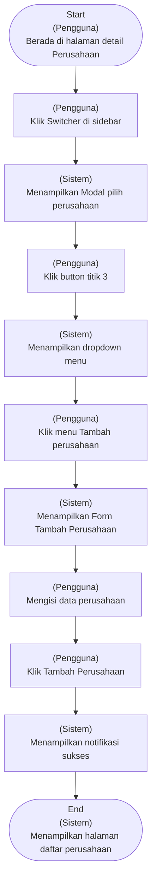

---

**CF-NG-CMP: Negative Flow – Tambah Perusahaan – Proses Tambah Perusahaan Gagal** (Negative Flow)

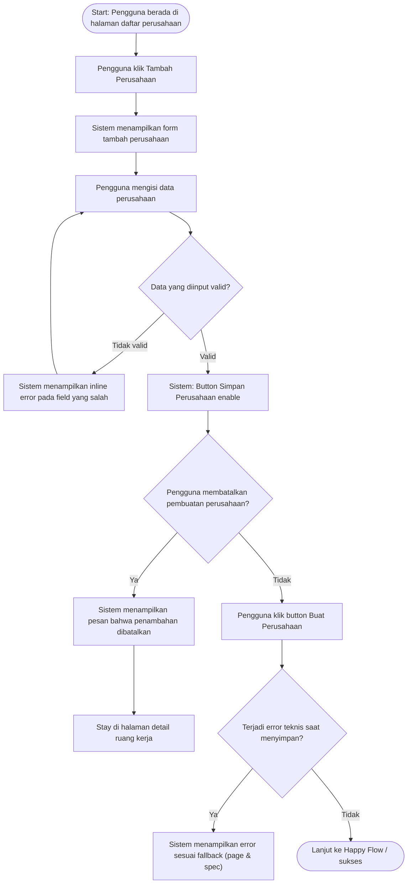

---

**CF-HP-CMP: Happy Flow – Tambah Perusahaan – Pengguna Berhasil Menambahkan Perusahaan** (Happy Flow)

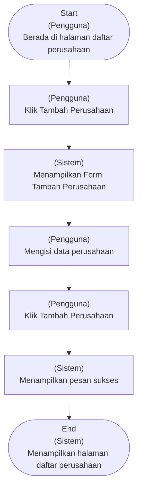

---

### Supporting Information

*Belum tersedia*

### Constraint and Consideration

**10.1.1. Analisis Security & Compliance**

- UU PDP (No. 27/2022) – Data identitas perusahaan & user yang mengaitkan perusahaan ke akun adalah data yang harus diproses secara sah
- aman
- dan sesuai tujuan.
- UU PDP – Relasi perusahaan dengan user (owner/admin) termasuk data yang dapat mengidentifikasi pihak tertentu.
- PP 71/2019 (PSTE) – Sistem wajib menjaga kerahasiaan dan keutuhan data perusahaan yang digunakan lintas aplikasi.
- GDPR / PDPA (baseline regional) – Data perusahaan yang dapat dikaitkan ke individu harus dibatasi aksesnya sesuai peran.

**10.1.2. Sensitivitas Data & Perlakuan**

- Nama Perusahaan
- ID Perusahaan
- User ID (Creator / Owner)
- Relasi User–Perusahaan
- ID Ruang Kerja

**10.2.1. Dampak ke Data/Fitur Lain**

Tidak ada

**10.2.2. Dampak ke Notifikasi**

Tidak Ada

**10.3.1. NFR (Non-Functional Requirements)**

- Sistem harus memproses penambahan perusahaan dan menampilkan hasilnya dalam waktu ≤2 detik untuk minimal 90% request (p90) setelah pengguna mengirimkan data.
- Sistem tidak boleh menyimpan data perusahaan dalam kondisi tidak lengkap
- Data perusahaan harus konsisten dan dapat digunakan lintas aplikasi GroApp
- Hanya user yang memiliki kewenangan yang dapat menambah perusahaan
- Data antar perusahaan harus terpisah dengan jelas
- Aksi tambah perusahaan
- baik berhasil maupun gagal
- harus dapat ditelusuri
- Alur tambah perusahaan mudah dipahami dan diselesaikan pengguna
- Sistem mendukung penambahan lebih dari satu perusahaan dalam satu akun

**10.4. Asumsi dan Risiko**

- User yang menambah perusahaan adalah user berwenang (owner / role berizin)
- User memahami bahwa penambahan perusahaan belum mencakup setup akuntansi
- Data perusahaan diisi secara benar oleh user
- Satu akun dapat mengelola lebih dari satu perusahaan
- Penambahan perusahaan tidak berdampak ke perusahaan lain
- Kegagalan sistem saat tambah perusahaan jarang terjadi
- Aplikasi lain menggunakan data perusahaan dari IAM

#### Success Metrics Fitur

**Indikator keberhasilan untuk fitur ini:**

| Kategori | Indikator | Alasan / Urgensi |
|----------|-----------|------------------|
| Adoption | ≥ 30% pengguna aktif menambahkan lebih dari satu perusahaan dalam satu akun dalam 90 hari pertama | Adoption menunjukkan bahwa fitur benar-benar digunakan untuk skenario bisnis berkembang (multi-perusahaan), bukan hanya sebagai kebutuhan awal onboarding. |
| Drop-off | ≤ 15% pengguna berhenti di tengah proses Tambah Perusahaan | Drop-off membantu mengidentifikasi adanya friksi atau kebingungan dalam flow. Batas ini menjaga agar proses penambahan perusahaan tidak menjadi hambatan utama, terutama bagi user di luar onboarding. |
| Completion | ≥ 85% pengguna yang memulai proses Tambah Perusahaan berhasil menyelesaikan pembuatan perusahaan | Completion menunjukkan apakah pengguna mampu menyelesaikan tujuan utama fitur. Angka ini mencerminkan bahwa proses cukup jelas dan tidak menghalangi user untuk melanjutkan penggunaan GroApp. |

### User Stories

**User Stories dalam fitur ini:**

1. [US-CMP-CANCEL](#user-story-1-us-cmp-cancel)
2. [US-CMP-CREATE](#user-story-2-us-cmp-create)
3. [US-CMP-INPUT](#user-story-3-us-cmp-input)
4. [US-CMP-OPENFORM ](#user-story-4-us-cmp-openform )
5. [US-CMP-TECHERR](#user-story-5-us-cmp-techerr)

##### User Story 1: US-CMP-CANCEL

**Sebagai Pengguna, saya ingin membatalkan proses tambah perusahaan sebelum data disimpan sehingga perusahaan tidak ditambahkan ke ruang kerja.**

**Scenario GWT:**

| Kode | Given | When | Then |
|------|-------|------|------|
| SC-2280 | Pengguna telah menjalankan skenario AC-CMP-INPUT-01<br>Samaseperti AC-CMP-INPUT-01 | Pengguna klik tombol Batal.<br>Button Batal on klik | Sistem menampilkan dialog konfirmasi pembatalan.<br>Dialog tampil di tengah layar<br>Background form menjadi overlay<br>Judul dialog: “Batalkan Tambah Perusahaan?”<br>deskripsi dialog: “Yakin ingin membatalkan proses ini?”<br>Tombol Kembali ke Form dan Ya enable |
| SC-2282 | Pengguna telah menjalankan skenario AC-CMP-CANCEL-01<br>Sama seperti AC-CMP-CANCEL-01 | Pengguna klik tombol Kembali ke Form.<br>Button Kembali ke Form diklik | Sistem menutup dialog konfirmasi pembatalan.<br>Dialog menghilang dari layar<br>indikator loading tampil<br>indikator loading pada screen tampil<br>screen dalam kondisi overlay |
| SC-2299 |  |  | Form Tambah Perusahaan  kembali tampil dengan data yang sudah diisi sebelumnya.<br>indikator loading dan overlay hilang<br>Field yang sebelumnya telah diisi tetap ada & menampilkan data yang sama<br>Tidak ada data yang dihapus atau di-reset |
| SC-2301 | Pengguna telah menjalankan skenario AC-CMP-CANCEL-01<br>Sama seperti AC-CMP-CANCEL-01 | Pengguna klik tombol Ya.<br>Button Ya diklik | Sistem menutup dialog konfirmasi pembatalan.<br>Dialog menghilang dari layar<br>indikator loading pada screen tampil<br>screen dalam kondisi overlay |
| SC-2302 |  | - | Pengguna kembali ke halaman Daftar Perusahaan<br>Indikator loading Dan overlay hilang<br>Halaman Daftar Perusahaan tampil kembali<br>Daftar perusahaan tidak bertambah |

**Acceptance Criteria:**

- **AC-CMP-CANCEL-03**: Penggunan memilih "Ya" pada dialog konfirmasi, form tertutup
tidak ada data yang tersimpan dan pengguna kembali ke halaman Daftar Persahaan
- **AC-CMP-CANCEL-02**: Pengguna memilih "Kembali ke Form" pada dialog konfirmasi, dialog tertutup
form tetap terbuka dengan data yang sudah diisi sebelumnya.
- **AC-CMP-CANCEL-01**: Penggunaklik tombol Batal, sistem menampilkan dialog konfirmasi pembatalan.

**Rekapitulasi Multibahasa:**

| Komponen | Bahasa Indonesia | English | Page |
|----------|------------------|---------|------|
| Modal Title | Batalkan Tambah Perusahaan? | Cancel Adding Company? | Detail Ruang Kerja |
| Modal Description | Yakin ingin membatalkan proses ini? | Are you sure you want to cancel this process? | Detail Ruang Kerja |
| Button | Kembali ke Form | Back to Form | Detail Ruang Kerja |
| Button | Batalkan | Cancel | Detail Ruang Kerja |
| Button | Batal | Cancel | Detail Ruang Kerja |

---

##### User Story 2: US-CMP-CREATE

**Sebagai Pengguna, saya ingin menyimpan data perusahaan agar perusahaan baru tersimpan di sistem dan saya menerima konfirmasi bahwa perusahaan berhasil ditambahkan.**

**Scenario GWT:**

| Kode | Given | When | Then |
|------|-------|------|------|
| SC-2304 | Pengguna telah menjalankan skenario  AC-CMP-INPUT-01<br>Sama dengan AC-CMP-INPUT-01 | Pengguna klik tombol Buat Perusahaan.<br>Button Tambah Perusahaan diklik<br>Button Batal tetap enable | Sistem memproses penyimpanan data perusahaan.<br>Tampilan overlay (blur)<br>muncul indikator loading |
| SC-2305 |  | - | Sistem menutup modal Tambah Perusahaan, dan mengarahkan pengguna kembali ke halaman Daftar Perusahaan.<br>menampilkan Perusahaan yang baru dibuat tampil pada daftar perusahaan dan sistem menampilkan  Pesan Sukses.<br>Modal Tambah Perusahaan tertutup<br>Halaman Daftar Perusahaan tampil<br>Perusahaan baru muncul paling atas daftar perusahaan & ter highlight  + ada label “Baru”. <br>Contoh : PT Karya Anak Bangsa - Baru<br>Menampilkan  Pesan<br>Judul : sukses!<br>Isi: “Perusahaan berhasil ditambahkan” |

**Acceptance Criteria:**

- **AC-CMP-SAVE-01**: Pengguna klik tombol Tambah Perusahaan, 
sistem menyimpan data perusahaan dan menampilkan pesan bahwa perusahaan berhasil ditambahkan. 
pengguna kembali ke halaman Daftar Perusahaan
perusahaan yang baru dibuat tampil pada daftar perusahaan.

**Rekapitulasi Multibahasa:**

| Komponen | Bahasa Indonesia | English | Page |
|----------|------------------|---------|------|
| Button | Batal | Cancel | Detail Ruang Kerja |
| Toast Message | Perusahaan berhasil ditambahkan | Company added successfully | Detail Ruang Kerja |
| Button | Buat Perusahaan | Create Company | Detail Ruang Kerja |

---

##### User Story 3: US-CMP-INPUT

**Sebagai Pengguna, saya ingin mengisi data perusahaan pada form tambah perusahaan sehingga informasi perusahaan dapat tersimpan di sistem.**

**Scenario GWT:**

| Kode | Given | When | Then |
|------|-------|------|------|
| SC-2250 | Pengguna telah menjalankan skenario SC-2491<br>Sama dengan SC-2491 | Pengguna Klik ke dropdown pilih ruang kerja dan memilih Ruang Kerja “RK Pribadi”<br>dropdown pilihan ruang kerja dipilih<br>Button Tambah Perusahaan disable<br>Button Batal enable | Sistem menampilkan nama ruang kerja yang telah dipilih pengguna<br>dropdown pilihan ruang kerja tampil RK Pribadi<br>Button Tambah Perusahaan disable<br>Button Batal enable |
| SC-2254 |  | Pengguna klik  ke field nama perusahaan dan mengisi field nama perusahaan dengan data yang valid.<br>Field Nama perusahaan on fokus<br>Field Nama perusahaan terisi dengan data yang valid. Contoh :  PT KARYA ANAK BANGSA<br>Button Tambah Perusahaan disable<br>Button Batal enable | Sistem menampilkan nama yang diinputkan dan memvalidasi bahwa format data telah sesuai.<br><br>Catatan Hi-Fi:<br>Field Nama perusahaan terisi dengan data yang valid. Contoh :  PT KARYA ANAK BANGSA<br>Tidak ada inline error yang tampil<br>Button Tambah Perusahaan disable<br>Button Batal enable |
| SC-2255 |  | Pengguna beralih ke drop down Jenis usaha dan memilih jenis usaha<br>dropdown jenis usaha di klik<br>pilihan dropdown tampil → Jasa, Retail & Manufaktur. contoh yang dipilih pengguna Jasa<br>Button buat perusahaan disable<br>Button batal enable | Sistem menampilkan field nama perusahaan & jenis usaha sudah terisi<br>Field Nama perusahaan terisi dengan data yang valid. Contoh :  PT KARYA ANAK BANGSA<br>Dropdown jenis usaha yang tampil : Jasa<br>Button buat perusahaan disable<br>Button batal enable |
| SC-2256 |  | Pengguna klik  ke field nama perusahaan dan mengisi field nama perusahaan dengan data yang tidak valid.<br>Field Nama perusahaan on fokus<br>Field Nama perusahaan terisi dengan data yang tidak valid. Contoh :  PT<br>Button Tambah Perusahaan disable<br>Button Batal enable |  |
| SC-2257 |  | Pengguna beralih dari field Nama Perusahaan ke Jenis Usaha<br>User klik Dropdown Jenis usaha. pilihan Jenis Usaha (Jasa,Retail,Manufaktur)<br>Button Tambah Perusahaan disable<br>Button Batal enable | Sistem menampilkan inline error di bawah field nama perusahaan.<br>Inline error Nama Perusahaan: Nama Perusahaan minimal 3 karakter.<br>Button Tambah Perusahaan disable<br>Button Batal enable |
| SC-2266 |  | Pengguna klik dropdown Jenis Usaha.<br>Dropdown Jenis Usaha on focus<br>Opsi dropdown tampil (Pilihannya : Jasa, Retail, Manufaktuf)<br>Button Tambah Perusahaan disable<br>Button Batal enable |  |
| SC-2274 | Pengguna telah menjalankan skenario AC-CMP-INPUT-02.<br>Sama seperti AC-CMP-INPUT-02. | Pengguna klik field Nama Perusahaan. <br>Field Nama Perusahaan on focus  <br>Inline error Nama Perusahaan masih tampil <br>Button Buat Perusahaan disable <br>Button Batal enable | - |
| SC-2275 |  | Pengguna memperbaiki isi field Nama Perusahaan menjadi valid dan  Pengguna keluar dari field Nama Perusahaan. <br>Contoh input: PT Karya Anak Bangsa<br>Button Tambah Perusahaan disable<br>Button Batal enable | Sistem Menampilkan Nama Perusahaan yang baru dan Inline error dibawah field nama perusahaan hilang<br>inline error hilang<br>Button Tambah Perusahaan disable <br>Button Batal enable |
| SC-2276 |  | Pengguna klik dropdown Jenis Usaha. <br>Dropdown Jenis Usaha on focus  <br>Opsi dropdown tampil (Jasa, Retail, Manufaktur)<br>klik ke jenis usaha Jasa<br>Button Tambah Perusahaan disable<br>Button Batal enable | Sistem menghilangkan inline error pada field Jenis <br>Usaha. <br>Inline error Jenis Usaha hilang <br>Field Jenis Usaha menampilkan value: Jasa <br>Button Buat Perusahaan disable <br>Button Batal enable |
| SC-2277 |  | Pengguna mengisi sisa  field wajib lainnya dengan data yang valid. <br>Negara sudah dipilih <br>Mata Uang Utama sudah diisi <br>Tidak ada inline error pada field lain | Sistem mengaktifkan tombol Tambah Perusahaan. <br>Semua field wajib dalam keadaan terisi & valid.<br>contoh: <br>Ruang Kerja : RK Pribadi<br>Nama Perusahaan : PT KARYA ANAK BANGSA<br>Jenis Usaha : Jasa<br>Negara : Indonesia<br>Mata Uang Utama : IDR<br>Tidak ada inline error yang tampil <br>Button Tambah Perusahaan enable <br>Button Batal tetap enable |
| SC-2493 |  | Pengguna beralih ke drop down Negara dan memilih Negara<br>dropdown Negara di klik<br>pilihan dropdown tampil → untuk MVP hanya Indonesia yang tampil<br>Button buat perusahaan disable<br>Button batal enable | Sistem menampilkan field nama perusahaan, jenis usaha dan Negara sudah terisi<br>Field Nama perusahaan terisi dengan data yang valid. Contoh :  PT KARYA ANAK BANGSA<br>Dropdown jenis usaha yang tampil : Jasa<br>Dropdown Negara yang tampil : Indonesia<br>Button Tambah Perusahaan disable<br>Button Batal enable |
| SC-2494 |  | Pengguna tidak memilih opsi apa pun pada dropdown Jenis Usaha, lalu keluar dari field tersebut.<br>Dropdown ditutup tanpa ada opsi yang dipilih<br>Placeholder “Pilih Jenis Usaha” tetap tampil <br>Button Buat Perusahaan disable<br>Button Batal enable | Sistem menampilkan inline error di bawah field Jenis Usaha.<br>Inline error Jenis Usaha: “Pilih jenis usaha terlebih dahulu”<br>Inline error Nama Perusahaan tetap tampil<br>Button Buat Perusahaan disable<br>Button Batal enable |
| SC-2607 |  | Pengguna beralih ke drop down Mata Uang Utama dan memilih Mata Uang Utama<br>dropdown Mata Uang Utama di klik<br>pilihan dropdown tampil → untuk MVP hanya IDR yang tampil<br>Button buat perusahaan disable<br>Button batal enable | Sistem menampilkan field nama perusahaan, jenis usaha, Negara dan Mata Uang Utama sudah terisi<br>Field Nama perusahaan terisi dengan data yang valid. Contoh :  PT KARYA ANAK BANGSA<br>Dropdown jenis usaha yang tampil : Jasa<br>Dropdown Negara yang tampil : Indonesia<br>Dropdown Mata Uang Utama yang tampil : IDR<br>Button Tambah Perusahaan enable<br>Button Batal enable |
| SC-2608 | Pengguna telah menjalankan skenario SC-2491<br>Sama dengan SC-2491 | Pengguna Klik ke dropdown pilih ruang kerja dan memilih Ruang Kerja “RK Pribadi”<br>dropdown pilihan ruang kerja dipilih<br>Button Tambah Perusahaan disable<br>Button Batal enable | Sistem menampilkan nama ruang kerja yang telah dipilih pengguna<br>dropdown pilihan ruang kerja tampil RK Pribadi<br>Button Tambah Perusahaan disable<br>Button Batal enable |

**Acceptance Criteria:**

- **AC-CMP-INPUT-03**: Pengguna memperbaiki field yang sebelumnya error menjadi valid, pesan error akan hilang dan tombol "Tambah Perusahaan" menjadi Enable
- **AC-CMP-INPUT-02**: Pengguna mengisi field dengan format yang tidak valid atau ada field wajib yang masih kosong, sistem akan menampilkan pesan inlineerror di bawah field tersebut dan tombol "Tambah Perusahaan" disable.
- **AC-CMP-INPUT-01**: Pengguna mengisi semua field wajib dengan format yang valid, tombol "Tambah Perusahaan" Enable.

**Form Specification:**

| Kolom/Field | Tipe | Wajib Diisi | Unik | Max/Min Karakter | Placeholder | Catatan |
|-------------|------|-------------|------|------------------|-------------|---------|
| Mata Uang Utama | Dropdown | Ya | Tidak |  | Pilih Mata Uang | untuk MVP hanya IDR |
| Jenis Usaha | Dropdown | Ya | Tidak |  | Pilih Jenis Usaha |  |
| Negara | Dropdown | Ya | Tidak |  | Pilih Negara |  |
| Nama Perusahaan | Text | Ya | Ya | 3-60 | Contoh: PT Kreasi Anak Bangsa | Aturan Penamaan Perusahaan:<br>Auto-Uppercase<br>Hanya boleh huruf, angka, titik, dan koma<br>Nama Perusahaan tidak boleh duplicate dalam 1 Ruang Kerja<br>60 karakter  (include spasi) |

**Field Error Messages:**

| Field | Input | Respon Sistem | Deskripsi Error | Momen Validasi | Catatan |
|-------|-------|---------------|-----------------|----------------|---------|
| Nama Perusahaan | Kurang dari 3 karakter | Inline Field Error | Nama Perusahaan minimal 3 karakter. | On Blur |  |
| Nama Perusahaan | Lebih dari 60 karakter | Inline Field Error | Nama Perusahaan maksimal 60 karakter. | On Blur | ketika user typing di karakter ke 60 inline error tampil & user gak bisa typing lagi |
| Nama Perusahaan | Mengandung karakter selain huruf, angka, titik, atau koma | Inline Field Error | Nama Perusahaan hanya boleh berisi huruf, angka, titik, dan koma. | On Blur |  |
| Nama Perusahaan | Nama perusahaan sudah terdaftar dalam 1 Ruang Kerja | Inline Field Error | Nama Perusahaan sudah digunakan di Ruang Kerja ini. Gunakan nama lain agar data tetap rapi. | On Blur | Cek unique dalam 1 Ruang Kerja |
| Jenis Usaha | Belum dipilih | Inline Field Error | Pilih Jenis Usaha terlebih dahulu. | On Blur |  |
| Negara | Belum dipilih | Inline Field Error | Pilih Negara terlebih dahulu. | On Blur |  |
| Mata Uang Utama | Belum dipilih | Inline Field Error | Pilih Mata Uang terlebih dahulu. | On Blur |  |
| Nama Perusahaan | Kosong | Inline Field Error | Nama Perusahaan wajib diisi. | On Blur |  |

**Rekapitulasi Multibahasa:**

| Komponen | Bahasa Indonesia | English | Page |
|----------|------------------|---------|------|
| Inline Error | Pilih Mata Uang terlebih dahulu. | Please select a currency | Detail Ruang Kerja |
| Inline Error | Minimal 3 karakter. | Minimum 3 characters. | Detail Ruang Kerja |
| Inline Error | Maksimal 60 karakter. | Maximum 60 characters. | Detail Ruang Kerja |
| Inline Error | Hanya huruf, angka, titik, dan koma. | Only letters, numbers, periods, and commas are allowed. | Detail Ruang Kerja |
| Inline Error | Nama sudah digunakan di ruang kerja ini. | This name is already used in this workspace. | Detail Ruang Kerja |
| Inline Error | Pilih jenis usaha terlebih dahulu. | Please select a business type. | Detail Ruang Kerja |
| Inline Error | Pilih negara terlebih dahulu. | Please select a country. | Detail Ruang Kerja |
| Inline Error | Nama perusahaan perlu diisi. | Company name is required. | Detail Ruang Kerja |

---

##### User Story 4: US-CMP-OPENFORM 

**Sebagai Pengguna, saya ingin membuka form tambah perusahaan agar saya dapat memasukkan data perusahaan baru.**

**Scenario GWT:**

| Kode | Given | When | Then |
|------|-------|------|------|
| SC-2228 | Pengguna berada di halaman Detail Perusahaan<br>Catatn Hifi:<br>sama seperti halaman detail perusahaan | Pengguna klik profile di pojok kanan atas navbar<br>profile diklik | Sistem menampilkan menu dropdown <br>isi menu dropdown:<br>Daftar Ruang Kerja <br>Daftar Perusahaan<br>Logout |
| SC-2229 | - | Pengguna klik menu daftar perusahaan<br>menu daftar perusahaan di klik | Sistem memuat halaman daftar perusahaan<br>screen overlay<br>indikator loading tampil |
| SC-2490 | Pengguna telah menjalankan skenario SC-2604 atau SC-2606<br>Sama Seperti  SC-2604 atau SC-2606 | Pengguna menekan tombol Tambah Perusahaan <br>pengguna klik Tambah Perusahaan | Sistem Memuat modal form tambah perusahaan<br>Loading state tampil |
| SC-2491 | - | - | Sistem menampilkan form Tambah Perusahaan <br>loading indikator hilang<br>Background halaman menjadi overlay<br>Modal muncul di tengah halaman. Field yang ada di form:<br>Header (Read Only). isi header:<br>Masukkan data perusahaan baru<br>Pilih Ruang kerja* → dropdown<br>Nama Perusahaan<br>Jenis Usaha<br>Negara<br>Mata Uang<br>Informasi Tambahan<br>Identitas Perusahaan<br>Logo Perusahaan<br>Tanggal Pembuatan Perusahaan<br>Tanggal Pendirian Perusahaan<br>Alamat<br>Provinsi<br>Kota/Kabupaten<br>Kecamatan<br>Kelurahan/Desa<br>Kode Pos<br>Alamat Lengkap<br>Kontak <br>Email<br>No Telepon<br>No WhatsApp<br>Website<br>Legal & Administrasi <br>NPWP, <br>NIB, <br>Status PKP<br>Nomor SPPKP<br>Tahun Buku<br>Tanggal Mulai Pembukuan<br>Tampil tombol Tambah Perusahaan dan Batal. |
| SC-2604 | - | - | Halaman Daftar Perusahaan selesai dimuat.<br>Indikator loading hilang<br>Tampil halaman daftar Perusahaan<br>Tampil tombol Tambah Perusahaan |
| SC-2605 | Pengguna berada di halaman Detail Perusahaan<br><br>Catatn Hifi:<br>sama seperti halaman detail perusahaan | Pengguna klik navigasi switcher di sidebar <br>Navigasi switcher di klik <br>info : namanya adalah Nama perusahaan yang sedang dibuka pengguna (aktif). | Sistem menampilkan popup modal<br><br>Catatan hifil:<br>Header modal : Pilih Perusahaan<br>ada button titik 3 yang isinya: Daftar Ruang Kerja, Daftar Perusahaan & Tambah Perusahaan<br>body modal : Tabel yang berisi nama perusahaan dan nama ruang kerja, dilengkapi aksi Set as Default agar sistem dapat langsung mengarahkan pengguna ke halaman detail perusahaan tersebut saat berhasil login |
| SC-2606 |  | Pengguna Klik button titik 3 <br>button titik 3 diklik. | sistem menampilkan menu Daftar Ruang Kerja, Daftar Perusahaan & Tambah Perusahaan<br>button titik 3 yang isinya: Daftar Ruang Kerja, Daftar Perusahaan & Tambah Perusahaan tampil |

**Acceptance Criteria:**

- **AC-CMP-OPENFORM -02**: Pengguna dapat mengakses Button tambah perusahaan untuk membuka form Tambah Perusahaan melalui menu pada sidebar.
- **AC-CMP-OPENFORM -03**: Setelah Pengguna menekan tombol “Tambah Perusahaan”, sistem menampilkan modal form Tambah Perusahaan kepada pengguna.
- **AC-CMP-OPENFORM -01**: Pengguna dapat mengakses form Tambah Perusahaan melalui menu akun profile pada navbar.

**Form Specification:**

| Kolom/Field | Tipe | Wajib Diisi | Unik | Max/Min Karakter | Placeholder | Catatan |
|-------------|------|-------------|------|------------------|-------------|---------|
| Tanggal Mulai Pembukuan | Date Picker | Tidak | Tidak |  | Pilih tanggal mulai pembukuan |  |
| Tahun Buku | Text | Tidak | Tidak |  | Contoh : 2026 |  |
| Nomor SPPKP | Text | Tidak | Tidak |  | Contoh : PEM-80.KPJ21/2025 |  |
| Status PKP | Text | Tidak | Tidak |  |  |  |
| NIB | Text | Tidak | Tidak |  | Contoh : 812358192100211 |  |
| NPWP | Text | Tidak | Tidak |  | Contoh : 123456789999000 |  |
| Website | Text | Tidak | Tidak |  | Contoh : www.hajiudin.pixel.id |  |
| Nomor Whatsapp | Phone | Tidak | Tidak |  | Contoh : 081234567891 |  |
| Nomor Telepon | Phone | Tidak | Tidak |  | Contoh : 021 - 6588912 |  |
| Email | Email | Tidak | Tidak |  | Contoh :  hajiudin21@sample.com |  |
| Alamat Lengkap | Text | Tidak | Tidak |  | Contoh : Jl. Melati Blok C no. 65 |  |
| Kode Pos | Number | Tidak | Tidak |  | Contoh : 65143 |  |
| Kelurahan/Desa | Dropdown | Tidak | Tidak |  | Pilih Kelurahan atau Desa |  |
| Kecamatan | Dropdown | Tidak | Tidak |  | Pilih Kecamatan |  |
| Kota/Kabupaten | Dropdown | Tidak | Tidak |  | Pilih Kota atau Kabupaten |  |
| Provinsi | Dropdown | Tidak | Tidak |  | Pilih Provinsi |  |
| Jumlah Unit Usaha | Number | Tidak | Tidak |  | Jumlah Unit Usaha |  |
| Tanggal Pendirian Perusahaan | Date Picker | Tidak | Tidak |  | Pilih tanggal pendirian perusahaan |  |
| Tanggal Pembuatan Perusahaan | Date Picker | Tidak | Tidak |  | Pilih tanggal pembuatan perusahaan |  |
| Logo Perusahaan | Image Upload | Tidak | Tidak |  | Unggah logo perusahaan Anda |  |
| Mata Uang Utama | Dropdown | Ya | Tidak |  | Pilih Mata Uang | untuk MVP hanya IDR |
| Jenis Usaha | Dropdown | Ya | Tidak |  | Pilih Jenis Usaha | Jenis Usaha : Jasa, Retail, Manufaktur |
| Negara | Dropdown | Ya | Tidak |  | Pilih Negara | untuk MVP hanya Indonesia |
| Nama Perusahaan | Text | Ya | Ya | 3-60 | Contoh: PT Kreasi Anak Bangsa / Toko Haji Udin | Aturan Penamaan Perusahaan:<br>Auto-Uppercase<br>Hanya boleh huruf, angka, titik, dan koma<br>Nama Perusahaan dalam 1 ruang kerja bisa sama ketika dari owner yang berbeda, misal:<br>Ruang kerja Shania<br>PT MAJU JALAN<br>PT MAJU JALAN - dibagikan oleh galuh<br>Nama perusahaan tidak boleh sama jika pemiliknya sama.<br>60 karakter  (include spasi) |

**Field Error Messages:**

| Field | Input | Respon Sistem | Deskripsi Error | Momen Validasi | Catatan |
|-------|-------|---------------|-----------------|----------------|---------|
| Mata Uang Utama | Belum dipilih | Inline Field Error | Pilih Mata Uang terlebih dahulu. | On Blur |  |
| Nama Perusahaan | Kurang dari 3 karakter | Inline Field Error | Nama Perusahaan minimal 3 karakter. | On Blur |  |
| Nama Perusahaan | Lebih dari 60 karakter | Inline Field Error | Nama Perusahaan maksimal 60 karakter. | On Blur | ketika user typing di karakter ke 60 inline error tampil & user gak bisa typing lagi |
| Nama Perusahaan | Mengandung karakter selain huruf, angka, titik, atau koma | Inline Field Error | Nama Perusahaan hanya boleh berisi huruf, angka, titik, dan koma. | On Blur |  |
| Nama Perusahaan | Nama perusahaan sudah terdaftar dalam 1 Ruang Kerja | Inline Field Error | Nama Perusahaan sudah digunakan di Ruang Kerja ini. Gunakan nama lain agar data tetap rapi. | On Blur | Cek unique dalam 1 Ruang Kerja |
| Jenis Usaha | Belum dipilih | Inline Field Error | Pilih Jenis Usaha terlebih dahulu. | On Blur |  |
| Negara | Belum dipilih | Inline Field Error | Pilih Negara terlebih dahulu. | On Blur |  |
| Nama Perusahaan | Kosong | Inline Field Error | Nama Perusahaan wajib diisi. | On Blur |  |

**Rekapitulasi Multibahasa:**

| Komponen | Bahasa Indonesia | English | Page |
|----------|------------------|---------|------|
| Placeholder | Pilih Negara | Select Country | Daftar Perusahaan |
| Label | Mata Uang Utama | Primary Currency | Daftar Perusahaan |
| Placeholder | Pilih Mata Uang | Select Currency | Daftar Perusahaan |
| Label | Logo Perusahaan | Company Logo | Daftar Perusahaan |
| Placeholder | Unggah logo perusahaan Anda | Upload your company logo | Daftar Perusahaan |
| Label | Tanggal Pembuatan Perusahaan | Company Creation Date | Daftar Perusahaan |
| Placeholder | Pilih tanggal pembuatan perusahaan | Select company creation date | Daftar Perusahaan |
| Label | Tanggal Pendirian Perusahaan | Company Establishment Date | Daftar Perusahaan |
| Placeholder | Pilih tanggal pendirian perusahaan | Select company establishment date | Daftar Perusahaan |
| Label | Jumlah Unit Usaha | Number of Business Units | Daftar Perusahaan |
| Placeholder | Jumlah Unit Usaha | Number of Business Units | Daftar Perusahaan |
| Label | Provinsi | Province | Daftar Perusahaan |
| Placeholder | Pilih Provinsi | Select Province | Daftar Perusahaan |
| Label | Kota/Kabupaten | City/Regency | Daftar Perusahaan |
| Placeholder | Pilih Kota atau Kabupaten | Select City or Regency | Daftar Perusahaan |
| Label | Kecamatan | District | Daftar Perusahaan |
| Placeholder | Pilih Kecamatan | Select District | Daftar Perusahaan |
| Label | Kelurahan/Desa | Subdistrict/Village | Daftar Perusahaan |
| Placeholder | Pilih Kelurahan atau Desa | Select Subdistrict or Village | Daftar Perusahaan |
| Label | Kode Pos | Postal Code | Daftar Perusahaan |
| Placeholder | Contoh: 65143 | Example: 65143 | Daftar Perusahaan |
| Label | Alamat Lengkap | Full Address | Daftar Perusahaan |
| Placeholder | Contoh: Jl. Melati Blok C no. 65 | Example: Jl. Melati Block C no. 65 | Daftar Perusahaan |
| Label | Email | Email | Daftar Perusahaan |
| Placeholder | Contoh: hajiudin21@sample.com | Example : hajiudin21@sample.com | Daftar Perusahaan |
| Label | Nomor Telepon | Phone Number | Daftar Perusahaan |
| Placeholder | Contoh: 021 - 6588912 | Example: 021 - 6588912 | Daftar Perusahaan |
| Label | Nomor Whatsapp | WhatsApp Number | Daftar Perusahaan |
| Placeholder | Contoh: 081234567891 | Example: 081234567891 | Daftar Perusahaan |
| Label | Website | Website | Daftar Perusahaan |
| Placeholder | Contoh: www.hajiudin.pixel.id |  | Daftar Perusahaan |
| Example: www.hajiudin.pixel.id |  |  | Daftar Perusahaan |
| Label | NPWP | Tax ID (NPWP) | Daftar Perusahaan |
| Placeholder | Contoh: 123456789999000 | Example: 123456789999000 | Daftar Perusahaan |
| Label | NIB | Business Identification Number (NIB) | Daftar Perusahaan |
| Placeholder | Contoh: 812358192100211 | Example: 812358192100211 | Daftar Perusahaan |
| Label | Status PKP | VAT Registered Status | Daftar Perusahaan |
| Placeholder | - | - | Daftar Perusahaan |
| Label | Nomor SPPKP | SPPKP Number | Daftar Perusahaan |
| Placeholder | Contoh: PEM-80.KPJ21/2025 | Example: PEM-80.KPJ21/2025 | Daftar Perusahaan |
| Label | Tahun Buku | Fiscal Year | Daftar Perusahaan |
| Placeholder | Contoh: 2026 | Example: 2026 | Daftar Perusahaan |
| Label | Tanggal Mulai Pembukuan | Accounting Start Date | Daftar Perusahaan |
| Placeholder | Pilih tanggal mulai pembukuan | Select Accounting Start Date | Daftar Perusahaan |
| Label | Negara | Country | Daftar Perusahaan |
| Placeholder | Pilih Jenis Usaha | Select Business Type | Daftar Perusahaan |
| Label | Jenis Usaha | Business Type | Daftar Perusahaan |
| Placeholder | Contoh: PT Kreasi Anak Bangsa / Toko Haji Udin | Example: PT Kreasi Anak Bangsa / Haji Udin Store | Daftar Perusahaan |
| Label | Nama Perusahaan | Company Name | Daftar Perusahaan |
| Button | Tambah Perusahaan | Add Company | Daftar Perusahaan |
| Button | Batal | Cancel | Daftar Perusahaan |
| Modal Title | Tambah perusahaan ke [Nama Ruang Kerja] | Add company to [Workspace Name] | Daftar Perusahaan |

---

##### User Story 5: US-CMP-TECHERR

**Sebagai Pengguna, saya ingin mendapatkan pesan error teknis ketika terjadi kegagalan sistem sehingga saya mengetahui bahwa proses belum berhasil dan dapat mencoba kembali.**

**Scenario GWT:**

| Kode | Given | When | Then |
|------|-------|------|------|
| SC-2308 | Pengguna telah mnjalankan skenario SC-2304<br>Sama seperti SC-2304 | Sistem memproses penambahan data perusahaan | Sistem gagal saat memproses Tambah Perusahaan. Sistem menampilkan pesan error teknis sesuai GenSpec <br>loading indikator hilang<br>Tampil Error teknis sesuai GenSpec |

**Acceptance Criteria:**

- **AC-CMP-TECHERR-01**: Sistem menampilkan pesan error teknis yang jelas ketika terjadi kegagalan sistem saat proses Tambah Perusahaan.
Detail pesan error teknis mengacu pada General Specification (GenSpec)
Sistem tidak mencatat perusahaan sebagai berhasil dibuat ketika terjadi error teknis.

**Form Specification:**

| Kolom/Field | Tipe | Wajib Diisi | Unik | Max/Min Karakter | Placeholder | Catatan |
|-------------|------|-------------|------|------------------|-------------|---------|
|  |  |  |  |  |  |  |

---


## Fitur: Lihat Daftar Semua Perusahaan

### Problem Statement Fitur

GroApp sedang membangun ekosistem ERP modular yang diawali dengan aplikasi GroApp Access sebagai sistem Identity & Access Management (IAM). GroApp Access berfungsi sebagai fondasi utama sebelum modul bisnis lain, seperti GroApp Accounting, dikembangkan dan digunakan.
Dalam arsitektur produk GroApp, struktur entitas bersifat hierarkis:
User → Ruang Kerja → Perusahaan → Unit Usaha
Satu akun user dapat memiliki banyak ruang kerja. Setiap ruang kerja dapat berisi banyak perusahaan, dan setiap perusahaan dapat memiliki banyak unit usaha. Struktur ini dirancang untuk mendukung skenario ERP multi-organisasi dan multi-bisnis dalam satu akun.
Fitur Daftar Perusahaan berada dalam konteks Detail Ruang Kerja dan berperan sebagai representasi konteks organisasi, bukan sebagai fitur operasional bisnis. Di halaman ini, pengguna dapat melihat seluruh perusahaan yang berada di bawah satu ruang kerja tertentu serta membuat perusahaan baru jika diperlukan.
Daftar perusahaan menjadi gerbang sebelum pengguna masuk ke domain yang lebih dalam, seperti pengelolaan unit usaha atau modul bisnis (misalnya akuntansi). Oleh karena itu, fitur ini sengaja dirancang sederhana dan fokus pada kejelasan konteks, bukan kelengkapan informasi.
Selain itu, saat ini pembuatan perusahaan hanya dapat dilakukan melalui GroApp Access. Namun ke depannya, ketika GroApp Accounting telah tersedia, pembuatan perusahaan juga dapat dilakukan dari modul tersebut. Perusahaan yang dibuat dari modul lain tetap akan muncul dan terdaftar secara konsisten di Daftar Perusahaan pada GroApp Access, karena GroApp Access berperan sebagai sumber kebenaran (single source of truth) untuk struktur organisasi.

### Goal Fitur

Fitur Daftar Perusahaan di Detail Ruang Kerja bertujuan membantu pengguna memahami dan mengelola konteks organisasinya dengan jelas dengan menampilkan seluruh perusahaan yang berada di bawah satu ruang kerja, baik perusahaan yang dimiliki langsung oleh pengguna maupun perusahaan milik pihak lain yang dapat diakses oleh pengguna.
Melalui daftar ini, pengguna dapat mengetahui dengan pasti batas kepemilikan dan aksesnya terhadap perusahaan-perusahaan yang tersedia, serta memilih atau membuat perusahaan sebagai prasyarat sebelum melanjutkan ke pengelolaan unit usaha maupun modul bisnis lain seperti GroApp Accounting.

### In Scope Fitur

1. Menampilkan nama ruang kerja
Menampilkan daftar perusahaan yang berada di bawah ruang kerja terpilih
Menampilkan total perusahaan milik user dan total perusahaan dengan akses (bukan milik user)
Aksi membuat perusahaan dari detail ruang kerja
Akses ke halaman detail perusahaan
Aksi mengedit nama ruang kerja

### Case Flow

**CF-AL-CPL: Alternative Flow – Daftar Perusahaan – Pengguna Mengakses Daftar Perusahaan Melalui Switcher Sidebar** (Alternative Flow)

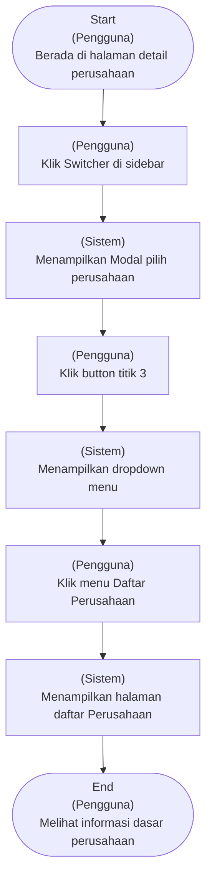

---

**CF-NG-CPL: Negative Flow – Daftar Perusahaan – Gagal Memuat Daftar Perusahaan** (Negative Flow)

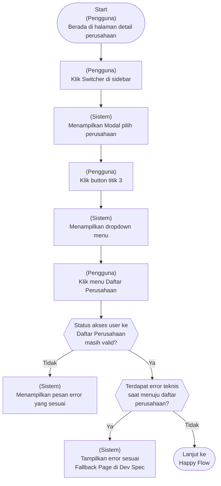

---

**CF-HP-CPL: Happy Flow – Daftar Perusahaan – Pengguna Melihat daftar Perusahaan** (Happy Flow)

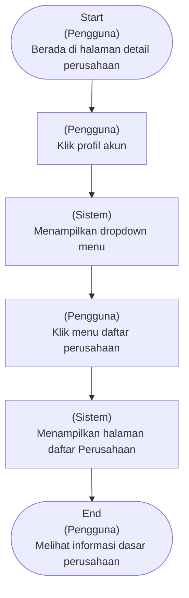

---

### Supporting Information

*Belum tersedia*

### Constraint and Consideration

**10.1.1. Analisis Security & Compliance**

- UU PDP No. 27/2022 – Data yang dapat mengidentifikasi individu (user) dan relasi akses wajib diproses sesuai prinsip perlindungan data pribadi (tujuan jelas
- minimisasi data
- pembatasan akses).
- PP 71/2019 (PSTE) – Sistem wajib menjamin kerahasiaan dan integritas data organisasi serta membatasi akses sesuai kewenangan.
- GDPR / PDPA (baseline regional) – Informasi akses & kepemilikan organisasi termasuk personal data berbasis konteks kerja dan harus dibatasi visibilitasnya.
- OWASP Top 10 (Access Control) – Data daftar perusahaan tidak boleh bisa diakses lintas ruang kerja atau lintas user tanpa hak.
- ISO 27001 (Access Control & Logging) – Akses ke daftar perusahaan harus berbasis role & tercatat secara sistematis.
- GroApp Security Baseline (IAM) – GroApp Access berperan sebagai single source of truth struktur organisasi dan kontrol akses.

**10.1.2. Sensitivitas Data & Perlakuan**

- User ID
- ID Ruang Kerja
- ID Perusahaan
- Nama Perusahaan
- Peran User di Perusahaan
- Status Akses (Milik / Akses)
- Histori Akses Perusahaan
- Timestamp Akses

**10.2.1. Dampak ke Data/Fitur Lain**

Tidak ada dampak langsung ke fitur/data yang sudah ada

**10.2.2. Dampak ke Notifikasi**

Tidak ada

**10.3.1. NFR (Non-Functional Requirements)**

- Sistem harus menampilkan daftar perusahaan dalam waktu ≤2 detik untuk minimal 90% request (p90) setelah pengguna mengklik halaman daftar perusahaan.
- Sistem tidak boleh menampilkan daftar perusahaan dalam kondisi tidak lengkap atau ambigu.
- Daftar perusahaan dan ringkasan jumlah (milik vs akses) harus selalu konsisten.
- Hanya perusahaan yang sesuai dengan hak akses user pada ruang kerja aktif yang boleh ditampilkan.
- Data dan konteks antar perusahaan harus terpisah dengan jelas dalam satu akun user.
- Perpindahan konteks perusahaan harus dapat ditelusuri secara internal jika terjadi isu.
- Konteks ruang kerja dan perusahaan aktif harus mudah dikenali oleh pengguna.
- Sistem mampu menampilkan lebih dari satu perusahaan dalam satu ruang kerja tanpa menurunkan usability.

**10.4. Asumsi dan Risiko**

- User selalu memilih Ruang Kerja sebelum melihat daftar perusahaan
- Sistem IAM sudah mampu menentukan hak akses user ke perusahaan dengan benar
- Relasi Ruang Kerja – Perusahaan konsisten dan valid
- User memahami perbedaan perusahaan milik sendiri dan perusahaan dengan akses
- Data minimum perusahaan (nama
- relasi akses) selalu tersedia
- Jumlah perusahaan per user masih relatif terbatas (fase awal)
- GroApp Access tetap menjadi single source of truth struktur organisasi
- User mengandalkan daftar perusahaan sebagai penentu konteks kerja

#### Success Metrics Fitur

**Indikator keberhasilan untuk fitur ini:**

| Kategori | Indikator | Alasan / Urgensi |
|----------|-----------|------------------|
| Clarity (Context Understanding) | ≥ 85% user memahami perbedaan antara perusahaan milik sendiri dan perusahaan dengan akses (shared) | Fitur ini membantu user memahami batas kepemilikan dan akses. Pada sistem IAM/Admin, tingkat pemahaman ≥85% digunakan sebagai ambang aman untuk mencegah salah asumsi kepemilikan yang dapat berujung pada kesalahan operasional. |
| Discoverability | ≥ 80% user dapat menemukan Daftar Perusahaan dalam waktu ≤ 5 detik | Daftar perusahaan berfungsi sebagai konteks orientasi, bukan fitur eksplorasi. Berdasarkan prinsip usability (Nielsen Norman Group), 5 detik merupakan ambang batas orientasi awal. Waktu lebih lama mengindikasikan konteks tidak cukup jelas. |
| Adoption | ≥ 70% user memiliki minimal 1 perusahaan (baik milik sendiri maupun hasil share akses) dalam satu ruang kerja pada H+30 | Indikator ini memvalidasi bahwa struktur ruang kerja → perusahaan relevan dengan kebutuhan user. Angka 70% digunakan sebagai baseline umum pada produk ERP B2B tahap awal, di mana mayoritas user mengelola setidaknya satu entitas bisnis. |
| Completion | ≥ 95% user yang login berhasil membuka Detail Ruang Kerja dan melihat Daftar Perusahaan | Completion memastikan user berhasil mencapai konteks organisasi utama. Pada sistem ERP/IAM, konteks organisasi adalah jalur wajib pasca-login. Jika metrik ini rendah, berarti terdapat masalah mendasar pada navigasi atau penentuan konteks awal. |

### User Stories

**User Stories dalam fitur ini:**

1. [US-CPL-SCRCH](#user-story-1-us-cpl-scrch)
2. [US-CPL-SLCFTR](#user-story-2-us-cpl-slcftr)
3. [US-CPL-TECHERR](#user-story-3-us-cpl-techerr)
4. [US-CPL-VIEW](#user-story-4-us-cpl-view)

##### User Story 1: US-CPL-SCRCH

**Sebagai pengguna, saya ingin mencari nama perusahaan melalui fitur pencarian di halaman daftar perusahaan sehingga saya dapat menemukan perusahaan yang ingin saya cari dengan lebih cepat.**

**Scenario GWT:**

| Kode | Given | When | Then |
|------|-------|------|------|
| SC-2619 | Pengguna telah menjalankan skenario SC-2610 atau SC-2615<br><br>Catatn hifi :<br>Sama Seperti SC-2610 atau SC-2615 | pengguna klik fitur search dan menginputkan nama perusahaan<br>Pengguna menginputkan nama merusahaan PT KARYA ANAK BANGSA di dalam search | Sistem menampilkan indikator loading saat mencari nama perusahaan yang di inputkan pengguna<br>tampil indikator loading |
| SC-2621 | - | - | Proses pencarian selesai dan  PT KARYA ANAK BANGSA ditemukan<br> indikator loading hilang <br>di halaman daftar perusahaan hanya tampil PT KARYA ANAK BANGSA |
| SC-2622 | Pengguna telah menjalankan skenario SC-2610 atau SC-2615<br><br>Catatn hifi :<br>Sama Seperti SC-2610 atau SC-2615 | pengguna klik fitur search dan menginputkan nama perusahaan<br>Pengguna menginputkan nama merusahaan PT YAHOO di dalam search | Sistem menampilkan indikator loading saat mencari nama perusahaan yang di inputkan pengguna<br>tampil indikator loading |
| SC-2623 | - | - | Proses pencarian selesai dan  PT KYAHOO Tidak ditemukan<br> indikator loading hilang <br>di halaman daftar perusahaantampil pesan:<br>ilustrasi data tidak ditemukan.<br>Title: Perusahaan belum ditemukan<br>Deskripsi: Sepertinya perusahaan yang Anda cari belum tersedia. Yuk, coba periksa kembali kata kunci yang dimasukkan. |

**Acceptance Criteria:**

- **US-CPL-SCRCH-02**: Pengguna dapat memasukkan kata kunci nama perusahaan pada fitur pencarian di halaman daftar perusahaan.
Sistem menampilkan kondisi tidak ditemukan ketika tidak ada perusahaan yang sesuai dengan kata kunci.
- **US-CPL-SCRCH-01**: Pengguna dapat memasukkan kata kunci nama perusahaan pada fitur pencarian di halaman daftar perusahaan.
Sistem menampilkan hasil yang relevan berdasarkan nama perusahaan yang dicari.

---

##### User Story 2: US-CPL-SLCFTR

**Sebagai pengguna, saya ingin melihat daftar perusahaan berdasarkan perusahaan yang saya pilih**

**Scenario GWT:**

| Kode | Given | When | Then |
|------|-------|------|------|
| SC-2618 | Pengguna telah menjalankan skenario SC-2313atau SC-2614<br>Sama Seperti skenario SC-2313 atau SC-2614 | Pengguna klik filter Ruang kerja dan memilih ruangkerja<br>filter ruang kerja isinya:<br>fitur search untuk mencari Ruang kerja berdasarkan nama Ruang kerja<br>semua ruang kerja yang dimiliki pengguna. <br>pengguna memilih RK Pribadi dan Bisnisku <br>button Terapkan<br>button Atur Ulang | Sistem menampilkan perusahaan yang beradi di dalam ruang kerja RK Pribadi dan Bisnisku<br>Tampil tombol Tambah Perusahaan <br>Filter yang dipilih RK Pribadi dan Bisnisku<br>daftar perusahaan yang tampil: perusahaan yang berada di RK Pribadi dan Bisnisku<br>fitur search untuk mencari perusahaan berdasarkan nama<br>daftar perusahaan : Logo Perusahaan, Nama perusahaan, total unit usaha, unit usaha aktif & non aktif, status kepemilikan (shared by nama orang / milik sendiri)<br>jika pengguna tidak memasukkan logo perusahaan maka yang tampil Pake placeholder image  dengan inisial nama perusahaan contoh Nama Perusahaan MAJU JAYA maka:<br> MJ dan MAJU JAYA — dibagikan oleh shania. |

**Acceptance Criteria:**

- **US-CPL-SLCFTR-01**: Pengguna dapat memilih Ruang Kerja melalui filter yang tersedia.
Sistem menampilkan daftar perusahaan sesuai Ruang Kerja yang dipilih.
Sistem memperbarui daftar perusahaan ketika pengguna mengubah pilihan Ruang Kerja.

---

##### User Story 3: US-CPL-TECHERR

**Sebagai pengguna, saya ingin mendapatkan pesan yang jelas ketika daftar perusahaan gagal dimuat agar saya memahami bahwa data belum berhasil ditampilkan dan dapat mencoba kembali.**

**Scenario GWT:**

| Kode | Given | When | Then |
|------|-------|------|------|
| SC-2326 | Pengguna telah menjalankan skenario SC-2313atau SC-2614<br>Sama Seperti skenario SC-2313 atau SC-2614 | Terjadi kegagalan sistem saat memuat daftar perusahaan.<br>- | Terjadi kegagalan sistem saat memuat daftar perusahaan. Sistem menampilkan pesan error teknis sesuai GenSpec <br>loading indikator hilang<br>Tampil Error teknis sesuai GenSpec |

**Acceptance Criteria:**

- **AC-CPL-TECHERR-01**: Sistem menampilkan pesan error teknis yang jelas ketika terjadi kegagalan sistem saat proses memuat daftar perusahaan.
Detail pesan error teknis mengacu pada General Specification (GenSpec)

---

##### User Story 4: US-CPL-VIEW

**Sebagai pengguna, saya ingin melihat semua perusahaan yang ada di dalam semua Ruang Kerja agar saya mengetahui perusahaan apa saja yang dapat saya akses.**

**Scenario GWT:**

| Kode | Given | When | Then |
|------|-------|------|------|
| SC-2312 | Pengguna berada di halaman Detail Perusahaan <br><br>Catatn Hifi:<br>Sama seperti halaman detail perusahaan | Pengguna klik profile di pojok kanan atas navbar<br>profile diklik | Sistem menampilkan menu dropdown <br>isi menu dropdown:<br>switcher multi bahasa (id-eng)<br>Daftar Ruang Kerja <br>Daftar Perusahaan<br>Logout |
| SC-2313 | — | Pengguna klik menu daftar perusahaan<br>menu daftar perusahaan di klik | Sistem memuat halaman daftar perusahaan<br>screen overlay<br>indikator loading tampil |
| SC-2317 | Pengguna telah menjalankan skenario SC-2313atau SC-2614<br>Sama Seperti skenario SC-2313atau SC-2614 | Sistem selesai memuat data<br>- | Sistem menampilkan empty state pada halaman Daftar Perusahaan<br>indikator loading hilang<br>Tampil tombol Tambah Perusahaan <br>fitur filter <br>fitur search untuk mencari perusahaan berdasarkan nama perusahaan dan jenis usaha<br>Tidak ada perusahaan yang dapat diakses pengguna <br>sistem menampilkan ilustrasi empty state. <br>Title : Belum Ada Perusahaan<br>Description: Saat ini belum ada perusahaan yang dapat Anda akses di Ruang Kerja ini.<br>Button :  Buat Perusahaan |
| SC-2610 | - | - | Halaman Daftar Perusahaan selesai dimuat.<br>Indikator loading hilang<br> halaman daftar perusahaan berisi :<br>Tampil tombol Tambah Perusahaan <br>Tampil Tombol Kelola Ruang Kerja<br>fitur filter (auto : All perusahaan yg tampil)<br>fitur search untuk mencari perusahaan berdasarkan nama dan jenis <br>daftar perusahaan : Logo Perusahaan, Nama perusahaan, total unit usaha, unit usaha aktif & non aktif, status kepemilikan (shared by nama orang / milik sendiri)<br>jika pengguna tidak memasukkan logo perusahaan maka yang tampil Pake placeholder image  dengan inisial nama perusahaan contoh Nama Perusahaan MAJU JAYA maka:<br> MJ dan MAJU JAYA — dibagikan oleh shania. |
| SC-2612 | Pengguna berada di halaman detail perusahaan<br>sama seperti detail perusahaan | Pengguna klik navigasi switcher di sidebar <br>Navigasi switcher di klik <br>info : namanya adalah Nama perusahaan yang sedang dibuka pengguna (aktif). | Sistem menampilkan popup modal<br><br>Catatan hifil:<br>Header modal : Pilih Perusahaan<br>ada button titik 3 yang isinya: Daftar Ruang Kerja, Daftar Perusahaan & Tambah Perusahaan<br>body modal : Tabel yang berisi nama perusahaan dan nama ruang kerja. |
| SC-2613 | - | Pengguna Klik button titik 3 <br>button titik 3 diklik. | sistem menampilkan menu Daftar Ruang Kerja, Daftar Perusahaan & Tambah Perusahaan<br>button titik 3 yang isinya: Daftar Ruang Kerja, Daftar Perusahaan & Tambah Perusahaan tampil |
| SC-2614 | - | pengguna klik menu Daftar perusahaan<br>menu Daftar perusahaan di klik | Sistem memuat halaman daftar perusahaan<br>overlay screen<br>tampil indikator loading |
| SC-2615 | - | - | Halaman Daftar Perusahaan selesai dimuat.<br>Indikator loading hilang<br> halaman daftar perusahaan berisi :<br>Tampil tombol Tambah Perusahaan <br>filter perusahaan berdasarkan Runag Kerja → tampilkan 3 ruangkerja terbaru, text button manage ruang kerja dan Semua ruang kerja.<br>filter semua ruang kerja aktif<br>fitur search untuk mencari perusahaan berdasarkan nama<br>infinite scroll → jadi gak perlu pagination kalo perusahaannya ada banyak<br>daftar perusahaan : Logo Perusahaan, Nama perusahaan, total unit usaha, unit usaha aktif & non aktif, status kepemilikan (shared by nama orang / milik sendiri)<br>jika pengguna tidak memasukkan logo perusahaan maka yang tampil Pake placeholder image  dengan inisial nama perusahaan contoh Nama Perusahaan MAJU JAYA maka:<br> MJ dan MAJU JAYA — dibagikan oleh shania. |
| SC-2624 | Pengguna telah menjalankan skenario  SC-2610 atau  SC-2615 <br>Sama Seperti skenario SC-2610 atau  SC-2615 | Pengguna menggulir (scroll) daftar perusahaan hingga bagian bawah (On Scroll)<br>bagian  daftar perusahaan di scroll sampe palih bawah | Sistem memuat  perusahaan lain  secara otomatis<br>bagian  daftar perusahaan di scroll sampe palih bawah <br>bagian paling bawah tampil indikator loading dengan text : memuat lebih banyak data |
| SC-2625 |  |  | Sistem menampilkan perusahaan tambahan di bawah daftar yang sudah ada<br>perusahaan tambahan ditampilkan di bawah daftar sebelumnya<br>posisi scroll tetap di lokasi terakhir pengguna |

**Acceptance Criteria:**

- **AC-CPL-VIEW-04**: Pengguna dapat menggulir (scroll) daftar perusahaan untuk melihat lebih banyak perusahaan.
Sistem menampilkan tambahan perusahaan secara otomatis saat pengguna mencapai bagian bawah daftar.
- **AC-CPL-VIEW-03**: Pengguna dapat mengakses Daftar Perusahaan melalui menu pada sidebar.
Sistem menampilkan daftar perusahaan yang dimiliki pengguna maupun perusahaan yang dibagikan kepada pengguna.
Setiap item pada daftar perusahaan menampilkan informasi dasar perusahaan secara konsisten.
- **AC-CPL-VIEW-02**: Sistem menampilkan empty state jika pengguna tidak memiliki perusahaan yang dapat diakses
- **AC-CPL-VIEW-01**: Pengguna dapat mengakses Daftar  Perusahaan melalui menu akun profile pada navbar.
Sistem menampilkan daftar perusahaan yang dimiliki pengguna maupun perusahaan yang dibagikan kepada pengguna.
Setiap item pada daftar perusahaan menampilkan informasi dasar perusahaan secara konsisten.

**Rekapitulasi Multibahasa:**

| Komponen | Bahasa Indonesia | English | Page |
|----------|------------------|---------|------|
| Description | Saat ini belum ada perusahaan yang dapat Anda akses di Ruang Kerja ini. | There are currently no companies you can access in this workspace. | Detail Ruang Kerja |
| Button | Tambah Perusahaan | Add Company | Detail Ruang Kerja |
| Title | Belum Ada Perusahaan | No Companies Yet | Detail Ruang Kerja |

---


## Fitur: Lihat Detail Perusahaan

### Problem Statement Fitur

Fitur Detail Perusahaan merupakan kelanjutan langsung dari fitur Daftar Perusahaan pada GroApp Access.
Setelah pengguna memilih atau masuk ke satu perusahaan dari Daftar Perusahaan, sistem perlu menyediakan satu halaman khusus yang berfungsi sebagai sumber informasi dan pengelolaan entitas perusahaan tersebut.
Pada fitur Daftar Perusahaan, fokus utama adalah orientasi dan pemilihan konteks perusahaan dalam satu ruang kerja. Namun, setelah konteks perusahaan dipilih, pengguna Owner/Admin membutuhkan kemampuan lanjutan untuk:
melihat informasi lengkap perusahaan yang sebelumnya hanya ditampilkan secara ringkas,
memastikan data perusahaan (nama, alamat, atribut dasar lain) dapat dikelola,
serta mengelola struktur unit usaha yang berada di bawah perusahaan tersebut.
Tanpa halaman Detail Perusahaan, pengguna harus mengandalkan data hasil input awal saat pembuatan perusahaan tanpa mekanisme terstruktur untuk:
melihat ulang informasi perusahaan,
melakukan perubahan data,
maupun memahami relasi perusahaan terhadap unit usaha yang dimilikinya.
Fitur Detail Perusahaan dengan demikian berperan sebagai:
halaman pengelolaan entitas perusahaan,
bukan lagi sebagai fitur orientasi konteks (yang sudah diselesaikan di Daftar Perusahaan).

### Goal Fitur

Fitur Detail Perusahaan bertujuan membantu Owner dan Admin mengelola satu perusahaan secara terstruktur setelah perusahaan tersebut dipilih dari Daftar Perusahaan, dengan menyediakan akses ke informasi lengkap perusahaan serta pengelolaan unit usaha di bawahnya, sehingga pengguna dapat menjaga akurasi data perusahaan dan memaha

### In Scope Fitur

1. Menampilkan informasi lengkap perusahaan
Menampilkan daftar unit usaha di bawah perusahaan
Aksi edit data perusahaan
Terbatas pada user dengan role Owner/Admin
Aksi menambah unit usaha di dalam perusahaan
Seluruh fitur berjalan dalam konteks:
Ruang Kerja aktif
Perusahaan aktif (dipilih dari Daftar Perusahaan)

### Case Flow

**CF-NG-: Negative Flow – Detail Perusahaan – Pengguna Gagal Mengakses Halaman Detail Perusahaan** (Negative Flow)

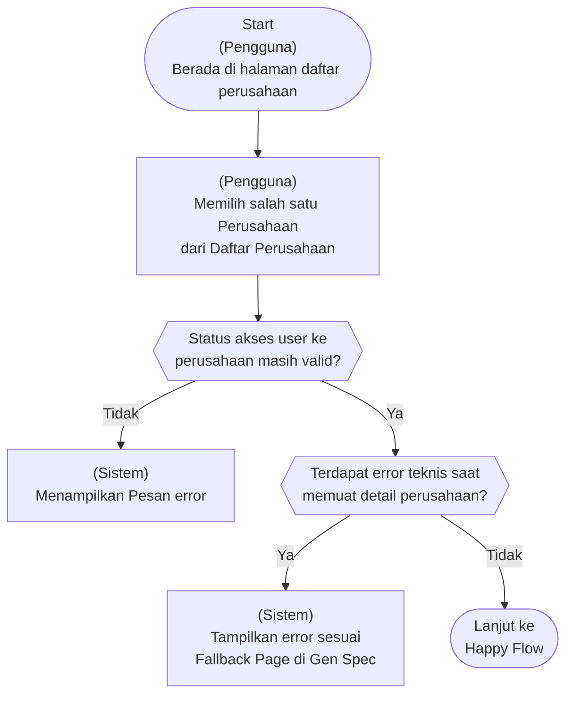

---

**CF-HP-: Happy Flow – Detail Perusahaan – Pengguna Berhasil Melihat Halaman Detail Perusahaan** (Happy Flow)

```mermaid
flowchart TD
    A(["Start<br/>(Pengguna)<br/>Berada di halaman Daftar Perusahaan"])
    C["(Pengguna)<br/>Memilih salah satu Perusahaan<br/>dari Daftar Perusahaan"]
    E["(Sistem)<br/>Menampilkan Halaman Detail Perusahaan"]
    F(["End<br/>(Pengguna)<br/>Melihat halaman detail perusahaan"])
    A --> C --> E --> F;
```

---

### Supporting Information

*Belum tersedia*

### Constraint and Consideration

**10.1.1. Analisis Security & Compliance**

- UU PDP No. 27/2022 – Data identitas organisasi yang dapat dikaitkan dengan individu pengelola wajib dilindungi dari akses tidak sah
- PP 71/2019 (PSTE) – Sistem wajib menjamin kerahasiaan & integritas data
- GDPR / PDPA (baseline regional) – Data identitas organisasi yang bisa mengarah ke individu wajib dibatasi aksesnya
- OWASP Top 10 – Broken Access Control harus dicegah
- ISO 27001 – Akses berbasis peran & pencatatan perubahan data
- GroApp Security Baseline (IAM) – Role-based access & audit logging

**10.1.2. Sensitivitas Data & Perlakuan**

- Nama Perusahaan
- Alamat Perusahaan
- Company ID
- Relasi Perusahaan–Unit Usaha
- User ID (editor)
- Timestamp perubahan

**10.2.1. Dampak ke Data/Fitur Lain**

Tidak Ada

**10.2.2. Dampak ke Notifikasi**

Tidak ada

**10.3.1. NFR (Non-Functional Requirements)**

- Sistem harus memastikan hanya user yang memiliki akses ke perusahaan yang dipilih dapat melihat halaman Detail Perusahaan.
- Halaman Detail Perusahaan harus berhasil dimuat tanpa ada error teknis
- Jika data Detail Perusahaan gagal dimuat
- sistem harus menampilkan error state yang terkontrol tanpa menampilkan data parsial.
- Sistem harus mencatat error saat gagal memuat Detail Perusahaan.
- Informasi perusahaan hanya ditampilkan dalam konteks perusahaan aktif dan tidak boleh tercampur dengan perusahaan lain.

**10.4. Asumsi dan Risiko**

- User selalu berada dalam konteks perusahaan aktif saat membuka Detail Perusahaan
- User yang mengakses Detail Perusahaan memiliki permission yang sesuai
- Data perusahaan tersedia lengkap dan konsisten di backend
- Relasi perusahaan–unit usaha sudah terbentuk dengan benar
- Infrastruktur API stabil pada kondisi normal

#### Success Metrics Fitur

**Indikator keberhasilan untuk fitur ini:**

| Kategori | Indikator | Alasan / Urgensi |
|----------|-----------|------------------|
| Adoption | ≥ 60% perusahaan memiliki minimal 1 unit usaha dalam 30 hari sejak perusahaan dibuat | Mengacu pada adoption benchmark B2B SaaS tahap awal (Activation → Retention bridge), angka 50–70% dianggap sehat. Target 60% memvalidasi bahwa fitur pengelolaan unit usaha benar-benar digunakan. |
| Functional Accuracy | 100% perubahan data perusahaan oleh user berwenang (Owner/Admin) tersimpan dan ditampilkan konsisten | Data perusahaan adalah master data lintas modul. Dalam praktik ERP/IAM, toleransi kesalahan pada entity master adalah 0% karena berdampak langsung ke integritas sistem lain. |
| Drop-off | ≤ 20% user keluar dari halaman Detail Perusahaan tanpa melakukan aksi bermakna (view, edit, atau tambah unit usaha) | Untuk halaman manajemen non-marketing pada produk B2B, drop-off normal berada di bawah 20–25%. Di atas 30% menandakan mismatch ekspektasi atau halaman tidak menjawab kebutuhan user. |
| Efficiency | User dapat menemukan informasi dasar perusahaan (nama, alamat, status) dalam waktu ≤ 10 detik | Berdasarkan usability benchmark Nielsen Norman Group, waktu orientasi dan pencarian informasi inti pada halaman referensi seharusnya ≤10 detik. Lebih lama menandakan masalah hierarchy atau layout informasi. |
| Completion | ≥ 90% user Owner/Admin berhasil melihat informasi detail perusahaan dan daftar unit usaha di bawahnya | Mengacu pada Activation metric (AARRR), 90% adalah baseline tervalidasi untuk memastikan value utama fitur (pemahaman struktur perusahaan–unit usaha) tersampaikan ke user target. |
| Completion | ≥ 95% user yang membuka Detail Perusahaan dari Daftar Perusahaan berhasil memuat halaman tanpa error | Transisi konteks organisasi pada sistem IAM/ERP adalah jalur wajib. Standar produk B2B kritikal menetapkan ≥95% sebagai ambang minimum keberhasilan; di bawah ini mengindikasikan masalah routing, permission, atau state konteks. |

### User Stories

**User Stories dalam fitur ini:**

1. [US-CP-ERRORLOAD](#user-story-1-us-cp-errorload)
2. [US-CP-OPEN](#user-story-2-us-cp-open)
3. [US-CP-OPENPRO](#user-story-3-us-cp-openpro)
4. [US-CP-REDIRECT
](#user-story-4-us-cp-redirect
)
5. [US-CP-SETDEFAULT](#user-story-5-us-cp-setdefault)
6. [US-CP-SWITCH](#user-story-6-us-cp-switch)

##### User Story 1: US-CP-ERRORLOAD

**Sebagai pengguna, saya ingin mengetahui ketika Detail Perusahaan gagal dimuat agar saya memahami bahwa terjadi kendala sistem.**

**Scenario GWT:**

| Kode | Given | When | Then |
|------|-------|------|------|
| SC-2345 | Pengguna telah mnjalankan skenario SC-2329<br>Sama seperti SC-2329 | Sistem memuat data detail perusahaan<br>tampil indikator loading | sistem gagal memproses pemuatan data detail perusahaan. Sistem menampilkan pesan error teknis sesuai GenSpec <br>loading indikator hilang<br>Tampil Error teknis sesuai GenSpec |

**Acceptance Criteria:**

- **AC-CP-ERRORLOAD-01**: Jika terjadi error teknis saat memuat Detail Perusahaan, sistem menampilkan fallback error page sesuai GenSpec dan tidak menampilkan data perusahaan yang tidak lengkap atau tidak valid.

---

##### User Story 2: US-CP-OPEN

**Sebagai Pengguna, saya ingin membuka halaman Detail Perusahaan agar saya dapat melihat informasi perusahaan yang saya pilih.**

**Scenario GWT:**

| Kode | Given | When | Then |
|------|-------|------|------|
| SC-2329 | Pengguna berada di halaman Daftar Perusahaan <br> halaman daftar perusahaan berisi :<br>Tampil tombol Tambah Perusahaan <br>Tampil Tombol Kelola Ruang Kerja<br>Fitir filter <br>fitur search untuk mencari perusahaan berdasarkan nama dan jenis.<br>daftar perusahaan : Logo Perusahaan, Nama perusahaan, total unit usaha, unit usaha aktif & non aktif, status kepemilikan (shared by nama orang / milik sendiri)<br>jika pengguna tidak memasukkan logo perusahaan maka yang tampil Pake placeholder image  dengan inisial nama perusahaan contoh Nama Perusahaan MAJU JAYA maka:<br> MJ dan MAJU JAYA — dibagikan oleh shania. | Pengguna memilih salah satu perusahaan dari Daftar Perusahaan. <br>Salah satu item perusahaan diklik oleh pengguna. | Sistem memverifikasi akses pengguna terhadap Ruang Kerja terkait dan memuat halaman Detail Perusahaan.<br>Tampil indikator loading saat proses perpindahan halaman. |
| SC-2330 | — | Hasil verifikasi akses pengguna valid. | Sistem menampilkan halaman Detail Perusahaan. <br>section 1 data perusahaan<br>button hapus perusahaan<br>switcher set as default<br>Ringkasan Profil Perusahaan<br>Logo Perusahaan<br>Nama Perusahaan*<br>Jenis Usaha*<br>Alamat Lengkap<br>Email<br>No Telepon<br>No WhatsApp<br>jumlah Unit Usaha Aktif & Nonaktif serta total semua Unit usaha dibawah perusahaan tersebut<br>section 2 <br>terdapat 4 card yang dapat di klik<br>Profil Perusahaan → di klik menuju Profil Perusahaan<br>Unit Usaha → menuju ke halaman daftar unit usaha<br>Management Peran → menuju ke halaman management peran (coming soon)<br>Management Pengguna → menuju ke halaman management Pengguna (coming soon) |
| SC-2334 | Pengguna telang menjalankan skenario SC-2329<br>sama seperti SC-2329 | Hasil verifikasi akses pengguna tidak valid. | Sistem tidak memuat halaman Detail Perusahaan dan menampilkan pesan bahwa akses tidak tersedia. <br>Halaman Detail Perusahaan tidak ditampilkan.<br>Pengguna mendapatkan pesan : “Anda tidak memiliki akses ke perusahaan ini atau akses Anda sudah tidak berlaku.” + Button Kembali ke Daftar Perusahaan |

**Acceptance Criteria:**

- **AC-CP-OPEN-02**: Jika pengguna tidak memiliki akses yang valid, sistem tidak memuat halaman Detail Perusahaan dan menampilkan pesan bahwa akses tidak tersedia.
- **AC-CP-OPEN-01**: Jika pengguna memilih salah satu perusahaan dari Daftar Perusahaan
Sistem memverifikasi bahwa pengguna masih memiliki akses perusahaan yang dipilih sebelum menampilkan halaman Detail Perusahaan
sistem memuat dan menampilkan halaman Detail Perusahaan

**Form Specification:**

| Kolom/Field | Tipe | Wajib Diisi | Unik | Max/Min Karakter | Placeholder | Catatan |
|-------------|------|-------------|------|------------------|-------------|---------|
| Tanggal Pembuatan Perusahan | Readonly Text | Tidak | Tidak |  | DD-MM-YYYY | Mode Read Only |
| Nama Perusahaan | Text | Ya | Ya | 3-60 | Contoh: PT Kreasi Anak Bangsa | Aturan Penamaan Perusahaan:<br>Auto-Uppercase<br>Hanya boleh huruf, angka, titik, dan koma<br>Nama Perusahaan tidak boleh duplicate dalam 1 Ruang Kerja<br>60 karakter  (include spasi)<br>Mode Read Only |
| Jenis Usaha | Dropdown | Ya | Tidak |  | Pilih Jenis Usaha | Mode Read Only |
| Negara | Dropdown | Ya | Tidak |  | Pilih Negara | Mode Read Only |
| Provinsi | Dropdown | Tidak | Tidak |  | Pilih Provinsi | Mode Read Only |
| Kota/Kabupaten | Dropdown | Tidak | Tidak |  | Pilih Kota/Kabupaten | Mode Read Only |
| Kecamatan | Dropdown | Tidak | Tidak |  | Pilih Kecamatan | Mode Read Only |
| Kelurahan/Desa | Dropdown | Tidak | Tidak |  | Pilih Kelurahan/Desa | Mode Read Only |
| Kode Pos | Number | Tidak | Tidak | -5 | Contoh: 10130 | Mode Read Only |
| Alamat lengkap | Text | Tidak | Tidak | -255 | Contoh : Jl. Mangga No.1 | Mode Read Only |
| Mata Uang Utama | Dropdown | Ya | Tidak |  | Pilih Mata Uang | Mode Read Only |
| NPWP | Number | Tidak | Ya | -16 | Contoh: | Mode Read Only |
| NIB | Number | Tidak | Ya | -13 | Contoh: 9120101234567 | Mode Read Only |
| Status PKP | Dropdown | Tidak | Tidak |  | Pilih Status PKP | Pilihan :<br>PKP<br>Non PKP |
| Tahun Buku (Fisical Year) | Date Picker | Tidak | Tidak |  | DD-MM-YYYY | Mode Read Only |
| Tanggal Mulai Pembukuan | Date Picker | Tidak | Tidak |  | DD-MM-YYYY | Mode Read Only |
| Email | Text | Tidak | Tidak |  | kreasianakbangsa@gmail.com | Mode Read Only |
| No Telpon | Phone | Tidak | Ya | -11 | Contoh: 021xxxxxx | Mode Read Only |
| No WhatsApp | Phone | Tidak | Ya | -13 | Contoh: +6281xxxxxxx | Mode Read Only |
| Website | Text | Tidak | Tidak |  | www.kreasianakbangsa.com | Mode Read Only |
| Tanggal Pendirian  Perusahaan | Date Picker | Tidak | Tidak |  | DD-MM-YYYY | Mode Read Only |
| Jumlah Unit Usaha | Readonly Text | Tidak | Tidak |  | - | Terisi otomatis berdasarkan jumlah cabang/unit<br>Mode Read Only |
| Logo Perusahaan | Image Upload | Tidak | Tidak |  | Unggah Logo | Size max → 1 MB<br>Format PNG,JPG,JPEG & WEBP<br>Rekomendasi: jika file user terlalu besar sistem kita bisa meng-kompressnya dengan catatan gambar tidak rusak <br><br>Mode Read Only |

**Rekapitulasi Multibahasa:**

| Komponen | Bahasa Indonesia | English | Page |
|----------|------------------|---------|------|
| company.modal.save_changes.desc | Description | Perubahanmu akan disimpan dan data perusahaan akan diperbarui. |  |
| company.modal.save_changes.primary_button | Button | Simpan Perubahan |  |
| company.modal.save_changes.secondary_button | Button | Kembali Edit |  |
| Subtitle | Legal & Administrasi | Legal & Administration |  |
| Subtitle | Kontak | Contact |  |
| Subtitle | Alamat | Address |  |
| Subtitle | Identitas Perusahaan | Company Identity |  |
| Modal Title | Akses Tidak Tersedia | Access Unavailable | Detail Perusahaan |
| Modal Description | Anda tidak memiliki akses ke perusahaan ini atau akses Anda sudah tidak berlaku. | You no longer have access to this company or the access is no longer valid. | Detail Perusahaan |
| Button | Kembali ke Daftar Perusahaan | Back to Company List | Detail Perusahaan |

---

##### User Story 3: US-CP-OPENPRO

**Sebagai pengguna, saya ingin membuka halaman profil perusahaan dari Detail Perusahaan agar saya dapat melihat data detail perusahaan secara lengkap.**

**Scenario GWT:**

| Kode | Given | When | Then |
|------|-------|------|------|
| SC-2634 | Pengguna telah menjalankan skenario AC-CP-OPEN-01<br>sama seperti AC-CP-OPEN-01 | Pengguna klik card Profil Perusahaan<br>card profil perusahaan di klik | Sistem memuat halam Profil perusahaan<br>screen overlay <br>muncul indikator loading |
| SC-2636 |  |  | Sistem selesai memuat  halaman Profil Perusahaan<br>indikator loading hilang <br>tampil halaman profil perusahaan <br>button edit tampil persection data perusahaan. pembagiannya seperti berikut:<br>Identitas Perusahaan<br>Logo Perusahaan<br>Nama Perusahaan*<br>Jenis Usaha*<br>Tanggal Pembuatan Perusahaan<br>Tanggal Pendirian Perusahaan<br>Jumlah Unit Usaha<br>Alamat<br>Negara*<br>Provinsi<br>Kota/Kabupaten<br>Kecamatan<br>Kelurahan/Desa<br>Kode Pos<br>Alamat Lengkap<br>Kontak <br>Email<br>No Telepon<br>No WhatsApp<br>Website<br>Legal & Administrasi <br>NPWP, <br>NIB, <br>Status PKP<br>Nomor SPPKP<br>Mata Uang Utama*<br>Tahun Buku<br>Tanggal Mulai Pembukuan |

**Acceptance Criteria:**

- **US-CP-OPENPRO-01**: Pengguna dapat membuka halaman Profil Perusahaan melalui card “Profil Perusahaan” pada halaman Detail Perusahaan.
Setelah card di klik, halaman Profil Perusahaan dari perusahaan tersebut ditampilkan.
Pada halaman Profil Perusahaan, pengguna dapat melihat informasi perusahaan.

---

##### User Story 4: US-CP-REDIRECT


**Sebagai pengguna, saya ingin diarahkan ke halaman Detail Perusahaan setelah saya berhasil login agar saya dapat langsung melihat detail perusahaan yang sering saya akses.**

**Scenario GWT:**

| Kode | Given | When | Then |
|------|-------|------|------|
| SC-2637 | Pengguna telah menjalankan skenario Login <br>Sama Seperti skenario Login | Proses login selesai<br>- | Sistem Menampilkan halaman detail perusahaan <br>Tampil halaman detail perusahaan :<br>section 1 data perusahaan<br>button hapus perusahaan<br>button set as default<br>Ringkasan Profil Perusahaan<br>Logo Perusahaan<br>Nama Perusahaan*<br>Jenis Usaha*<br>Alamat Lengkap<br>Email<br>No Telepon<br>No WhatsApp<br>jumlah Unit Usaha Aktif & Nonaktif serta total semua Unit usaha dibawah perusahaan tersebut<br>section 2 <br>terdapat 4 card yang dapat di klik<br>Profil Perusahaan → di klik menuju Profil Perusahaan<br>Unit Usaha → menuju ke halaman daftar unit usaha<br>Management Peran → menuju ke halaman management peran (coming soon)<br>Management Pengguna → menuju ke halaman management Pengguna (coming soon)<br>Note:<br>jika pengguna punya lebih dari 1 perusahaan dan belum menentukan perusahaan aman yang bisa menjadi default maka yang tampil adalah perusahaan yang terakhir kali diakses |

**Acceptance Criteria:**

- **US-CP-REDIRECT-01**: Setelah login berhasil, pengguna langsung diarahkan ke halaman Detail Perusahaan.
Halaman Detail Perusahaan yang ditampilkan adalah perusahaan yang terakhir digunakan atau telah ditentukan sebagai default.

---

##### User Story 5: US-CP-SETDEFAULT

**Sebagai pengguna, saya ingin mengatur perusahaan default agar sistem dapat langsung membuka perusahaan yang saya pilih saat saya masuk ke aplikasi.**

**Scenario GWT:**

| Kode | Given | When | Then |
|------|-------|------|------|
| SC-2638 | Pengguna telah menjalankan skenario SC-2637<br><br>Catatn hifi:<br>sama seperti SC-2637 | Pengguna switch “Atur sebagai perusahaan utama”<br>swithcer diklik pengguna | Sistem memproses detail perusahaan yang sedang dibuka pengguna sebagai default halaman yang tampil ketika pengguna berhasil login<br>overlay screen<br>tampil indikator loading |
| SC-2639 |  |  | Proses set default perusahaan telah selesai dilakukan sistem<br>indikator loading hilang<br>tampil toast:<br>judul : Sukses!<br>deskripsi: Perusahaan ini akan otomatis terbuka saat Anda masuk. |

**Acceptance Criteria:**

- **US-CP-SETDEFAULT-01**: Pengguna dapat mengatur perusahaan sebagai default melalui halaman Detail Perusahaan.

---

##### User Story 6: US-CP-SWITCH

**Sebagai pengguna, saya ingin berpindah perusahaan langsung dari halaman Detail Perusahaan agar saya dapat melihat detail perusahaan lain tanpa kembali ke daftar perusahaan.**

**Scenario GWT:**

| Kode | Given | When | Then |
|------|-------|------|------|
| SC-2348 | Pengguna telah menjalankan skenario AC-CP-OPEN-01<br>Sama Seperti AC-CP-OPEN-01 | sistem telah menampilkan halaman detail perusahaan<br>detail perusahaan tampil (sama seperti screen given di samping) | Sistem menampilkan komponen navigasi pilihan perusahaan pada halaman.<br>Navigasi berada si sidebar kiri<br>Perusahaan yang sedang aktif(sedang dibuka user) dapat dilihat sebagai selected/active state.<br>terdapat  menu : detail perusahaan, unit, management pengguna, management peran |
| SC-2349 |  | Pengguna membuka navigasi pilihan  perusahaan.<br>penguna Click pada komponen perusahaan. | Sistem menampilkan daftar perusahaan yang dapat diakses oleh pengguna.<br>Sistem menampilkan daftar perusahaan yang memiliki relasi dengan pengguna.<br>Daftar perusahaan ditampilkan dalam bentuk list/dropdown.<br>Pengguna dapat memilih perusahaan lain dari daftar tersebut. |
| SC-2355 |  | Pengguna memilih salah satu perusahaan dari daftar.<br>Pengguna melakukan click pada item perusahaan yang tersedia di daftar. | Sistem memuat halaman Detail Perusahaan dari perusahaan yang dipilih.<br>Tampil indikator loading |
| SC-2574 |  | - | Sistem menampilkan halaman Detail Perusahaan dari perusahaan yang dipilih.<br>indikator loading hilang<br>Data halaman diperbarui sesuai perusahaan yang dipilih.<br>Perusahaan yang dipilih menjadi active state pada navigasi. |

**Acceptance Criteria:**

- **AC-CP-SWITCH-01**: Sistem menampilkan navigasi pilihan perusahaan pada halaman Detail Perusahaan yang menunjukkan perusahaan aktif.
Navigasi hanya menampilkan perusahaan yang memiliki relasi dengan pengguna.
Ketika pengguna memilih perusahaan lain, sistem memuat halaman Detail Perusahaan dari perusahaan yang dipilih.

---


## Fitur: Edit Data Perusahaan

### Problem Statement Fitur

Pada kondisi saat ini, data perusahaan hanya dapat diinput pada saat proses pembuatan perusahaan awal. Dalam praktiknya, kesalahan input maupun perubahan informasi perusahaan (seperti alamat atau data administratif lain) merupakan hal yang tidak terhindarkan. Namun, sistem belum menyediakan mekanisme bagi admin atau owner perusahaan untuk memperbarui data tersebut setelah perusahaan dibuat.
Kondisi ini membuat data perusahaan berisiko menjadi tidak akurat dan tidak lagi merepresentasikan kondisi aktual, padahal data perusahaan digunakan sebagai referensi utama dalam berbagai proses di dalam sistem. Tanpa kemampuan untuk melakukan pembaruan, admin dan owner tidak memiliki kontrol untuk menjaga validitas data, sehingga menimbulkan potensi masalah operasional serta menurunkan kepercayaan pengguna terhadap keandalan sistem.

### Goal Fitur

Fitur Edit Perusahaan bertujuan membantu admin dan owner perusahaan menjaga agar data dan informasi perusahaan tetap akurat dan relevan sepanjang waktu, meskipun terjadi kesalahan input awal atau perubahan kondisi perusahaan. Dengan tercapainya tujuan ini, pengguna memiliki kontrol untuk memastikan data perusahaan selalu merepresentasikan kondisi aktual, sehingga proses lanjutan di dalam sistem dapat berjalan dengan lebih andal dan kepercayaan terhadap produk tetap terjaga.

### In Scope Fitur

1. Pengguna dengan peran admin atau owner perusahaan dapat melakukan perubahan terhadap informasi perusahaan yang sudah dibuat, dengan ketentuan:
Pengguna dapat mengubah informasi dasar perusahaan yang sebelumnya diinput saat pembuatan perusahaan
Perubahan dapat dilakukan untuk mengoreksi kesalahan input maupun perubahan data aktual perusahaan
Aksi edit hanya tersedia untuk admin dan owner, bukan role lain
Sistem menyimpan dan menggunakan data perusahaan terbaru sebagai sumber kebenaran

### Case Flow

**CF-NG-EDT: Negative Flow – Edit Perusahaan – Pengguna Gagal atau Membatalkan Perubahan Data Perusahaan** (Negative Flow)

```mermaid
flowchart TD
    A(["Start<br/>(Pengguna)<br/>Berada di halaman detail perusahaan"])
    B["(Pengguna)<br/>Klik Profil Perusahaan"]
    C["(Sistem)<br/>Menampilkan halaman profil perusahaan"]
    E["(Pengguna)<br/>Klik Edit pada section data"]
    F["(Sistem)<br/>Tampilkan Mode Edit"]
    G["(Pengguna)<br/>Mengubah data"]
    H{{"Pengguna membatalkan<br/>edit perusahaan?"}}
    I["(Sistem)<br/>Menampilkan modal konfirmasi pembatalan"]
    J["(Pengguna)<br/>Konfirmasi pembatalan"]
    K["(Sistem)<br/>Menampilkan informasi tidak tersimpan<br/>dan kembali ke view mode"]
    L([End<br/>Perubahan dibatalkan])
    M{{"Data/struktur perusahaan<br/>valid?"}}
    O["(Sistem)<br/>Menampilkan pesan validasi error<br/>dan field yang perlu diperbaiki"]
    P{{"Terdapat error teknis<br/>saat menyimpan?"}}
    Q["(Sistem)<br/>Tampilkan error sesuai<br/>Fallback Page di Gen Spec"]
    R(["Lanjut ke<br/>Happy Flow"])
    A --> B --> C --> E --> F --> G --> H
    H -- Ya --> I --> J --> K --> L
    H -- Tidak --> M
    M -- Tidak --> O
    M -- Ya --> P
    P -- Ya --> Q
    P -- Tidak --> R;
```

---

**CF-HP-EDT: Happy Flow – Edit Perusahaan – Pengguna Berhasil Mengubah Data Perusahaan** (Happy Flow)

```mermaid
flowchart TD
    A(["Start<br/>(Pengguna)<br/>Berada di halaman detail Perusahaan"])
    C["(Pengguna)<br/>Klik Profil Perusahaan"]
    D["(Sistem)<br/>Menampilkan halaman profil<br/>perusahaan view mode"]
    F["(Pengguna)<br/>Klik Edit pada section<br/>data profil perusahaan"]
    G["(Sistem)<br/>Tampilkan Mode Edit pada<br/>section yang diklik"]
    I["(Pengguna)<br/>Mengubah data"]
    K["(Pengguna)<br/>Klik Simpan Perubahan"]
    L["(Sistem)<br/>Menampilkan modal konfirmasi perubahan"]
    N["(Pengguna)<br/>Klik Konfirmasi"]
    O["(Sistem)<br/>Simpan perubahan"]
    P["(Sistem)<br/>Tampilkan feedback sukses"]
    Q(["End<br/>(Sistem)<br/>Kembali ke View Mode dengan data terbaru"])
    A --> C --> D --> F --> G --> I --> K --> L --> N --> O --> P --> Q;
```

---

### Supporting Information

*Belum tersedia*

### Constraint and Consideration

**10.1.1. Analisis Security & Compliance**

- UU No. 27 Tahun 2022 (UU PDP) – Data kontak yang dapat digunakan untuk menghubungi entitas perusahaan wajib diproses secara sah dan aman.
- UU No. 27 Tahun 2022 (UU PDP) – Data kontak langsung yang berpotensi disalahgunakan wajib dilindungi dari akses tidak sah.
- PP 71/2019 (PSTE) – Sistem wajib menjaga keamanan dan integritas data lokasi yang disimpan.

**10.1.2. Sensitivitas Data & Perlakuan**

- Email perusahaan
- Nomor telepon perusahaan
- Alamat lengkap perusahaan

**10.2.1. Dampak ke Data/Fitur Lain**

Tidak Ada

**10.2.2. Dampak ke Notifikasi**

Tidak Ada

**10.3.1. NFR (Non-Functional Requirements)**

- Sistem harus memastikan hanya role Admin/Owner yang dapat mengakses endpoint edit & simpan data perusahaan. Validasi hak akses dilakukan di server-side.
- Sistem tidak boleh menampilkan email
- nomor telepon
- atau alamat lengkap dalam log teknis atau error response.
- Proses simpan harus bersifat atomic (berhasil seluruhnya atau tidak sama sekali).
- Sistem harus mencegah duplicate submit saat tombol “Simpan Perubahan” ditekan lebih dari satu kali (proteksi UI & server-side).
- Sistem harus mencatat event simpan berhasil dan gagal karena error sistem.
- Proses simpan perubahan data perusahaan harus selesai ≤2 detik untuk 90% request (p90).terhitung dari pengguna klik simpan

**10.4. Asumsi dan Risiko**

- Admin/Owner memahami data perusahaan yang mereka ubah
- Sistem IAM selalu tersedia saat proses simpan dilakukan
- Validasi dasar (format & mandatory field) cukup menjaga kualitas data
- Perubahan data perusahaan tidak berdampak ke modul lain pada fase awal
- Tidak diperlukan verifikasi legal (NIB/akta) pada fase awal

#### Success Metrics Fitur

**Indikator keberhasilan untuk fitur ini:**

| Kategori | Indikator | Alasan / Urgensi |
|----------|-----------|------------------|
| Drop-off | Proporsi kecil (≤10%) pengguna keluar dari proses edit sebelum menyimpan perubahan | Drop-off digunakan sebagai indikator risiko dalam flow edit, tanpa mengasumsikan motif user. Nilai ini membantu mendeteksi potensi kebingungan, keraguan, atau friksi dalam proses edit yang perlu dianalisis lebih lanjut pasca-rilis. |
| Data Quality / Functional Accuracy | Seluruh perubahan yang disimpan menghasilkan data perusahaan terbaru yang konsisten digunakan sebagai sumber kebenaran di sistem | Indikator ini memastikan bahwa hasil edit benar-benar menggantikan data sebelumnya dan digunakan secara konsisten oleh sistem. Jika akurasi fungsional gagal, maka tujuan utama fitur—menjaga validitas data—tidak tercapai meskipun proses edit terlihat sukses. |
| Efficiency | Proses edit dapat diselesaikan dalam waktu yang relatif singkat (≤2 menit sebagai baseline awal) | Waktu penyelesaian digunakan untuk mengidentifikasi friksi. Proses edit yang terlalu lama berisiko membuat user menunda atau membatalkan pembaruan data, sehingga data tetap tidak valid. |
| Adoption | Sebagian besar perusahaan relevan (≥60%) melakukan pembaruan data setidaknya satu kali setelah fitur tersedia | Adoption mengukur apakah fitur benar-benar digunakan untuk menjaga data tetap relevan, bukan sekadar tersedia. Nilai ini dipakai sebagai baseline awal untuk melihat kebutuhan aktual terhadap fitur edit perusahaan. |
| Completion (Wajib) | Sebagian besar (≥90%) admin/owner yang memulai proses edit berhasil menyimpan perubahan data perusahaan | Completion merepresentasikan keberhasilan user mencapai tujuan utama fitur, yaitu memperbarui data perusahaan. Angka ini digunakan sebagai baseline untuk memastikan proses edit dapat diselesaikan tanpa hambatan signifikan. |

### User Stories

**User Stories dalam fitur ini:**

1. [US-EDT-CANCEL](#user-story-1-us-edt-cancel)
2. [US-EDT-ERROR](#user-story-2-us-edt-error)
3. [US-EDT-OPEN](#user-story-3-us-edt-open)
4. [US-EDT-SAVE](#user-story-4-us-edt-save)
5. [US-EDT-UPDATE](#user-story-5-us-edt-update)

##### User Story 1: US-EDT-CANCEL

**Sebagai Admin / Owner, saya ingin membatalkan proses edit agar tidak ada perubahan data yang tersimpan.**

**Scenario GWT:**

| Kode | Given | When | Then |
|------|-------|------|------|
| SC-2394 | Pengguna telah menjalankan skenario AC-EDT-UPDATE-01<br>Sama seperti AC-EDT-UPDATE-01 | Pengguna menekan tombol Batal.<br>* Tombol Batal diklik | Sistem menampilkan modal konfirmasi pembatalan perubahan.<br>* Modal tampil di tengah halaman dan menampilkan pesan konfirmasi sebelum data disimpan.<br>Modal Title: Membatalkan proses <br>Modal Text: Apakah Kamu yakin ingin membatalkan proses perubahan data perusahaan?<br>Background halaman menjadi overlay.<br>Modal menampilkan button Ya dan Tidak (kedua button enable) |
| SC-2399 | Pengguna telah menjalankan skenario AC-EDT-CANCEL-01<br>Sama seperti AC-EDT-CANCEL-01 | Pengguna menekan tombol Ya pada modal konfirmasi pembatalan perubahan.<br>* Tombol Ya diklik | Sistem tidak menyimpan perubahan data perusahaan dan kembali ke halaman profil Perusahaan.<br>Modal konfirmasi ditutup.<br>Halaman profil Perusahaan ditampilkan.<br>Data perusahaan yang tampil adalah data sebelum proses edit dilakukan kembali ke mode view<br>tampil toast:<br>title: Dibatalkan!<br>Deskripsi : Ubah profil perusahaan dibatalkan |
| SC-2401 | Pengguna telah menjalankan skenario AC-EDT-CANCEL-01<br>sama seperti AC-EDT-CANCEL-01 | Pengguna menutup dialog konfirmasi pembatalan. <br>Pengguna memilih aksi Kembali pada dialog konfirmasi. | Sistem menutup dialog konfirmasi pembatalan.<br>dialog konfirmasi pembatalan tertutup<br>pengguna kembali ke form edit data perusahaan (data perubahan tidak hilang) |
| SC-2402 | — | — | Sistem tetap mempertahankan halaman profil Perusahaan dalam mode edit dengan perubahan yang telah dilakukan pengguna. <br>Data yang telah diubah pengguna tetap berada pada field form. <br>Tidak ada perubahan yang disimpan ke sistem.<br>Tombol Simpan Perubahan dan Batal tetap tersedia pada halaman edit. |

**Acceptance Criteria:**

- **AC-EDT-CANCEL-03**: Jika pengguna menekan tombol kembali di dialog konfirmasi pembatalan, sistem menutup dialog dan tetap mempertahankan halaman dalam mode edit dengan perubahan yang telah dilakukan pengguna.
- **AC-EDT-CANCEL-02**: Jika pengguna melakukan pembatalan, sistem tidak menyimpan perubahan data perusahaan.
Setelah pembatalan disetujui, sistem kembali ke halaman Detail Perusahaan dengan data sebelum di edit.
- **AC-EDT-CANCEL-01**: Saat pengguna klik Batal, sistem menampilkan dialog konfirmasi pembatalan perubahan hanya jika pengguna melakukan perubahan data.

---

##### User Story 2: US-EDT-ERROR

**Sebagai Admin / Owner, saya ingin mendapatkan informasi saat terjadi error teknis agar saya mengetahui bahwa perubahan tidak berhasil disimpan.**

**Scenario GWT:**

| Kode | Given | When | Then |
|------|-------|------|------|
| SC-2648 | Pengguna telah menjalankan skenario  SC-2391<br>sama seperti  SC-2391 | Terjadi kegagalan sistem saat memuat daftar perusahaan.<br>- | Sistem menampilkan pesan error teknis sesuai GenSpec <br>loading indikator hilang<br>Tampil Error teknis sesuai GenSpec |

**Acceptance Criteria:**

- **AC-EDT-ERROR-01**: Jika terjadi error teknis saat proses penyimpanan data perusahaan, sistem menampilkan error sesuai fallback page di GenSpec
Saat error teknis terjadi, perubahan data perusahaan tidak tersimpan.

---

##### User Story 3: US-EDT-OPEN

**Sebagai Admin / Owner, saya ingin masuk ke mode edit data perusahaan agar saya dapat melakukan perubahan informasi perusahaan.**

**Scenario GWT:**

| Kode | Given | When | Then |
|------|-------|------|------|
| SC-2362 | Pengguna telah menjalankan skenario SC-2636<br>sama seperti SC-2636 | Pengguna menekan tombol Edit Data Perusahaan pada section alamat<br> Tombol edit di section diklik | Sistem memproses aksi yang dilakukan pengguna <br>menampilkan indikator loading pada screen |
| SC-2584 |  |  | Sistem selesai memuat mode read ke mode edit<br><br>Sistem menampilkan section Alamatdalam mode edit<br>Alamat<br>Negara*<br>Provinsi<br>Kota/Kabupaten<br>Kecamatan<br>Kelurahan/Desa<br>Kode Pos<br>Alamat Lengkap |

**Acceptance Criteria:**

- **AC-EDT-OPEN-01**: Saat pengguna klik Edit Data Perusahaan, sistem menampilkan halaman profil Perusahaan dalam mode edit.

**Form Specification:**

| Kolom/Field | Tipe | Wajib Diisi | Unik | Max/Min Karakter | Placeholder | Catatan |
|-------------|------|-------------|------|------------------|-------------|---------|
| Nama Perusahaan | Text | Ya | Ya | 3-60 | Contoh: PT Kreasi Anak Bangsa | Aturan Penamaan Perusahaan:<br>Auto-Uppercase<br>Hanya boleh huruf, angka, titik, dan koma<br>Nama Perusahaan tidak boleh duplicate dalam 1 Ruang Kerja<br>60 karakter  (include spasi) |
| Jenis Usaha | Readonly Text | Ya | Tidak |  | Pilih Jenis Usaha | pada mode edit, field ini hanya read only |
| Negara | Dropdown | Ya | Tidak |  | Pilih Negara |  |
| Provinsi | Dropdown | Tidak | Tidak |  | Pilih Provinsi |  |
| Kota/Kabupaten | Dropdown | Tidak | Tidak |  | Pilih Kota/Kabupaten |  |
| Kecamatan | Dropdown | Tidak | Tidak |  | Pilih Kecamatan |  |
| Kelurahan/Desa | Dropdown | Tidak | Tidak |  | Pilih Kelurahan/Desa |  |
| Kode Pos | Number | Tidak | Tidak | -5 | Contoh: 10130 |  |
| Alamat lengkap | Text | Tidak | Tidak | -255 | Contoh : Jl. Mangga No.1 |  |
| Mata Uang Utama | Readonly Text | Ya | Tidak |  | Pilih Mata Uang | pada mode edit, field ini hanya read only |
| NPWP | Number | Tidak | Ya | -16 | Contoh: |  |
| NIB | Number | Tidak | Ya | -13 | Contoh: 9120101234567 |  |
| Status PKP | Dropdown | Tidak | Tidak |  | Pilih Status PKP | Pilihan :<br>PKP<br>Non PKP |
| Tahun Buku (Fisical Year) | Date Picker | Tidak | Tidak |  | DD-MM-YYYY |  |
| Tanggal Mulai Pembukuan | Date Picker | Tidak | Tidak |  | DD-MM-YYYY |  |
| Email | Text | Tidak | Tidak |  | kreasianakbangsa@gmail.com |  |
| No Telpon | Phone | Tidak | Ya | -11 | Contoh: 021xxxxxx |  |
| No WhatsApp | Phone | Tidak | Ya | -13 | Contoh: +6281xxxxxxx |  |
| Website | Text | Tidak | Tidak |  | www.kreasianakbangsa.com |  |
| Tanggal Pendirian  Perusahaan | Date Picker | Tidak | Tidak |  | DD-MM-YYYY |  |
| Tanggal Pembuatan Perusahan | Readonly Text | Tidak | Tidak |  | DD-MM-YYYY | Terisi otomatis berdasarkan tanggal pembuatan perusahaan di sistem |
| Jumlah Unit Usaha | Readonly Text | Tidak | Tidak |  | - | Terisi otomatis berdasarkan jumlah cabang/unit |
| Logo Perusahaan | Image Upload | Tidak | Tidak |  | Unggah Logo | Size max → 1 MB<br>Format PNG,JPG,JPEG & WEBP<br>Rekomendasi: jika file user terlalu besar sistem kita bisa meng-kompressnya dengan catatan gambar tidak rusak |

**Field Error Messages:**

| Field | Input | Respon Sistem | Deskripsi Error | Momen Validasi | Catatan |
|-------|-------|---------------|-----------------|----------------|---------|
| Logo Perusahaan | Upload file selain PNG/JPG/JPEG/WEBP | Inline Field Error | Format file tidak didukung. Gunakan PNG, JPG, JPEG, atau WEBP. | On upload |  |
| Nama Perusahaan | Kosong | Inline Field Error | Nama perusahaan wajib diisi. | On Blur |  |
| Nama Perusahaan | < 3 karakter | Inline Field Error | Nama perusahaan minimal 3 karakter. | On Blur |  |
| Nama Perusahaan | > 60 karakter | Inline Field Error | Nama perusahaan maksimal 60 karakter. | On Blur |  |
| Nama Perusahaan | Mengandung karakter selain huruf, angka, titik, koma | Inline Field Error | Nama perusahaan hanya boleh berisi huruf, angka, titik, dan koma. | On Blur |  |
| Nama Perusahaan | Duplicate dalam 1 ruang kerja | Inline Field Error | Nama perusahaan sudah digunakan di ruang kerja ini. Gunakan nama lain. | On Blur |  |
| Jenis Usaha | Tidak dipilih | Inline Field Error | Jenis usaha wajib dipilih. | On Blur |  |
| Negara | Tidak dipilih | Inline Field Error | Negara wajib dipilih. | On Blur |  |
| Kode Pos | Input bukan angka | Inline Field Error | Kode pos harus berupa angka. | On Blur |  |
| Kode Pos | Jumlah digit ≠ 5 | Inline Field Error | Kode pos harus terdiri dari 5 digit angka. | On Blur |  |
| Mata Uang Utama | Tidak dipilih | Inline Field Error | Mata uang utama wajib dipilih. | On Blur |  |
| NPWP | Input bukan angka | Inline Field Error | NPWP harus berupa angka. | On Blur |  |
| NPWP | Jumlah digit ≠ 16 | Inline Field Error | NPWP harus terdiri dari 16 digit angka. | On Blur |  |
| NPWP | Duplicate | Inline Field Error | NPWP sudah terdaftar pada perusahaan lain di ruang kerja ini. | On Blur |  |
| NIB | Input bukan angka | Inline Field Error | NIB harus berupa angka. | On Blur |  |
| NIB | Jumlah digit ≠ 13 | Inline Field Error | NIB harus terdiri dari 13 digit angka. | On Blur |  |
| NIB | Duplicate | Inline Field Error | NIB sudah terdaftar pada perusahaan lain di ruang kerja ini. | On Blur |  |
| Email | Format email tidak valid | Inline Field Error | Format email tidak valid. Masukkan alamat email yang benar. | On Blur |  |
| No Telpon | Input bukan angka | Inline Field Error | Nomor telepon harus berupa angka. | On Blur |  |
| No Telpon | > 11 digit | Inline Field Error | Nomor telepon maksimal 11 digit. | On Blur |  |
| No Telpon | Duplicate | Inline Field Error | Nomor telepon sudah digunakan oleh perusahaan lain. | On Blur |  |
| No WhatsApp | Format nomor tidak valid | Inline Field Error | Masukkan nomor WhatsApp dengan format yang benar. | On Blur |  |
| No WhatsApp | > 13 digit | Inline Field Error | Nomor WhatsApp maksimal 13 digit. | On Blur |  |
| No WhatsApp | Duplicate | Inline Field Error | Nomor WhatsApp sudah digunakan oleh perusahaan lain. | On Blur |  |
| Website | Format URL tidak valid | Inline Field Error | Format website tidak valid. Gunakan format seperti: www.domain.com | On Blur |  |
| Logo Perusahaan | Upload file >1MB | Inline Field Error | Ukuran file terlalu besar. Maksimal 1 MB. | On upload |  |

**Rekapitulasi Multibahasa:**

| Komponen | Bahasa Indonesia | English | Page |
|----------|------------------|---------|------|
| Error Message | Format file tidak didukung. Gunakan PNG, JPG, JPEG, atau WEBP. | File format is not supported. Use PNG, JPG, JPEG, or WEBP. | Form Perusahaan |
| Error Message | Nama perusahaan wajib diisi. | Company name is required. | Form Perusahaan |
| Error Message | Nama perusahaan minimal 3 karakter. | Company name must be at least 3 characters. | Form Perusahaan |
| Error Message | Nama perusahaan maksimal 60 karakter. | Company name must not exceed 60 characters. | Form Perusahaan |
| Error Message | Nama perusahaan hanya boleh berisi huruf, angka, titik, dan koma. | Company name may only contain letters, numbers, periods, and commas. | Form Perusahaan |
| Error Message | Nama perusahaan sudah digunakan di ruang kerja ini. Gunakan nama lain. | Company name already exists in this workspace. Please use another name. | Form Perusahaan |
| Error Message | Jenis usaha wajib dipilih. | Business type must be selected. | Form Perusahaan |
| Error Message | Negara wajib dipilih. | Country must be selected. | Form Perusahaan |
| Error Message | Mata uang utama wajib dipilih. | Primary currency must be selected. | Form Perusahaan |
| Error Message | Kode pos harus terdiri dari 5 digit angka. | Postal code must contain 5 digits. | Form Perusahaan |
| Error Message | NPWP harus terdiri dari 16 digit angka. | NPWP must contain 16 digits. | Form Perusahaan |
| Error Message | NPWP sudah terdaftar pada perusahaan lain di ruang kerja ini. | NPWP already exists for another company in this workspace. | Form Perusahaan |
| Error Message | NIB harus terdiri dari 13 digit angka. | NIB must contain 13 digits. | Form Perusahaan |
| Error Message | NIB sudah terdaftar pada perusahaan lain di ruang kerja ini. | NIB already exists for another company in this workspace. | Form Perusahaan |
| Error Message | Format email tidak valid. Masukkan alamat email yang benar. | Invalid email format. Please enter a valid email address. | Form Perusahaan |
| Error Message | Nomor telepon harus berupa angka. | Phone number must contain numbers only. | Form Perusahaan |
| Error Message | Nomor telepon maksimal 11 digit. | Phone number must not exceed 11 digits. | Form Perusahaan |
| Error Message | Nomor telepon sudah digunakan oleh perusahaan lain. | Phone number is already used by another company. | Form Perusahaan |
| Error Message | Masukkan nomor WhatsApp dengan format yang benar. | Please enter a valid WhatsApp number. | Form Perusahaan |
| Error Message | Nomor WhatsApp maksimal 13 digit. | WhatsApp number must not exceed 13 digits. | Form Perusahaan |
| Error Message | Nomor WhatsApp sudah digunakan oleh perusahaan lain. | WhatsApp number is already used by another company. | Form Perusahaan |
| Error Message | Format website tidak valid. Gunakan format seperti: www.domain.com | Invalid website format. Use format like: www.domain.com | Form Perusahaan |
| Error Message | Ukuran file terlalu besar. Maksimal 1 MB. | File size is too large. Maximum 1 MB. | Form Perusahaan |
| Placeholder | Unggah Logo | Upload Logo | Form Perusahaan |
| Label | Nama Perusahaan | Company Name | Form Perusahaan |
| Placeholder | Contoh: PT Kreasi Anak Bangsa | Example: PT Kreasi Anak Bangsa | Form Perusahaan |
| Label | Jenis Usaha | Business Type | Form Perusahaan |
| Placeholder | Pilih Jenis Usaha | Select Business Type | Form Perusahaan |
| Label | Negara | Country | Form Perusahaan |
| Placeholder | Pilih Negara | Select Country | Form Perusahaan |
| Label | Provinsi | Province | Form Perusahaan |
| Placeholder | Pilih Provinsi | Select Province | Form Perusahaan |
| Label | Kota/Kabupaten | City / Regency | Form Perusahaan |
| Placeholder | Pilih Kota/Kabupaten | Select City / Regency | Form Perusahaan |
| Label | Kecamatan | District | Form Perusahaan |
| Placeholder | Pilih Kecamatan | Select District | Form Perusahaan |
| Label | Kelurahan / Desa | Village / Subdistrict | Form Perusahaan |
| Placeholder | Pilih Kelurahan / Desa | Select Village / Subdistrict | Form Perusahaan |
| Label | Kode Pos | Postal Code | Form Perusahaan |
| Placeholder | Contoh: 10130 | Example: 10130 | Form Perusahaan |
| Label | Alamat Lengkap | Full Address | Form Perusahaan |
| Placeholder | Contoh: Jl. Mangga No.1 | Example: Jl. Mangga No.1 | Form Perusahaan |
| Label | Mata Uang Utama | Primary Currency | Form Perusahaan |
| Placeholder | Pilih Mata Uang | Select Currency | Form Perusahaan |
| Label | NPWP | Tax ID (NPWP) | Form Perusahaan |
| Label | NIB | Business Identification Number (NIB) | Form Perusahaan |
| Label | Status PKP | PKP Status | Form Perusahaan |
| Placeholder | Pilih Status PKP | Select PKP Status | Form Perusahaan |
| Label | Tahun Buku | Fiscal Year | Form Perusahaan |
| Label | Tanggal Mulai Pembukuan | Accounting Start Date | Form Perusahaan |
| Label | Email | Email | Form Perusahaan |
| Label | No Telepon | Phone Number | Form Perusahaan |
| Label | No WhatsApp | WhatsApp Number | Form Perusahaan |
| Label | Website | Website | Form Perusahaan |
| Label | Tanggal Pendirian Perusahaan | Company Establishment Date | Form Perusahaan |
| Label | Tanggal Pembuatan Perusahaan | Company Creation Date | Form Perusahaan |
| Label | Jumlah Unit Usaha | Total Business Units | Form Perusahaan |
| Label | Logo Perusahaan | Company Logo | Form Perusahaan |

---

##### User Story 4: US-EDT-SAVE

**Sebagai Admin / Owner, saya ingin menyimpan perubahan data perusahaan agar data terbaru tersimpan di sistem.**

**Scenario GWT:**

| Kode | Given | When | Then |
|------|-------|------|------|
| SC-2387 | Pengguna telah menjalankan skenario AC-EDT-UPDATE-01<br>Sama seperti AC-EDT-UPDATE-01 | Pengguna menekan tombol Simpan Perubahan.<br>tombol simpan perubahan di klik | Sistem menampilkan modal konfirmasi penyimpanan perubahan.<br>Modal tampil di tengah halaman dan menampilkan pesan konfirmasi sebelum data disimpan.<br>Background halaman menjadi overlay.<br>Modal Title: Simpan perubahan data perusahaan sekarang?<br>Modal desc: Perubahanmu akan disimpan dan data perusahaan akan diperbarui.<br><br>Primary button:  Simpan Perubahan (enable)<br>Secondary button : Kembali Edit (enable) |
| SC-2391 | Pengguna telah menjalankan skenario AC-EDT-SAVE-01.<br>* Sama seperti AC-EDT-SAVE-01. | Pengguna menekan tombol Simpan Perubahan pada modal konfirmasi penyimpanan perubahan.<br>* Tombol Simpan Perubahan di klik | Sistem memproses penyimpanan perubahan data perusahaan.<br>* loading state tampil |
| SC-2392 |  |  | Sistem berhasil menyimpan perubahan data perusahaan.<br>Sistem menampilkan feedback sukses dan kembali ke view mode detail perusahaan dengan data perusahaan terbaru.<br>loading state hilang<br>Pesan sukses tampil : <br>Judul : Sukses!<br>isi: Perubahan data perusahaan berhasil disimpan<br>Data perusahaan yang ditampilkan adalah data terbaru hasil penyimpanan.<br>section data perusahaan kembali ke mode view |

**Acceptance Criteria:**

- **AC-EDT-SAVE-02 **: Pengguna klik Konfirmasi, sistem menyimpan perubahan data perusahaan.
Setelah penyimpanan berhasil, sistem menampilkan feedback sukses.
Setelah penyimpanan berhasil, sistem kembali ke view mode dengan data perusahaan terbaru.
- **AC-EDT-SAVE-01 **: Saat pengguna klik Simpan Perubahan, sistem menampilkan modal konfirmasi penyimpanan perubahan.

**Rekapitulasi Multibahasa:**

| Komponen | Bahasa Indonesia | English | Page |
|----------|------------------|---------|------|
|  |  |  |  |
|  |  |  |  |
| Modal Title | Simpan perubahan data perusahaan sekarang? | Save changes to company data now? | Edit Perusahaan |
| Modal Description | Perubahanmu akan disimpan dan data perusahaan akan diperbarui. | Your changes will be saved and company data will be updated. | Edit Perusahaan |
| Button | Simpan Perubahan | Save Changes | Edit Perusahaan |
| Button | Kembali Edit | Back to Edit | Edit Perusahaan |
| Success Message | Perubahan data perusahaan berhasil disimpan | Company data changes have been saved successfully | Edit Perusahaan |

---

##### User Story 5: US-EDT-UPDATE

**Sebagai Admin / Owner, saya ingin melakukan perubahan data perusahaan agar informasi perusahaan tetap akurat.**

**Scenario GWT:**

| Kode | Given | When | Then |
|------|-------|------|------|
| SC-2366 | Pengguna telah menjalankan skenario AC-EDT-OPEN-01<br>Sama seperti AC-EDT-OPEN-01 | Pengguna ingin mengubah Alamat Lengkap Perusahaan<br>hover state Field Alamat Lengkap | Sistem menampilkan field Alamat Lengkap dalam keadaan mulai diedit user<br>Field berada pada focus state.<br>Tombol simpan perubahan tetap disabled.<br>Tombol Batal tetap enabled. |
| SC-2370 |  | Pengguna mengisi field Alamat Lengkap dengan data yang valid, lalu keluar dari field.<br>Contoh input: JL mangga 2 no 3 RT 001 RW 001<br>User klik area lain di form untuk keluar dari field. | Sistem mengecek semua form yang wajib di isi pada section alamat sudah terisi dengan data yang valid<br>data yang ada di section alamat terisi semuanya valid (tidak ada inlene error)<br>Tombol simpan perubahan tetap enabled.<br>Tombol Batal tetap enabled. |
| SC-2377 | Pengguna berada di halaman profil perusahaan | Pengguna klik edit pada section identitas perusahaan<br>button edit pada section identitas perusahaan di klik | Sistem memproses aksi yang dilakukan pengguna <br>menampilkan indikator loading pada screen |
| SC-2381 | Pengguna telah menjalankan skenario AC-EDT-UPDATE-02<br>Sama seperti AC-EDT-UPDATE-02 | Pengguna klik field Nama Perusahaan. <br>Field Nama Perusahaan focus state <br>Inline error Nama Perusahaan masih tampil <br>Button  Simpan Perubahan disable <br>Button Batal enable |  |
| SC-2382 |  | Pengguna memperbaiki isi field Nama Perusahaan menjadi valid. <br>Contoh input: PT Maju Jaya <br>Panjang karakter sudah sesuai ketentuan <br>Button simpan perubahan disable<br>Button Batal enable | Sistem mengaktifkan tombol Buat Perusahaan. <br>Semua field wajib di isi dalam keadaan valid <br>Tidak ada inline error yang tampil <br>Button simpan perubahan enable <br>Button Batal tetap enable |
| SC-2643 |  | Pengguna mengedit field Nama Perusahaan dengan kurang dari 3 karakter, lalu keluar dari field.<br>Contoh input: “PT”.<br>User klik area lain di form untuk keluar dari field. | Sistem menampilkan inline error pada field Nama Perusahaan.<br>* Inline error: “Nama perusahaan minimal 3 karakter.”.<br>* Tombol simpan perubahan tetap disabled.<br>* Tombol Batal tetap enabled. |
| SC-2644 |  |  | Sistem selesai memuat mode read ke mode edit<br>indikator loading hilang<br>Sistem menampilkan section identitas Perusahaan dalam mode mode edit<br>Identitas Perusahaan<br>Logo Perusahaan<br>Nama Perusahaan*<br>Jenis Usaha*<br>Tanggal Pembuatan Perusahaan<br>Tanggal Pendirian Perusahaan<br>Jumlah Unit Usaha |

**Acceptance Criteria:**

- **AC-EDT-UPDATE-03**: Pengguna memperbaiki data yang tidak valid
Jika seluruh data yang diubah valid, tombol Simpan Perubahan menjadi aktif
- **AC-EDT-UPDATE-02**: Sistem memvalidasi data perusahaan saat pengguna melakukan perubahan pada field.
Jika terdapat field yang tidak valid, sistem menampilkan inline error pada field yang salah.
tombol Simpan Perubahan berada dalam kondisi disabled.
- **AC-EDT-UPDATE-01**: Pengguna dengan role Admin atau Owner dapat mengubah field perusahaan yang tersedia di mode edit.

---


## Fitur: hapus perusahaan

### Problem Statement Fitur

fitur ini baru saja ditambahkan atas dasar feedback dari stake holder, setelah PO kaji lebih dalam diputuskan fitur ini dapat dibangun di MVP saat ini dengan catatan:
Penghapusan permanen hanya diperbolehkan jika perusahaan belum memiliki transaksi. Jika perusahaan sudah memiliki transaksi, sistem tidak mengizinkan penghapusan 
kedepannya akan ada fitur aktif dan non aktifkan perusahaan ini menjadi jalan keluar bagi user jika ada perusahaannya yang sudah tidak berjalan agar tidak tampil di pilihan pembuatan tagihan/keuangan lainnya tapi riwayat transaksinya dibutuhkan.
dengan adanya fitur non aktifkan perusahaan ini jika ada user yang mau menghapus perusahaannya tapi ada transaksi didalamnya maka pengguna mendapat info perusahaan tidak dapat dihapus tapi hanya bisa di non aktifkan

### Goal Fitur


### In Scope Fitur

*Belum tersedia*

### Case Flow

**CF-NG-DEL: Negative Flow – Hapus Perusahaan – Penghapusan perusahaan gagal** (Negative Flow)

```mermaid
flowchart TD
    A(["Start<br/>(Pengguna)<br/>Berada di halaman Detail perusahaan"])
    C["(Pengguna)<br/>Klik spot Hapus Perusahaan"]
    E["(Sistem)<br/>Menampilkan ringkasan dampak penghapusan"]
    F["(Pengguna)<br/>Menekan tombol setuju hapus perusahaan"]
    G["(Pengguna)<br/>Mengetik Nama Perusahaan sebagai konfirmasi"]
    I["(Pengguna)<br/>Klik tombol konfirmasi"]
    J{{"Perusahaan telah<br/>memiliki transaksi?"}}
    K2["(Sistem)<br/>Menampilkan pesan tidak dapat menghapus<br/>perusahaan karena memiliki transaksi terkait"]
    L{{"Unit sudah di-assign ke perusahaan<br/>dan memiliki transaksi?"}}
    M2["(Sistem)<br/>Menampilkan pesan tidak dapat menghapus<br/>perusahaan karena Unit sudah memiliki transaksi"]
    N{{"Terdapat error teknis saat<br/>Penghapusan Perusahaan?"}}
    O["(Sistem)<br/>Tampilkan error sesuai<br/>Fallback Page di Dev Spec"]
    P(["Lanjut ke<br/>Happy Flow"])
    A --> C --> E --> F --> G --> I --> J
    J -- Ya --> K2
    J -- Tidak --> L
    L -- Ya --> M2
    L -- Tidak --> N
    N -- Ya --> O
    N -- Tidak --> P;
```

---

**CF-HP-DEL: Happy Flow – Hapus Perusahaan – Pengguna Berhasil Menghapus Perusahaan** (Happy Flow)

```mermaid
flowchart TD
    A(["Start<br/>(Pengguna)<br/>Berada di halaman Detail perusahaan"])
    C["(Pengguna)<br/>Klik button Hapus Perusahaan"]
    E["(Sistem)<br/>Menampilkan ringkasan dampak penghapusan"]
    F["(Pengguna)<br/>Menekan tombol setuju hapus perusahaan"]
    H["(Pengguna)<br/>Mengetik Nama Perusahaan sebagai konfirmasi"]
    J["(Pengguna)<br/>Klik tombol konfirmasi"]
    K["(Sistem)<br/>Menghapus perusahaan dari daftar perusahaan"]
    M(["End<br/>(Sistem)<br/>Menampilkan pesan berhasil hapus perusahaan"])
    A --> C --> E --> F --> H --> J --> K --> M;
```

---

### Supporting Information

*Belum tersedia*

### Constraint and Consideration

**10.1.1. Analisis Security & Compliance**

*Tidak ada*

**10.1.2. Sensitivitas Data & Perlakuan**

*Tidak ada*

**10.2.1. Dampak ke Data/Fitur Lain**

*Tidak ada*

**10.2.2. Dampak ke Notifikasi**

*Tidak ada*

**10.3.1. NFR (Non-Functional Requirements)**

*Tidak ada*

**10.4. Asumsi dan Risiko**

*Tidak ada*

### User Stories

**User Stories dalam fitur ini:**

1. [US-DEL-CANCL](#user-story-1-us-del-cancl)
2. [US-DEL-CONFIRM](#user-story-2-us-del-confirm)
3. [US-DEL-IMPACT](#user-story-3-us-del-impact)
4. [US-DEL-TECHERR](#user-story-4-us-del-techerr)

##### User Story 1: US-DEL-CANCL

**Sebagai Admin / Owner, saya ingin membatalkan proses penghapusan perusahaan agar  perusahaan saya tetap ada dalam sistem**

**Scenario GWT:**

| Kode | Given | When | Then |
|------|-------|------|------|
| SC-2520 | Pengguna telah menjalankan skenario AC-DEL-IMPACT-01<br>sama seperti AC-DEL-IMPACT-01 | Pengguna klik tombol “Batal”<br>Button Batal di klik | Sistem memproses aksi pembatalan<br><br>catatan hifi<br>screen overlay<br>muncul indikator loading di tengah screen |
| SC-2521 |  |  | Proses pembatalan berhasil, sistem mengarahkan pengguna kembali ke halaman detail perusahaan.<br><br>catatan hifi<br>screen overlay + indikator loading hilang<br>halaman detail perusahaan tampil |

**Acceptance Criteria:**

- **US-DEL-CANCL-01**: Pengguna klik tombol batal pada modal konfirmasi

---

##### User Story 2: US-DEL-CONFIRM

**Sebagai Admin / Owner, saya ingin mengonfirmasi penghapusan dengan mengetik nama perusahaan agar saya benar-benar sadar sebelum melakukan aksi yang tidak bisa dibatalkan.**

**Scenario GWT:**

| Kode | Given | When | Then |
|------|-------|------|------|
| SC-2523 | Pengguna telah menjalankan skenario AC-DEL-IMPACT-02<br>sama seperti AC-DEL-IMPACT-02 | Pengguna menginputkan nama perusahaan dengan valid<br>field Nama perusahaan terisi : PT KARYA ANAK BANNGSA<br>checkbox tercentang<br>tidak ada inline error yang tampil | sistem enable button konfirmasi<br>button konfirmasi enable |
| SC-2524 |  | pengguna klik tombol konfirmasi<br>button konfirmasi di klik | sistem memproses penghapusan Perusahaan<br>screen overlay<br>muncul indikator loading di tengah screen |
| SC-2525 |  |  | Proses penghapusan berhasil. pengguna diarahkan ke halaman daftar perusahaan dan mendapatkan pesan penghapusan perusahaan berhasil dilakukan<br>overlay & indikator loading hilang<br>tampil halaman daftar perusahaan<br>pengguna mendapatkan pesan:<br>judul: Sukses<br>deskripsi: Data perusahaan telah berhasil dihapus |
| SC-2526 | Pengguna telah menjalankan skenario AC-DEL-IMPACT-02<br>sama seperti AC-DEL-IMPACT-02 | Pengguna menginputkan nama perusahaan yang berbeda.<br><br>contoh: yang di hapus adalah PT KARYA ANAK BANGSA tapi yang diinputkan PT KARYA ANAK<br>checkbox tercentang<br>field Nama perusahaan terisi : PT KARYA ANAK | Sistem menampilkan inline error pada field  nama perusahaan.<br>checkbox tercentang<br>field Nama perusahaan terisi : PT KARYA ANAK <br>inline error yang tampil pada field Nama Perusahaan.<br>inline error : Nama perusahaan tidak sesuai<br>button konfirmasi disable |

**Acceptance Criteria:**

- **AC-DEL-CONFIRM-02 **: Tombol konfirmasi tetap disabled sampai input nama perusahaan sesuai persis dengan nama perusahaan yang akan dihapus.
- **AC-DEL-CONFIRM-01**: Jika input sesuai dan pengguna klik tombol konfirmasi, sistem memproses penghapusan perusahaan.
sistem menghapus perusahaan dari daftar perusahaan pada ruang kerja dan menampilkan pesan berhasil hapus perusahaan.

---

##### User Story 3: US-DEL-IMPACT

**Sebagai Admin / Owner, saya ingin melihat ringkasan dampak penghapusan sebelum melanjutkan penghapusan agar saya tahu apa saja yang akan terdampak.**

**Scenario GWT:**

| Kode | Given | When | Then |
|------|-------|------|------|
| SC-2515 | Pengguna telah menjalankan skenario AC-CP-OPEN-01<br>sama seperti AC-CP-OPEN-01 | Pengguna Klik button “Ya, Lanjutkan”<br>pengguna klik button Ya, Lanjutkan | Sistem sistem menampikan modal ringkasan dampak penghapusan perusahaan<br>Judul Modal: Ringkasan Dampak Penghapusan <br>Deskripsi: Perusahaan “Nama Perusahaan” akan dihapus.<br>Unit Usaha yang akan terhapus {jumlah unit usaha yang ada di dalam perusahaan terkait}<br>Button Batal dan Ya, Lanjutkan enable |
| SC-2517 | Pengguna telah menjalankan skenario AC-DEL-IMPACT-01<br>sama seperti AC-DEL-IMPACT-01 | Pengguna klik button “Lanjut Hapus Perusahaan”<br>button Lanjut Hapus Perusahaan di klik | Sistem melakukan proses pengecekkan perusahaan & unit usaha dibawahnya apakah meliki transaksi atau tidak<br>screen overlay<br>muncul indikator loading di tengah screen |
| SC-2519 |  |  | Sistem mendeteksi perusahaan & unit usaha dibawahnya tidak memiliki transaksi, maka sistem menampilkan modal konfirmasi Penghapusan perusahaan.<br> overlay & indikator loading hilang<br>modal konfirmasi : <br>Judul modal: Konfirmasi Hapus Perusahaan<br>Deskripsi modal: <br>Semua data terkait akan ikut terhapus dan tidak dapat dikembalikan.<br>Tindakan ini bersifat permanen dan tidak dapat dibatalkan.<br>check box → saya menyetujui penghapusan perusahaan ini dilakukan secara permanen dan tidak dapat di batalkan<br>text : Ketik {Nama Perusahaan} untuk mengkonfirmasi<br>Form Input<br>Placeholder: {Nama Perusahaan}<br>Button Konfirmasi disable<br>Button Batal enable |
| SC-2706 | Pengguna telah menjalankan skenario AC-DEL-IMPACT-01<br>sama seperti AC-DEL-IMPACT-01 | Pengguna klik button “Ya, Lanjutkan”<br>button Ya, Lanjutkan Hapus Perusahaan di klik | Sistem melakukan proses pengecekkan perusahaan & unit usaha dibawahnya apakah stausnya aktif atau non aktif<br>screen overlay<br>muncul indikator loading di tengah screen |
| SC-2707 |  | Sistem mendeteksi perusahaan & unit usaha dibawahnya ada yang nonaktif<br><br>Catatn hifi:<br>- | sistem menampilkan modal untuk mengaktifkan unit usaha terlebih dahulu<br> overlay & indikator loading hilang<br>modal konfirmasi : <br>Judul modal: Gagal Hapus Perusahaan<br>Deskripsi modal: <br>Beberapa unit usaha dalam perusahaan ini masih nonaktif. Aktifkan terlebih dahulu sebelum melanjutkan proses.<br>button : kembali ke daftar unit usaha<br>button : batal |

**Acceptance Criteria:**

- **AC-DEL-IMPACT-03**: Sistem memberikan arahan ke pengguna untuk mengubah status unit usaha yang nonaktif menjadi aktif agar bisa melakukan penghapusan perusahaan
- **AC-DEL-IMPACT-02 **: Sistem hanya mengizinkan proses hapus perusahaan jika perusahaan dan seluruh unit usaha di bawahnya dengan status Aktif
- **AC-DEL-IMPACT-01**: Jika pengguna klik Hapus Perusahaan, sistem menampilkan ringkasan dampak penghapusan perusahaan.

**Form Specification:**

| Kolom/Field | Tipe | Wajib Diisi | Unik | Max/Min Karakter | Placeholder | Catatan |
|-------------|------|-------------|------|------------------|-------------|---------|
| Nama Perusahaan | Text | Ya |  | 3-60 | Ketik nama perusahaan untuk konfirmasi penghapusan |  |

**Field Error Messages:**

| Field | Input | Respon Sistem | Deskripsi Error | Momen Validasi | Catatan |
|-------|-------|---------------|-----------------|----------------|---------|
| Nama Perusahaan | Input nama perusahaan tidak sesuai | Inline Field Error | Nama perusahaan tidak sesuai | On Blur |  |
| Nama Perusahaan | Input nama perusahaan kosong | Inline Field Error | Nama perusahaan harus diisi untuk melanjutkan penghapusan | On Blur |  |

**Rekapitulasi Multibahasa:**

| Komponen | Bahasa Indonesia | English | Page |
|----------|------------------|---------|------|
| Description | Penghapusan perusahaan akan dilakukan secara permanen dan tidak dapat dipulihkan kembali. Penghapusan ini akan berdampak ke unit usaha di dalamnya. | Company deletion is permanent and cannot be undone. This deletion will affect the business units under it. | Delete Company |
| Button | Batal | Cancel | Delete Company |
| Button | Setuju, Hapus Perusahaan | Agree, Delete Company | Delete Company |
| Title | Konfirmasi Penghapusan Perusahaan | Confirm Company Deletion | Delete Company |
| Description | Untuk melanjutkan, ketik nama perusahaan di bawah ini sebagai konfirmasi bahwa Anda memahami tindakan ini tidak dapat dibatalkan. | To proceed, type the company name below as confirmation that you understand this action cannot be undone. | Delete Company |
| Label | Nama Perusahaan | Company Name | Delete Company |
| Placeholder | Ketik nama perusahaan untuk konfirmasi penghapusan | Type the company name to confirm deletion | Delete Company |
| Button | Batal | Cancel | Delete Company |
| Button | Hapus Perusahaan | Delete Company | Delete Company |
| Error Message | Perusahaan tidak dapat dihapus karena memiliki transaksi | Company cannot be deleted because it has transactions | Delete Company |
| Error Message | Perusahaan tidak dapat dihapus karena unit usaha memiliki transaksi | Company cannot be deleted because its business units have transactions | Delete Company |
| Error Message | Nama perusahaan tidak sesuai | Company name does not match | Delete Company |
| Error Message | Nama perusahaan harus diisi untuk melanjutkan penghapusan | Company name is required to proceed with deletion | Delete Company |
| Title | Ringkasan Dampak Penghapusan Perusahaan | Company Deletion Impact Summary | Delete Company |

---

##### User Story 4: US-DEL-TECHERR

**Sebagai Admin / Owner, saya ingin mendapatkan informasi saat terjadi error teknis agar saya mengetahui bahwa penghapusan tidak berhasil dilakukan.**

**Scenario GWT:**

| Kode | Given | When | Then |
|------|-------|------|------|
| SC-2522 | Pengguna telah menjalankan skenario SC-2524<br>Sama seperti SC-2524 | Terjadi kegagalan sistem saat menghapus  perusahaan. | Sistem menampilkan pesan error teknis sesuai GenSpec <br>loading indikator hilang<br>Tampil Error teknis sesuai GenSpec |

**Acceptance Criteria:**

- **AC-DEL-TECHERR-01 **: Jika terjadi error teknis saat proses hapus perusahaan, sistem menampilkan fallback error page sesuai GenSpec.
perusahaan tidak terhapus dari daftar perusahaan.

---


## Fitur: Tambah Unit Usaha

### Problem Statement Fitur

Fitur Tambah Unit Usaha perlu dibuat untuk memastikan struktur operasional bisnis dapat direpresentasikan secara jelas dan konsisten di dalam sistem sejak awal, khususnya sebagai fondasi bagi pengembangan modul Groapp Accounting.
Pada praktik bisnis jasa, retail, dan manufaktur (target UMK hingga UMKM makro), pemisahan operasional seperti cabang, outlet, divisi layanan, atau pabrik adalah hal yang umum. Pemisahan ini biasanya berimplikasi langsung pada kebutuhan pelaporan keuangan, pembatasan akses pengguna, serta pengelolaan tanggung jawab operasional.
Jika unit usaha tidak didefinisikan secara eksplisit dan terstruktur sejak tahap IAM, maka ketika modul akuntansi dikembangkan akan muncul risiko berikut:
Semua transaksi berisiko tercampur di level perusahaan tanpa pemisahan unit operasional.
Sulit melakukan pembatasan akses berbasis unit operasional.
Laporan keuangan per unit usaha tidak bisa dipisahkan secara sistematis.
Potensi revamp struktur data dan permission di IAM saat modul Accounting dirilis.
Risiko migrasi data serta gangguan terhadap konsistensi audit trail.
Karena itu, fitur Tambah Unit Usaha bukan sekadar fitur administratif, melainkan komponen struktural yang harus dirancang sejak awal agar modul akuntansi dapat langsung menggunakan struktur organisasi yang sudah stabil dan tervalidasi.

### Goal Fitur

Fitur Tambah Unit Usaha di Groapp Access bertujuan membantu user (UMK–UMKM makro pada bisnis jasa, retail, dan manufaktur) menyusun struktur operasional di bawah perusahaan secara rapi dan terkontrol aksesnya (user/role), sehingga modul Groapp Accounting nantinya dapat langsung menggunakan entitas tersebut sebagai konteks transaksi, pembatasan akses, serta dasar pelaporan keuangan, tanpa memerlukan perubahan arsitektur, relasi data, maupun model otorisasi di Groapp Access.

### In Scope Fitur

1. User dapat menambahkan unit usaha di bawah perusahaan yang dipilih
2. Sistem mewajibkan unit usaha terhubung ke perusahaan (tidak bisa dibuat tanpa parent)
3. Sistem menyimpan unit usaha
User dapat melihat daftar unit usaha dalam satu perusahaan
4. Unit usaha dapat direferensikan oleh modul lain (siap digunakan oleh Groapp Accounting)
5. User dapat melihat unit usaha yang baru saja ditambahkan

### Case Flow

**CF-NG-UNIT: Negative Flow – Tambah Unit Usaha – Penanganan kesalahan saat penambahan unit usaha** (Negative Flow)

```mermaid
flowchart TD
    A([Pengguna berada di halaman daftar unit usaha])
        --> B[Pengguna klik Tambah Unit Usaha]
    B --> C[Sistem menampilkan form tambah unit usaha]
    C --> D[Pengguna mengisi data unit usaha]
    %% VALIDASI INPUT
    D --> E{Data yang diinput tidak valid?}
    E -->|Ya| F[Sistem menampilkan inline error pada field yang salah]
    F --> D
    %% JIKA VALID
    E -->|Tidak| G[Sistem tombol Simpan Unit Usaha aktif]
    %% CANCEL FLOW
    G --> H{Pengguna membatalkan pembuatan unit usaha?}
    H -->|Ya| I[Sistem menampilkan pesan batal]
    I --> J([Kembali tanpa menyimpan data])
    %% LANJUT SIMPAN
    H -->|Tidak| K[Pengguna klik Simpan Unit Usaha]
    %% ERROR TEKNIS
    K --> L{Terjadi error teknis saat menyimpan?}
    L -->|Ya| M[Sistem menampilkan error sesuai fallback page]
    L -->|Tidak| N([Lanjut ke Happy Flow])
    %% Journey Flow
    O["Journey: A → B → C → D → E → G → H → K → L → N"]
    N --> O

```

---

**CF-HP-UNIT: Happy Flow – Tambah Unit Usaha – Pengguna berhasil menambahkan unit usaha baru** (Happy Flow)

```mermaid
flowchart TD
    A([Pengguna berada di halaman daftar unit usaha])
        --> B[Pengguna klik Tambah Unit Usaha]
    B --> C[Sistem menampilkan form tambah unit usaha]
    C --> D[Pengguna mengisi data unit usaha]
    D --> E[Pengguna klik Simpan Unit Usaha]
    E --> F[Sistem menampilkan notifikasi sukses]
    F --> G([Sistem kembali ke halaman daftar unit usaha dan menampilkan data terbaru])
    %% Journey Flow
    H["Journey: A → B → C → D → E → F → G"]
    G --> H

```

---

### Supporting Information

*Belum tersedia*

### Constraint and Consideration

**10.1.1. Analisis Security & Compliance**

- UU PDP – Data yang mengidentifikasi perusahaan dan struktur organisasi harus dikelola secara aman dan tidak boleh diakses oleh pihak yang tidak berhak.
- UU PDP – Hak akses harus dibatasi sesuai peran (owner
- admin
- staf).
- PP 71/2019 – Sistem wajib menjaga keutuhan struktur data (unit usaha tidak boleh tanpa parent).
- GDPR/PDPA – Akses data harus bisa dibatasi dan dilacak.
- ISO 27001 – Setiap perubahan struktur organisasi harus dapat ditelusuri.
- OWASP – Validasi input wajib dilakukan agar tidak terjadi manipulasi data.

**10.1.2. Sensitivitas Data & Perlakuan**

- Nama Unit Usaha
- ID Perusahaan (Parent)
- ID Unit Usaha
- User ID pembuat
- Timestamp pembuatan

**10.2.1. Dampak ke Data/Fitur Lain**

Tidak Ada

**10.2.2. Dampak ke Notifikasi**

Tidak Ada

**10.3.1. NFR (Non-Functional Requirements)**

- Unit usaha tidak bisa dibuat tanpa parent company yang valid.
- Hanya role tertentu (Owner/Admin) yang dapat membuat unit usaha.
- 100% unit usaha harus memiliki relasi ke 1 perusahaan.
- Sistem harus mencatat setiap pembuatan unit usaha di log.
- Proses simpan unit usaha ≤ 2 detik dalam kondisi normal.
- Jika terjadi error saat simpan
- data tidak boleh setengah tersimpan.
- Struktur harus mendukung minimal 100 unit usaha per perusahaan.

**10.4. Asumsi dan Risiko**

- Sebagian user butuh multi-unit
- Modul Accounting akan pakai unit usaha
- User memahami istilah “Unit Usaha”
- Struktur cukup 1 level
- Permission scoped ke unit dibutuhkan

#### Success Metrics Fitur

**Indikator keberhasilan untuk fitur ini:**

| Kategori | Indikator | Alasan / Urgensi |
|----------|-----------|------------------|
| Permission Readiness (Wajib – future-proofing) | Model role & permission mampu membatasi akses minimal sampai level perusahaan dan siap diperluas ke level unit usaha | Menghindari redesign model otorisasi saat Accounting membutuhkan pembatasan per unit usaha. |
| Data Integrity (Wajib) | 100% unit usaha yang tersimpan tidak boleh tanpa parent (harus terhubung ke perusahaan yang valid) | Mencegah struktur organisasi rusak yang akan berdampak langsung pada referensi transaksi Accounting. |
| Drop-off | ≤ 10% user keluar dari flow Tambah Unit Usaha sebelum selesai | Menghindari friksi berlebihan yang membuat user gagal membentuk struktur unit usaha. |
| Completion (Wajib) | ≥ 90% user yang memulai proses “Tambah Unit Usaha” berhasil menyimpan unit usaha | Mengukur keberhasilan pembentukan struktur organisasi sebagai fondasi transaksi. |

### User Stories

**User Stories dalam fitur ini:**

1. [US-UNITADD-ACCESS](#user-story-1-us-unitadd-access)
2. [US-UNITADD-CANCEL](#user-story-2-us-unitadd-cancel)
3. [US-UNITADD-INPUTFORM](#user-story-3-us-unitadd-inputform)
4. [US-UNITADD-SUCCESS](#user-story-4-us-unitadd-success)
5. [US-UNITADD-SYSERROR](#user-story-5-us-unitadd-syserror)

##### User Story 1: US-UNITADD-ACCESS

**Sebagai Owner/Admin, 
saya ingin melihat aksi Tambah Unit Usaha di halaman Detail Perusahaan 
sehingga saya dapat menambahkan unit usaha baru.**

**Scenario GWT:**

| Kode | Given | When | Then |
|------|-------|------|------|
| SC-2331 | Pengguna masuk di Halaman Detail Perusahaan dan memiliki permission untuk Tambah Unit Usaha<br>menampilkan halaman Detail perusahaan<br>terdapat Feature Card Unit Usaha | Pengguna klik pada Card Unit Usaha | sistem mengarahkan masuk ke Halaman Daftar Unit Usaha<br>sistem menampilkan button untuk Tambah Unit Usaha<br>button Enable untuk digunakan<br><br>Catatan Hifi ;<br>pengguna sudah masuk ke screen Daftar Unit Usaha<br>terdapat button untuk menambah Unit Usaha dengan wording “+ Tambah Unit Usaha”<br>button ENABLE untuk digunakan / dapat di klik |
| SC-2332 | Pengguna masuk di Halaman Detail Perusahaan dan tidak memiliki permission untuk Tambah Unit Usaha<br>menampilkan halaman Detail perusahaan<br>terdapat Feature Card Unit Usaha | Pengguna klik pada Card Unit Usaha | sistem mengarahkan masuk ke Halaman Daftar Unit Usaha<br>sistem menampilkan button untuk Tambah Unit Usaha<br>button Disable untuk digunakan<br><br>Catatan Hifi ;<br>pengguna sudah masuk ke screen Daftar Unit Usaha<br>terdapat button untuk menambah Unit Usaha dengan wording “+ Tambah Unit Usaha”<br>button DISABLE untuk digunakan / tidak dapat di klik |
| SC-2333 | pengguna tidak memiliki permission untuk Tambah Unit Usaha<br>tidak perlu pada scenario Hifi | pengguna mencoba melakukan Tambah Unit Usaha melalui endpoint sistem<br>tidak perlu pada scenario Hifi | Sistem memberikan Error Result<br>Sistem menampilkan pesan bahwa pengguna tidak memiliki akses<br>tidak perlu pada scenario Hifi |

**Acceptance Criteria:**

- **US-UNITADD-ACCESS-AC1**: User yang diberikan akses hanya user dengan role :  Owner atau Admin
Jika user memiliki role yg sesuai, maka tombol Tambah akan Enable
Jika user tidak memilki role yang sesuai, maka tombol Tambah Disable / Tidak ada

---

##### User Story 2: US-UNITADD-CANCEL

**Sebagai Owner/Admin, 
saya ingin membatalkan proses untuk tambah Unit Usaha sebelum data tersimpan
sehingga data unit usaha yang telah saya tuliskan tidak ditambahkan ke data Unit Usaha Perusahaan**

**Scenario GWT:**

| Kode | Given | When | Then |
|------|-------|------|------|
| SC-2409 | User telah klik tombol Tambah Unit Usaha dan muncul form Tambah Unit Usaha<br>spesifikasi sama dengan SC-2411 | User tidak input apapun dan klik pada tombol Batal | Screen balik lagi ke Detail Perusahaan<br>TIdak ada penambahan Unit Usaha baru |
| SC-2410 |  | User input data kebutuhan Tambah Unit Usaha Baru, tetapi kemudian klik pada tombol Batal | Screen balik lagi ke Detail Perusahaan<br>TIdak ada penambahan Unit Usaha baru<br>Form akan tereset, jadi jika di klik Tambah Unit Usaha lagi, yang sebelumnya diinput tidak muncul |

**Acceptance Criteria:**

- **AC-UNIT-CANCEL-01 **: User berhasil melakukan pembatalan proses Tambah Unit Usaha
Data Unit Usaha yang dituliskan tidak masuk dan tidak tersimpan kedalam sistem

---

##### User Story 3: US-UNITADD-INPUTFORM

**Sebagai Owner/Admin, 
saya ingin melihat Data apa saja yang dibutuhkan untuk melakukan Tambah Unit Usaha baru 
sehingga saya dapat memberikan data yang sesuai dengan ketentuan sistem**

**Scenario GWT:**

| Kode | Given | When | Then |
|------|-------|------|------|
| SC-2411 | pengguna berada di halaman form Tambah Unit Usaha<br>Form dalam bentuk Modal<br>Judul form : “Tambah Unit Usaha”<br>subtext : “Bagian dari perusahaan [Nama Perusahaan] - [Nama Ruang Kerja]”<br>Required field di Form : <br>Nama Unit Usaha<br>Jenis Unit Usaha<br>Alamat<br>Opsional field di Form : <br>Logo Unit Usaha<br>Tanggal Pembukaan<br>Kelurahan<br>Kecamatan<br>Kota / Kabupaten<br>Provinsi<br>Nomor Telfon<br>Email<br>NPWPD<br>NIB<br>tombol : <br>Batal , untuk close modal dan kembali ke daftar Unit Usaha<br>Simpan, untuk melanjutkan proses<br>Logic Condition : <br>semua Field ( Required dan Opsional ) HARUS ditampilkan di Modal<br>untuk Field yang Required ditambahkan asterix (*) sebagai penanda field yang harus diisikan | Pengguna telah mengisi semua required data<br>pengguna mengisi field  Nama Unit Usaha dengan nama yang sudah terdaftar pada 1 Perusahaan yang sama | sistem menampilkan pesan error bahwa Nama Unit Usaha sudah digunakan di perusahaan yang sama<br>Error message berupa In-line Message<br>Wording error : “Nama Unit Usaha telah terdaftar. Silakan gunakan nama yang berbeda” |
| SC-2412 |  | Pengguna telah mengisi semua required data<br>Pengguna mengisi field Nama Unit Usaha dengan nama yang belum pernah digunakan pada 1 Perusahaan yang sama | Tombol Simpan akan enable dan pengguna dapat melanjutkan ke proses selanjutnya |
| SC-2414 | pengguna berada di halaman form Tambah Unit Usaha<br>spesifikasi sama dengan SC-2411 | Pengguna belum melakukan input apapun<br>User belum menginputkan data apapun<br>Form masih menampilkan placeholder dengan wording “Contoh : Loundry Digital Kota Cabang Meruya” | Tombol Simpan masih Disable<br>Sistem tidak mengeluarkan error message<br>bentuk screen masih sama dengan state awal |
| SC-2416 | pengguna berada di halaman form Tambah Unit Usaha dan field required field telah diisi oleh pengguna<br>spesifikasi sama dengan SC-2411<br>Ketiga required field telah terisikan value | pengguna menghapus semua isian pada field yang required dan mencoba berpindah untuk mengisi field lain<br>User menghapus inputan data sampai kosong<br>Field kembali memunculkan placeholder | Tombol Simpan masih Disable<br>Sistem mengeluarkan error message berupa In-line message di field required yang tidak terisi<br>menampilkan In-line Error message dibawah text-box, dengan wording <br>Jenis Unit Usaha : “Pilih Jenis Unit Usaha terlebih dahulu”<br>Alamat : “Alamat wajib diisi” |
| SC-2435 | pengguna berada di halaman form Unit Usaha<br>spesifikasi sama dengan SC-2411 | Pengguna input semua data sesuai dengan ketentuan pengisian data<br>semua field dalam form diisikan value | Button Simpan akan Enable<br>pengguna dapat melanjutkan proses dengan klik tombol Simpan |
| SC-2438 |  | Pengguna mencoba input Nama Unit Usaha tetapi melebihi maximum karakter ( 60 Karakter ) dan berpindah ke field yang lain<br>field terisikan dengan value dan indikator karakternya menampilkan 60/60 | sistem akan mengeluarkan Informasi In-line message dengan wording “Jumlah karakter melebihi batas maksimal 60 karakter.”<br>Button Simpan tetap Disable<br>Error In-line akan muncul dibawah field Nama Unit Usaha |
| SC-2451 |  | Pengguna mencoba input Nama Unit Usaha tetapi kurang dari minimum karakter ( 3 Karakter ) dan berpindah ke field yang lain<br>field terisikan dengan value dan indikator karakternya menampilkan 2/60 | sistem akan mengeluarkan Error In-line message dengan wording error “Nama Unit Usaha harus terdiri dari 3-60 karakter.”<br>Button Simpan tetap Disable |
| SC-2512 | pengguna berada di halaman form Tambah Unit Usaha <br>spesifikasi sama dengan SC-2411 | Pengguna tidak mengisi semua ( 3 ) atau hanya isi salah satu required field yang telah ditentuakn<br>dari 3 required field, diisikan salah satu saja, sample : Nama Unit Usaha | Tombol Simpan masih Disable<br>Sistem mengeluarkan error message berupa In-line message di setiap field required<br>menampilkan In-line Error message dibawah text-box, dengan wording <br>Nama Unit Usaha : “Nama Unit Usaha wajib diisi”<br>Jenis Unit Usaha : “Pilih Jenis Unit Usaha terlebih dahulu”<br>Alamat : “Alamat wajib diisi” |
| SC-2513 |  | Pengguna mengisi semua required field yang telah ditentukan, tetapi tidak mengisikan field field lainnya<br>diisikan 3 required field tersebut dengan value<br>untuk field lainnya dikosongkan | Tombol Simpan sudah Enable dan siap digunakan untuk proses selanjutnya<br>Tombol Simpan state : Enable |
| SC-2514 |  | Pengguna mengisi semua data yang ada pada Form Tambah Unit Usaha<br>mengisi semua field pada form Tambah Unit Usaha dengan sample data | Tombol Simpan sudah Enable dan siap digunakan untuk proses selanjutnya<br>Tombol Simpan state : Enable |
| SC-2708 | Pengguna masuk pada form Tambah Unit Usaha<br>menampilkan yg sama dengan Given pada SC-2411 | Pengguna arahkan kursor hover ke Informasi Perusahaan dan Ruang Kerja dibawah title Tambah Unit Usaha | Menampilkan detail full informasi keterangan Nama Perusahaan dan Nama Ruang Kerja yg terkait<br>menampilkan informasi terkait Nama Perusahaan dan Nama Ruang Kerja |

**Acceptance Criteria:**

- **US-ADDUU-INPUTFORM-AC4**: SIstem mengeluarkan hover untuk menampilkan complete view dari Informasi Perusahaan terkait
- **US-ADDUU-INPUTFORM-AC2**: Sistem Validasi Required parameter :
Nama Unit
Jenis Unit
Alamat
- **US-ADDUU-INPUTFORM-AC3**: Sistem Validasi Kesesuaian data di setiap parameter yang diinputkan oleh user berdasarkan ketentuan pengisian
- **US-ADDUU-INPUTFORM-AC1**: Sistem Validasi Nama Unit Usaha berdasarkan data Perusahaan
Jika Nama Unit Usaha telah terdaftar sebelumnya maka akan muncul error sistem
Jika valid maka proses berlanjut ke validasi selanjutnya

**Form Specification:**

| Kolom/Field | Tipe | Wajib Diisi | Unik | Max/Min Karakter | Placeholder | Catatan |
|-------------|------|-------------|------|------------------|-------------|---------|
| Logo Unit Usaha | Image Upload | Tidak | Tidak |  | Unggah logo Unit Usaha |  |
| NIB | Text | Tidak | Tidak |  | Contoh : 91200202991 |  |
| Tanggal Pembukaan | Date Picker | Tidak | Tidak |  | Pilih Tanggal Pembukaan |  |
| NPWPD | Text | Tidak | Tidak |  | Contoh : P-1299490012-0 |  |
| Email | Email | Tidak | Tidak |  | Contoh : dapurdewi@sample.id |  |
| Nomor Telepon | Phone | Tidak | Tidak |  | Contoh : 021-285859 |  |
| Kecamatan | Dropdown | Tidak | Tidak |  | Pilih Kecamatan |  |
| Kota/Kabupaten | Dropdown | Tidak | Tidak |  | Pilih Kota/Kabupaten |  |
| Provinsi | Dropdown | Tidak | Tidak |  | Pilih Provinsi |  |
| Kelurahan/Desa | Dropdown | Tidak | Tidak |  | Pilih Kelurahan/Desa |  |
| Alamat | Text | Ya | Tidak |  | Contoh : Jl. Mawar, No. 17, RT/RW 02/15 |  |
| Jenis Unit Usaha | Dropdown | Ya | Tidak |  | Pilih Jenis Unit Usaha |  |
| Nama Unit Usaha | Text | Ya | Ya | 3-60 | Contoh : Dapur Dewi | Aturan Penamaan Nama Unit Usaha:<br>Auto-Uppercase<br>Hanya boleh huruf, angka, spasi, titik, dan koma<br>Nama Unit Usaha tidak boleh duplicate dalam 1 Perusahaan<br>60 karakter  (include spasi) |

**Field Error Messages:**

| Field | Input | Respon Sistem | Deskripsi Error | Momen Validasi | Catatan |
|-------|-------|---------------|-----------------|----------------|---------|
|  |  |  |  |  |  |
| Nama Unit Usaha | Kurang dari 3 karakter | Inline Field Error | Nama Unit Usaha minimal 3 karakter. | On Blur |  |
| Nama Unit Usaha | Lebih dari 60 karakter | Inline Field Error | Nama Unit Usaha maksimal 60 karakter. | On Blur | ketika user typing di karakter ke 60 inline error tampil & user gak bisa typing lagi |
| Nama Unit Usaha | Mengandung karakter selain huruf, angka, titik, atau koma | Inline Field Error | Nama Unit Usaha hanya boleh berisi huruf, angka, titik, dan koma. | On Blur |  |
| Nama Unit Usaha | Nama perusahaan sudah terdaftar dalam 1 Ruang Kerja | Inline Field Error | Nama Unit Usaha telah terdaftar. Silakan gunakan nama yang berbeda | On Blur | Cek unique dalam 1 Perusahaan |
| Jenis Unit Usaha | Belum dipilih | Inline Field Error | Pilih Jenis Unit Usaha terlebih dahulu. | On Blur |  |
| Alamat | Kosong | Inline Field Error | Alamat wajib diisi. | On Blur |  |
| Kelurahan/Desa | Belum dipilih | Inline Field Error | Pilih Kelurahan/Desa terlebih dahulu. | On Submit |  |
| Kecamatan | Belum dipilih | Inline Field Error | Pilih Kecamatan terlebih dahulu. | On Submit |  |
| Kota/Kabupaten | Belum dipilih | Inline Field Error | Pilih Kota/Kabupaten terlebih dahulu. | On Submit |  |
| Nama Unit Usaha | Kosong | Inline Field Error | Nama Unit Usaha wajib diisi. | On Blur |  |

**Rekapitulasi Multibahasa:**

| Komponen | Bahasa Indonesia | English | Page |
|----------|------------------|---------|------|
| Placeholder | Contoh: 91200202991 | Example: 91200202991 | Tambah Unit Usaha |
| Label | NIB | Business Identification Number (NIB) | Tambah Unit Usaha |
| Placeholder | Contoh: P-1299490012-0 | Example: P-1299490012-0 | Tambah Unit Usaha |
| Label | NPWPD | Local Tax ID (NPWPD) | Tambah Unit Usaha |
| Placeholder | Contoh: 021 - 6588912 | Example: 021 - 6588912 | Tambah Unit Usaha |
| Label | Nomor Telepon | Phone Number | Tambah Unit Usaha |
| Placeholder | Contoh: hajiudin21@sample.com | Example : hajiudin21@sample.com | Tambah Unit Usaha |
| Label | Email | Email | Tambah Unit Usaha |
| Placeholder | Pilih tanggal pembukaan | Select Opening date | Tambah Unit Usaha |
| Label | Tanggal Pembukaan | Opening Date | Tambah Unit Usaha |
| Placeholder | Unggah logo Unit Usaha | Upload your Business Unit logo | Tambah Unit Usaha |
| Label | Logo Unit Usaha | Business Unit Logo | Tambah Unit Usaha |
| Placeholder | Pilih Jenis Unit Usaha | Select Business Unit Type | Tambah Unit Usaha |
| Label | Alamat | Address | Tambah Unit Usaha |
| Placeholder | Contoh: Contoh : Jl. Mawar, No. 17, RT/RW 02/15 | Example: Contoh : Jl. Mawar, No. 17, RT/RW 02/15 | Tambah Unit Usaha |
| Label | Kelurahan/Desa | Village/Subdistrict | Tambah Unit Usaha |
| Placeholder | Pilih Kelurahan/Desa | Select Village | Tambah Unit Usaha |
| Label | Kecamatan | District | Tambah Unit Usaha |
| Placeholder | Pilih Kecamatan | Select District | Tambah Unit Usaha |
| Label | Kota/Kabupaten | City/Regency | Tambah Unit Usaha |
| Placeholder | Pilih Kota/Kabupaten | Select City | Tambah Unit Usaha |
| Label | Provinsi | Province | Tambah Unit Usaha |
| Placeholder | Pilih Provinsi | Select Province | Tambah Unit Usaha |
| Placeholder | Contoh: Dapur Dewi | Example: Dapur Dewi | Tambah Unit Usaha |
| Label | Jenis Unit Usaha | Business Unit Type | Tambah Unit Usaha |
| Label | Nama Unit Usaha | Business Unit Name | Tambah Unit Usaha |
| Page Title | Tambah Unit Usaha | Add Business Unit | Tambah Unit Usaha |

---

##### User Story 4: US-UNITADD-SUCCESS

**Sebagai Owner/Admin, 
saya ingin menambahkan data Unit Usaha baru
sehingga saya dapat menyesuaikan setiap Unit Usaha yang dimiliki oleh perusahaan terkait**

**Scenario GWT:**

| Kode | Given | When | Then |
|------|-------|------|------|
| SC-2406 | User telah masuk ke form Tambah Unit Usaha<br>spesifikasi sama dengan SC-2411 | User memasukkan data Unit Usaha yang sesuai dengan policy dan validasi sistem dan klik tombol Simpan | Sistem berhasil membuat Unit Usaha baru<br>Sistem redirect User ke Halaman Daftar Unit Usaha<br>Unit Usaha baru muncul di daftar Unit Usaha<br>Setelah berhasil terinput screen di redirect ke Halaman Daftar unit Usaha<br>Unit Usaha terbaru muncul pada daftar Unit Usaha |
| SC-2407 |  | User memasukkan data detail Unit Usaha yang sesuai dengan policy dan validasi sistem dan klik tombol Simpan | Sistem berhasil membuat Unit Usaha baru<br>Sistem redirect User ke Halaman Detail Perusahaan<br>User mendapatkan notifikasi Toast message bahwa Unit Usaha baru berhasil dibuat<br>Pada Toast message dapat ditambahkan CTA untuk Lihat Detail Unit Usaha<br>Screen di redirect ke Halaman Daftar Unit Usaha<br>Toast message yang ditampilkan “Unit Usaha berhasil ditambahkan !”<br>dibawah message tersebut terdapat text-to-link dengan wording “Lihat Detail” untuk shortcut ke Detail Unit Usaha yang telah ditambahkan sebelumnya. |

**Acceptance Criteria:**

- **US-ADDUU-SUCCESS-AC1**: User mengisi semua field sesuai dengan ketentuan data yang ditentukan
User berhasil submit data Unit Bisnis Baru
Unit Bisnis baru tampil pada Daftar Unit Bisnis di perusahaan tersebut

---

##### User Story 5: US-UNITADD-SYSERROR

**Sebagai Owner/Admin, 
saya ingin mendapatkan informasi yang jelas jika terjadi kegagalan saat menambah Unit Usaha Baru 
agar saya tahu apa yang harus dilakukan selanjutnya.**

**Scenario GWT:**

| Kode | Given | When | Then |
|------|-------|------|------|
| SC-2695 | Pengguna telah submit untuk Proses Tambah Unit Usaha<br>spesifikasi sama dengan SC-2411 | Sistem gagal untuk memproses Tambah Unit usaha<br>loading state | Sistem gagal saat memproses Request. Sistem menampilkan pesan error teknis sesuai GenSpec <br>loading indikator hilang<br>Tampil Error teknis sesuai GenSpec |

**Acceptance Criteria:**

- **AC-UNIT-TECHERR-01**: Sistem menampilkan pesan error teknis ketika terjadi kegagalan sistem saat proses tambah unit usaha.
Detail pesan error teknis mengacu pada General Specification (GenSpec).
Sistem tidak mencatat unit usaha sebagai berhasil dibuat ketika terjadi error teknis.

---


## Fitur: Lihat Daftar Unit Usaha

### Problem Statement Fitur

Saat ini pengguna dengan peran Owner dan Admin yang memiliki perusahaan dengan lebih dari satu unit usaha (seperti cabang, pabrik, atau outlet) belum memiliki visibilitas yang jelas terhadap daftar unit usaha yang berada di bawah perusahaan tersebut. Ketiadaan fitur yang secara eksplisit menampilkan daftar unit usaha menyebabkan keterbatasan dalam memahami struktur operasional perusahaan di dalam sistem.
Tanpa adanya daftar unit usaha yang terstruktur dan mudah diakses, pengguna berpotensi mengalami kebingungan dalam mengelola aktivitas atau data yang berkaitan dengan masing-masing unit. Fitur Daftar Unit Usaha diharapkan memberikan transparansi struktur organisasi perusahaan sehingga Owner dan Admin dapat mengetahui dan memahami unit-unit yang mereka miliki dalam satu tampilan yang terpusat.

Bullet Kontekstual
Masalah: Owner dan Admin tidak memiliki visibilitas jelas terhadap unit usaha yang berada di bawah perusahaan mereka.
Kebutuhan: Tampilan terstruktur yang menampilkan seluruh unit usaha (cabang, pabrik, gudang, dll.) dalam satu konteks perusahaan.
Konsekuensi: Pengguna tidak mengetahui unit usaha apa saja yang dimiliki → berpotensi menghambat pengelolaan operasional dan pengambilan keputusan.
Validasi: Belum ada validasi kuantitatif atau kualitatif yang terdokumentasi (perlu dipertimbangkan pada tahap berikutnya).

### Goal Fitur

Fitur Daftar Unit Usaha bertujuan membantu Owner dan Admin perusahaan untuk mengetahui dan memahami seluruh unit usaha yang berada di bawah perusahaan mereka dalam satu tampilan yang terstruktur dan mudah diakses. Dengan adanya fitur ini, pengguna dapat memperoleh visibilitas yang jelas terhadap struktur operasional perusahaan (cabang, pabrik, gudang, dan unit lainnya), sehingga memudahkan pengelolaan dan pengambilan keputusan yang berkaitan dengan masing-masing unit usaha.

### In Scope Fitur

1. Owner dan Admin dapat melihat daftar seluruh unit usaha yang berada di bawah perusahaan yang dipilih
2. Sistem menampilkan nama unit usaha minimal sebagai identitas utama
3. Daftar unit usaha hanya menampilkan unit yang terdaftar dan terasosiasi dengan perusahaan tersebut
4. Halaman dapat diakses oleh role Owner dan Admin
5. Jika perusahaan tidak memiliki unit usaha, sistem menampilkan kondisi kosong (empty state)

### Case Flow

**CF-NG-DUNIT: Negative Flow – Daftar Unit Usaha – Penanganan error saat membuka detail perusahaan** (Negative Flow)

```mermaid
flowchart TD
    A([Pengguna berada di halaman detail ruang kerja])
        --> B[Pengguna klik menu Daftar Ruang Kerja]
    B --> C[Pengguna memilih perusahaan]
    C --> D["Sistem menampilkan halaman detail perusahaan (terdapat section daftar unit usaha)"]
    D --> E{Terjadi error teknis saat membuka detail perusahaan?}
    E -->|Tidak| F([Lanjut ke Happy Flow])
    E -->|Ya| G[Sistem menampilkan error sesuai fallback page]
    %% Journey Flow
    H["Journey: A → B → C → D → E → F"]
    F --> H

```

---

**CF-HP-DUNIT: Happy Flow – Daftar Unit Usaha – Pengguna melihat daftar unit usaha pada detail perusahaan** (Happy Flow)

```mermaid
flowchart TD
    A([Pengguna berada di halaman detail perusahaan])
        --> B[Pengguna klik fitur / sidebar unit usaha]
    B --> C[Sistem menampilkan halaman daftar unit usaha]
    C --> D([Pengguna melihat daftar unit usaha dalam perusahaan tersebut])
    %% Journey Flow
    E["Journey: A → B → C → D"]
    D --> E

```

---

### Supporting Information

*Belum tersedia*

### Constraint and Consideration

**10.1.1. Analisis Security & Compliance**

- UU PDP (UU No.27/2022) – Akses data organisasi harus berdasarkan hak akses yang sah (role-based). Tidak boleh ada akses lintas company tanpa otorisasi.
- PP 71/2019 (PSTE) – Sistem wajib memastikan integritas dan akurasi data yang ditampilkan sesuai sumber data resmi (database company–unit).
- GDPR/PDPA Baseline – Data yang dapat mengidentifikasi entitas bisnis harus diakses sesuai prinsip purpose limitation (hanya untuk konteks company yang dibuka).
- ISO 27001 – Access Control Principle – Akses ke daftar unit harus dibatasi hanya untuk role Owner dan Admin.
- OWASP – Broken Access Control Prevention – Sistem wajib mencegah manipulasi parameter (misalnya mengganti company_id di URL/API).

**10.1.2. Sensitivitas Data & Perlakuan**

- User ID (Owner/Admin yang mengakses)
- Company ID
- Unit ID
- Nama Unit Usaha
- Relasi Company → Unit

**10.2.1. Dampak ke Data/Fitur Lain**

Tidak Ada

**10.2.2. Dampak ke Notifikasi**

Tidak Ada

**10.3.1. NFR (Non-Functional Requirements)**

- Halaman Detail Perusahaan (section Daftar Unit Usaha) harus tampil ≤2 detik untuk 90% request normal.
- Sistem harus memastikan user hanya dapat melihat unit usaha yang berada di bawah company yang dipilih.
- Jika terjadi kegagalan memuat data unit
- sistem harus menampilkan pesan error yang jelas dan tidak menampilkan data parsial.
- Sistem harus mencatat kegagalan pemuatan data Daftar Unit Usaha untuk keperluan investigasi.
- Sistem harus tetap mampu menampilkan daftar unit secara stabil meskipun jumlah unit dalam satu company >50.

**10.4. Asumsi dan Risiko**

- Relasi Company → Unit sudah konsisten di database
- Role Owner & Admin sudah terdefinisi jelas dalam sistem
- Jumlah unit dalam satu company masih dalam batas wajar (<100)
- Penyimpanan preference user (default unit
- urutan
- kolom) tidak konflik
- pemuatan data unit stabil

#### Success Metrics Fitur

**Indikator keberhasilan untuk fitur ini:**

| Kategori | Indikator | Alasan / Urgensi |
|----------|-----------|------------------|
| Data Quality / Functional Accuracy | 100% unit usaha yang sudah terdaftar di sistem muncul pada halaman Daftar Unit Usaha sesuai perusahaan terkait | Feature KPI Model (Netflix PM framework): fitur dianggap sukses bila output fungsionalnya benar. Jika ada unit tidak tampil, maka trust terhadap sistem turun. |
| Efficiency (Time-to-Complete) | ≥90% halaman Daftar Unit Usaha tampil dalam ≤2 detik | Berdasarkan Google HEART (Efficiency) dan standar UX Nielsen (response time <2 detik untuk mempertahankan alur kognitif), keterlambatan akan mengurangi persepsi kejelasan struktur. |
| Adoption | ≥60% Owner/Admin aktif mengakses halaman Daftar Unit Usaha minimal 1× dalam 30 hari pertama setelah rilis | Berdasarkan model AARRR (Activation → Engagement), fitur yang bernilai akan diakses secara natural tanpa dipaksa. 60% adalah baseline konservatif untuk fitur structural visibility (bukan fitur transaksi). |
| Completion | ≥85% Owner/Admin yang membuka halaman Daftar Unit Usaha melihat minimal 1 unit usaha yang terdaftar | Completion menunjukkan fitur benar-benar memberikan value visibility. Jika user membuka halaman tetapi tidak menemukan unit, fitur gagal memberi kejelasan struktur. |

### User Stories

**User Stories dalam fitur ini:**

1. [US-UNITLIST-SEARCH](#user-story-1-us-unitlist-search)
2. [US-UNITLIST-SYSERROR](#user-story-2-us-unitlist-syserror)
3. [US-UNITLIST-VIEW](#user-story-3-us-unitlist-view)

##### User Story 1: US-UNITLIST-SEARCH

**Sebagai pengguna
saya ingin melakukan pencarian Unit Usaha sesuai dengan yang saya inginkan
agar dapat melakukan pencarian secara instant**

**Scenario GWT:**

| Kode | Given | When | Then |
|------|-------|------|------|
| SC-2481 | Pengguna berada di halaman Daftar Unit Usaha<br>tampilan sama dengan kondisi Then di SC-2225 | Pengguna mengetik keyword pada Search Input dan berhenti mengetik selama beberapa detik<br>Field search terisi keyword | Sistem mencari data berdasarkan nama / jenis Unit Usaha<br>Indikator loading data tampil pada field search |
| SC-2482 |  | Pengguna selesai mengetik keyword dan sistem berhasil mencari data sesuai keyword<br><br>Catatan Hifi <br>Tidak perlu hifi | Sistem menampilkan hasil pencarian sesuai dengan data yang dicari<br>List ter-update sesuai hasil search. |
| SC-2483 | Pengguna berada di halaman Daftar Unit Usaha<br>tampilan sama dengan kondisi Then di SC-2225 | Sistem selesai mencari data dan mendeteksi tidak ada data dengan keyword tersebut<br><br>Catatan Hifi <br>Tidak perlu hifi | Sistem menampilkan empty state “data tidak ditemukan”.<br>Empty state tampil menggantikan isi tabel.<br>Empty State Title : Data tidak ditemukan<br>Empty State Desc : Coba gunakan kata kunci lain, ya. |

**Acceptance Criteria:**

- **US-UNITLIST-SEARCH-AC2**: Sistem menampilkan daftar kosong karena Keyword yang dituliskan tidak ada yg match dengan existing data
- **US-UNITLIST-SEARCH-AC1**: Sistem menampilkan daftar data Unit Usaha sesuai dengan Keyword yang dituliskan Pengguna

---

##### User Story 2: US-UNITLIST-SYSERROR

**Sebagai pengguna, saya ingin mendapatkan pesan yang jelas ketika daftar unit usaha gagal dimuat agar saya memahami bahwa data belum berhasil ditampilkan dan dapat mencoba kembali.**

**Scenario GWT:**

| Kode | Given | When | Then |
|------|-------|------|------|
| SC-2484 | pengguna memuat halaman daftar unit usaha<br>tampilan halaman detail perusahaan <br>tampil indikator loading | Sistem gagal get data karena kondisi tertentu<br>- | Sistem gagal saat memproses Request. Sistem menampilkan pesan error teknis sesuai GenSpec <br>loading indikator hilang<br>Tampil Error teknis sesuai GenSpec |

**Acceptance Criteria:**

- **AC-UNIT-TECHERR-01 **: Jika terjadi error teknis saat memuat daftar unit usaha, sistem menampilkan fallback page sesuai GenSpec.

---

##### User Story 3: US-UNITLIST-VIEW

**Sebagai pengguna, 
saya ingin melihat daftar unit usaha yang ada di dalam perusahaan 
agar dapat mengetahui unit usaha apa saja yang berada di bawah perusahaan tersebut**

**Scenario GWT:**

| Kode | Given | When | Then |
|------|-------|------|------|
| SC-2225 | User telah berada di page Detail Perusahaan<br>menampilkan halaman Detail Perusahaan<br>menampilkan beberapa Feature Card termasuk Daftar Unit Usaha | pada Perusahaan A terdapat 1 Unit Usaha yang terdaftar <br>dan <br>User klik pada feature Card Daftar Unit Usaha<br>tidak memerlukan simulasi | Sistem mengarahkan screen ke halaman Daftar Unit Usaha<br>Sistem menampilkan Datar Unit Usaha yang terdaftar pada Perusahaan tersebut<br>Sistem menampilkan beberapa data pada Card Unit Usaha<br>Daftar Unit Usaha menampilkan list Unit Usaha dalam perusahaan tersebut dalam bentuk Card per Unit Usaha<br>Sistem menampilkan beberapa data Unit Usaha pada card tersebut yaitu : <br>Nama Unit Usaha<br>Jenis Unit Usaha<br>Status ( Aktif / Non-Aktif )<br>Alamat Unit Usaha<br>Card bersifat Clickable untuk user masuk ke Detail Unit Usaha |
| SC-2227 |  | pada Perusahaan A terdapat > 10 Unit Usaha yang terdaftar <br>dan <br>User klik pada feature Card Daftar Unit Usaha<br>tidak memerlukan simulasi | Sistem menampilkan Datar Unit Usaha yang terdaftar pada Perusahaan tersebut<br>Sistem menampilkan beberapa data pada Card Unit Usaha<br>Di state awal sistem hanya menampilkan beberapa Unit usaha ( misal 6 unit usaha )<br>untuk menampilkan lainnya user harus scroll kebawah untuk load data yang lain<br>tampilan sama dengan SC-2225<br>Menampilkan fitur Invinite Scrolling untuk user dapat melihat data yang lain yang belum ter-load diawal |
| SC-2231 | User telah berada di page Detail Perusahaan<br>menampilkan halaman Detail Perusahaan<br>menampilkan beberapa Feature Card termasuk Daftar Unit Usaha | pada Perusahaan A tidak ada Unit Usaha yang terdaftar<br>dan <br>User klik pada feature Card Daftar Unit Usaha<br>tidak memerlukan simulasi | Sistem mengarahkan screen ke halaman Daftar Unit Usaha <br>Sistem menampilkan Empty state ( data kosong ) karena tidak ada Unit Usaha yang terdaftar di Perusahaan A<br><br>Catatan Hifi ;<br>Menampilkan screen Halaman Daftar Unit Usaha<br>ditambahkan Headline dengan wording <br>“Tidak ada Unit usaha saat ini.”<br>deskripsi : “Tidak ada data yang bisa ditampilkan”<br>terdapat shortcut clickable ( button ) untuk user dapat melakukan pembuatan Unit Usaha baru<br>button wording “Tambah Unit Usaha” |

**Acceptance Criteria:**

- **US-UNITLIST-VIEW-AC2**: User ditampilkan screen dengan kondisi Empty State
- **US-UNITLIST-VIEW-AC1 **: User ditampilkan Daftar Unit Usaha sesuai dengan data User dan Perusahaan

---


## Fitur: Lihat Detail Unit Usaha

### Problem Statement Fitur

Dalam struktur Groapp, satu Perusahaan dapat memiliki beberapa Unit Usaha (Outlet, Cabang, Pabrik, atau Gudang). Fitur Daftar Unit Usaha sudah memberikan visibilitas terhadap unit-unit tersebut dalam satu tampilan terstruktur. Namun, daftar hanya menampilkan informasi ringkas dan belum menyediakan ruang khusus untuk memahami dan mengelola data unit secara mendalam.
Seiring dengan kebutuhan ERP yang menempatkan Unit Usaha sebagai konteks operasional (transaksi, user, laporan, dll.), diperlukan halaman Detail Unit Usaha yang berfungsi sebagai pusat informasi dan kontrol data pada level unit. Tanpa halaman ini, pengelolaan unit menjadi tidak terstruktur dan berpotensi menimbulkan inkonsistensi data di masa depan.

### Goal Fitur

Fitur Detail Unit Usaha bertujuan menyediakan halaman khusus yang menampilkan informasi lengkap dari satu Unit Usaha dalam satu Perusahaan.
Halaman ini menjadi pusat informasi unit sekaligus pintu untuk melakukan pembaruan data unit usaha. Dengan adanya fitur ini,pengguna dapat melihat detail unit secara menyeluruh dan melakukan perubahan data ketika diperlukan, sehingga pengelolaan unit usaha menjadi lebih terstruktur dan konsisten di dalam sistem.

### In Scope Fitur

1. Halaman Detail Unit Usaha dapat diakses melalui Daftar Unit Usaha
2. Sistem menampilkan informasi lengkap dari satu Unit Usaha dalam konteks Perusahaan yang aktif
3. Informasi yang ditampilkan minimal mencakup identitas dasar unit (misalnya: nama unit dan jenis unit)
4. Halaman hanya dapat diakses oleh pengguna yang memiliki hak akses terhadap unit tersebut
5. Halaman Detail Unit Usaha menjadi pintu untuk melakukan pembaruan data unit usaha

### Case Flow

**CF-NG-DTNIT: Negative Flow – Detail Unit Usaha – Penanganan akses tidak valid dan error teknis** (Negative Flow)

```mermaid
flowchart TD
    A([Pengguna berada di halaman daftar unit usaha])
        --> B[Pengguna memilih salah satu unit usaha dari daftar]
    %% VALIDASI AKSES
    B --> C{Status akses user ke unit usaha masih valid?}
    C -->|Tidak| D[Sistem menampilkan pesan error akses]
    
    %% JIKA VALID
    C -->|Ya| E{Terjadi error teknis saat memuat detail unit usaha?}
    E -->|Ya| F[Sistem menampilkan error sesuai fallback page]
    E -->|Tidak| G([Lanjut ke Happy Flow])
    %% Journey Flow
    H["Journey: A → B → C → E → G"]
    G --> H

```

---

**CF-HP-DTNIT: Happy Flow – Detail Unit Usaha – Pengguna melihat informasi detail unit usaha** (Happy Flow)

```mermaid
flowchart TD
    A([Pengguna berada di halaman daftar unit usaha])
        --> B[Pengguna klik salah satu unit usaha pada daftar]
    B --> C[Sistem menampilkan halaman detail unit usaha]
    C --> D([Pengguna melihat informasi unit usaha dan fitur di dalamnya])
    %% Journey Flow
    E["Journey: A → B → C → D"]
    D --> E

```

---

### Supporting Information

*Belum tersedia*

### Constraint and Consideration

**10.1.1. Analisis Security & Compliance**

- UU PDP (UU No. 27/2022) – Jika data unit mengandung informasi yang dapat mengidentifikasi individu (misalnya email atau nomor telepon yang terhubung ke individu)
- maka wajib dilindungi dari akses tidak sah dan tidak boleh terekspos di log publik.
- PP 71/2019 (PSTE) – Sistem wajib menjaga integritas dan keamanan data yang ditampilkan dan diubah oleh user yang memiliki hak akses.
- GDPR/PDPA Baseline (ASEAN readiness) – Data kontak harus diproses sesuai prinsip minimalisasi data & akses berbasis peran (role-based access).
- OWASP Top 10 – Wajib mencegah: Broken Access Control
- IDOR (akses unit milik perusahaan lain)
- dan manipulasi parameter saat edit.
- ISO 27001 (Governance & Access Control) – Akses halaman Detail Unit harus mengikuti role & permission yang valid dan terdokumentasi.

**10.1.2. Sensitivitas Data & Perlakuan**

- Nomor Telepon Unit
- Email Unit
- Alamat Unit
- Nama Unit
- Jenis Unit
- Relasi Unit ke Perusahaan

**10.2.1. Dampak ke Data/Fitur Lain**

Tidak ada

**10.2.2. Dampak ke Notifikasi**

Tidak ada

**10.3.1. NFR (Non-Functional Requirements)**

- Halaman Detail Unit Usaha hanya dapat ditampilkan jika pengguna memiliki akses ke perusahaan dan unit tersebut.
- Data unit yang ditampilkan harus selalu sesuai dengan perusahaan yang sedang aktif.
- Halaman Detail Unit Usaha harus tampil maksimal ≤2 detik untuk minimal 90% request untuk mayoritas pengguna dalam kondisi normal.
- Sistem harus tetap dapat menampilkan halaman dengan stabil tanpa error dalam kondisi penggunaan normal.
- Setiap kegagalan memuat data Detail Unit Usaha harus tercatat di sistem internal.
- Informasi unit harus ditampilkan secara jelas tanpa distraksi dan tanpa istilah yang ambigu.

**10.4. Asumsi dan Risiko**

- User hanya dapat melihat unit yang berada dalam perusahaan yang ia miliki aksesnya
- Context “Perusahaan Aktif” selalu sinkron dengan data unit yang ditampilkan
- Data unit sudah tersedia dan valid di sistem
- Fitur hanya bersifat view dan tidak ada perubahan data dari halaman ini
- Error gagal muat jarang terjadi dalam kondisi normal
- User memahami perbedaan konteks Perusahaan dan Unit

#### Success Metrics Fitur

**Indikator keberhasilan untuk fitur ini:**

| Kategori | Indikator | Alasan / Urgensi |
|----------|-----------|------------------|
| Data Quality / Functional Accuracy | 100% data unit yang ditampilkan sesuai dengan relasi Perusahaan yang aktif dan permission user | Akurasi relasi data adalah fondasi sistem ERP; ketidaksesuaian langsung menurunkan trust. |
| Efficiency (Time-to-Complete) | ≥90% halaman Detail Unit Usaha tampil ≤2 detik | ≥90% halaman Detail Unit Usaha tampil dalam ≤2 detik agar pengguna tidak merasakan keterlambatan (lemot/loading lama) saat mengakses informasi unit. |
| Activation / Completion | ≥90% pengguna yang membuka halaman berhasil melihat informasi unit tanpa error sistem | Fitur ini bersifat informational-structural; kegagalan load berarti gagal memberikan value utama. |
| Adoption | ≥60% pengguna yang memiliki akses membuka halaman Detail Unit Usaha minimal 1× dalam 30 hari pertama | Mengukur apakah fitur benar-benar digunakan oleh user yang relevan (authorized users), bukan hanya tersedia secara sistem. |

### User Stories

**User Stories dalam fitur ini:**

1. [US-UNITDTL-PROFILEUNIT](#user-story-1-us-unitdtl-profileunit)
2. [US-UNITDTL-SYSERROR](#user-story-2-us-unitdtl-syserror)
3. [US-UNITDTL-VIEW](#user-story-3-us-unitdtl-view)

##### User Story 1: US-UNITDTL-PROFILEUNIT

**Sebagai Pengguna,
saya ingin melihat semua detail informasi terkait Unit Usaha
agar saya dapat melihat dan melakukan pengecekan atas semua data yang telah dimasukkan sebelumnya**

**Scenario GWT:**

| Kode | Given | When | Then |
|------|-------|------|------|
| SC-2609 | Pengguna berada di Halaman Detail Unit Usaha dan menampilkan Feature Card Profil Unit Usaha<br>menampilkan sesuai dengan Then pada SC-2486 | Pengguna klik pada card Feature Profil Unit Usaha <br>sistem berhasil menampilkan data | Sistem menampilkan halaman Profil Unit Usaha<br>Sistem menampilkan semua data Unit Usaha yang telah diinputkan sebelumnya saat membuat Unit Usaha baru<br>Terdapat button Edit untuk melakukan perubahan data<br>Menampilkan halaman Profil Unit Usaha dengan detail ; <br>Title : Detail Unit Usaha<br>Avatar Identity Unit Usaha<br>Nama Unit Usaha<br>Button Edit Unit Usaha<br>Pada Body page terdapat semua informasi Unit Usaha yang telah diinputkan dengan detail : <br>Identitas Unit Usaha<br>Nama Unit Usaha<br>Jenis Unit Usaha<br>Tanggal Pembukaan<br>Logo Unit Usaha<br>Alamat<br>Alamat Lengkap<br>Kelurahan<br>Kecamatan<br>Kota / Kabupaten<br>Provinsi<br>Kontak<br>Nomor Telfon<br>Email<br>Legal & Administrasi<br>NPWPD<br>NIB |
| SC-2616 |  | Pengguna klik pada card Feature Profil Unit Usaha <br>sistem tidak berhasil menampilkan data | Sistem menampilkan pesan error sesuai dengan Handling sistem di<br>Copy of Copy 2 of Copy of 5.2. Fallback Modal<br>Sistem menampilkan empty state “data tidak ditemukan”. |

**Acceptance Criteria:**

- **US-UNITDTL-PROFILEUNIT-AC1**: Sistem menampilkan semua informasi terkait Unit Usaha yang telah diinputkan sebelumnya

---

##### User Story 2: US-UNITDTL-SYSERROR

**Sebagai Pengguna, 
saya ingin melihat fallback error yang informatif ketika terjadi kegagalan teknis saat memuat Detail Unit Usaha 
agar saya paham bahwa halaman gagal dimuat.**

**Scenario GWT:**

| Kode | Given | When | Then |
|------|-------|------|------|
| SC-2488 | Pengguna berada di halaman Daftar Unit Usaha<br>tampilan sama dengan kondisi Then di SC-2225 | Pengguna klik salah satu Unit Usaha<br>tetapi sistem gagal mengakses data karena kondisi tertentu | Sistem gagal saat memproses Request. Sistem menampilkan pesan error teknis sesuai GenSpec <br>loading indikator hilang<br>Tampil Error teknis sesuai GenSpec |

**Acceptance Criteria:**

- **AC-DUU-TECHERR-01**: Jika terjadi error teknis saat memuat halaman Detail Unit Usaha, sistem menampilkan fallback error page sesuai Generic Error Handling (GenSpec)

---

##### User Story 3: US-UNITDTL-VIEW

**Sebagai Pengguna, 
saya ingin membuka halaman Detail Unit Usaha
agar saya dapat melihat informasi lengkap unit dalam konteks perusahaan aktif.**

**Scenario GWT:**

| Kode | Given | When | Then |
|------|-------|------|------|
| SC-2486 | Pengguna berada di halaman Daftar Unit Usaha<br>tampilan sama dengan kondisi Then di SC-2225 | Pengguna klik salah satu Unit Usaha | Sistem menampilkan halaman detail Unit Usaha<br>Menampilkan 2 section di body page yaitu : <br>Ringkasan Informasi Unit Usaha<br>Daftar Fitur ( yang tersedia di Unit Usaha ini )<br>menampilkan halaman Detail Unit Usaha<br>Menampilkan judul page dengan wording “Detail Unit Usaha”<br>Menampilkan relasi “Bagian dari: [Nama Perusahaan] - [Nama Ruang Kerja]”<br>Section Ringkasan Informasi menampilkan <br>Data Unit Usaha : <br>Nama Unit Usaha<br>Jenis Unit Usaha<br>Alamat<br>Nomor Telfon<br>Tombol Hapus Unit usaha<br>Tombol Aktifkan / Non-Aktifkan Unit Usaha<br>Section Daftar Fitur berisikan list fitur yang terdapat di Unit Usaha tersebut<br>Tipe tampilan berupa Card<br>daftar fitur didalamnya : <br>Profile Unit usaha |

**Acceptance Criteria:**

- **US-UNITDTL-VIEW-AC1**: Halaman Detail Unit Usaha bisa dibuka dari Daftar Unit Usaha dan klik pada salah satu Unit Usaha
Menampilkan Judul page pada Header “Informasi Detail - Nama Unit Usaha”
Menampilkan relasi “Bagian dari: [Nama Perusahaan] - [Nama Ruang Kerja]” (read-only).

---


## Fitur: Edit Unit Usaha

### Problem Statement Fitur

Dalam struktur GroApp, Unit Usaha merupakan entitas operasional yang berada di bawah Perusahaan dan menjadi konteks utama untuk transaksi, pengelolaan user, dan laporan. Fitur Detail Unit Usaha telah menyediakan halaman informasi terpusat untuk melihat data unit secara menyeluruh.
Namun, seiring berjalannya operasional bisnis, data unit usaha seperti nama, jenis unit, alamat, dan kontak dapat berubah. Tanpa mekanisme edit yang terkontrol, perubahan data akan sulit dilakukan dan berisiko menyebabkan inkonsistensi informasi operasional.
Karena itu, diperlukan fitur Edit Unit Usaha yang memungkinkan pembaruan data unit secara langsung oleh pihak yang berwenang (Owner & Admin), dengan mekanisme pencatatan perubahan (audit trail) agar setiap perubahan dapat ditelusuri secara jelas: siapa yang mengubah, apa yang diubah, dan kapan perubahan dilakukan.

### Goal Fitur

Fitur Edit Unit Usaha bertujuan memungkinkan Owner dan Admin memperbarui informasi unit usaha secara langsung dan terkontrol, sehingga data operasional tetap akurat, relevan, dan konsisten dengan kondisi bisnis terkini, tanpa mengganggu struktur relasi perusahaan.

### In Scope Fitur

1. Pengguna dengan role Owner dan Admin dapat mengakses mode Edit dari halaman Detail Unit Usaha
2. Field yang dapat diubah:
Nama Unit
Alamat Unit
Nomor Telepon Unit
Email Unit
Logo Unit Usaha
Field yang bersifat read-only:
Jenis Unit
Relasi Unit ke Perusahaan (Parentnya)
Perubahan data: Langsung tersimpan setelah tombol Simpan ditekan & Tidak memerlukan approval
3. Sistem mencatat audit trail setiap perubahan:
User yang mengubah
Field yang diubah
Nilai sebelum & sesudah
Timestamp
Setelah simpan sukses:
Halaman kembali ke View Mode
4. Data terbaru langsung ditampilkan

### Case Flow

**CF-NG-EUNIT: Negative Flow – Edit Unit Usaha – Penanganan pembatalan, input tidak valid, dan error teknis saat edit unit usaha** (Negative Flow)

```mermaid
flowchart TD
    A([Pengguna berada di halaman detail unit usaha])
        --> B[Pengguna pada section fitur unit usaha]
    B --> C[Sistem menampilkan submenu edit dan detail unit usaha]
    C --> D[Pengguna klik Edit Data Unit Usaha]
    D --> E[Sistem menampilkan mode edit]
    E --> F{Pengguna membatalkan proses edit unit usaha?}
    F -->|Ya| G[Sistem menampilkan konfirmasi perubahan]
    G --> H[Pengguna klik Kembali]
    H --> I[Sistem menampilkan data unit usaha sebelum diubah]
    I --> J([Tetap berada di halaman detail unit usaha])
    F -->|Tidak| K{Informasi yang diinput tidak valid?}
    K -->|Ya| L[Sistem menampilkan inline error dan field yang bermasalah]
    L --> E
    K -->|Tidak| M[Pengguna klik Simpan]
    M --> N{Terjadi error teknis saat menyimpan perubahan?}
    N -->|Ya| O[Sistem menampilkan error sesuai fallback page]
    N -->|Tidak| P([Lanjut ke Happy Flow])
    %% Journey Flow
    Q["Journey: A → B → C → D → E → F → K → M → N → P"]
    P --> Q

```

---

**CF-HP-EUNIT: Happy Flow – Edit Unit Usaha – Pengguna berhasil mengubah data unit usaha** (Happy Flow)

```mermaid
flowchart TD
    A([Pengguna berada di halaman detail unit usaha])
        --> B[Pengguna pada section fitur, memilih fitur profil unit usaha]
    B --> C[Sistem menampilkan halaman profil unit usaha dan top level user detail unit usaha]
    C --> D[Pengguna klik Edit Data Unit Usaha]
    D --> E[Sistem menampilkan mode edit]
    E --> F[Pengguna mengubah data unit usaha]
    F --> G[Pengguna klik Simpan]
    G --> H[Sistem menampilkan modal konfirmasi perubahan]
    H --> I[Pengguna klik Konfirmasi]
    I --> J[Sistem menyimpan perubahan]
    J --> K[Sistem menampilkan feedback sukses]
    K --> L([Sistem kembali ke view mode dengan data terbaru])

```

---

### Supporting Information

*Belum tersedia*

### Constraint and Consideration

**10.1.1. Analisis Security & Compliance**

- UU PDP (Indonesia) → Email dan nomor telepon yang dapat mengidentifikasi individu termasuk data pribadi dan wajib dilindungi.
- UU PDP – Prinsip Akuntabilitas → Perubahan data pribadi harus dapat ditelusuri.
- PP 71/2019 (PSTE) → Sistem elektronik wajib menjaga integritas dan ketersediaan data serta mencatat perubahan.
- ISO 27001 (Governance & Logging) → Perubahan master data harus memiliki kontrol akses & audit trail before–after.
- OWASP (Input Validation & Access Control) → Input harus divalidasi dan akses dibatasi berdasarkan role.
- Baseline GroApp IAM → Hanya Owner/Admin yang boleh melakukan perubahan.

**10.1.2. Sensitivitas Data & Perlakuan**

- Email Unit
- Nomor Telepon Unit
- Alamat Unit
- Nama Unit Usaha
- User ID Pengubah
- Nilai Sebelum & Sesudah Perubahan
- Waktu Perubahan (Timestamp)

**10.2.1. Dampak ke Data/Fitur Lain**

Tidak ada

**10.2.2. Dampak ke Notifikasi**

Tidak ada

**10.3.1. NFR (Non-Functional Requirements)**

- Proses menyimpan perubahan data unit tidak lebih dari 2 detik dalam kondisi normal
- Jika terjadi gangguan sistem saat menyimpan
- data lama tidak boleh berubah sebagian
- Hanya role Owner dan Admin yang dapat mengakses dan menggunakan mode Edit
- Perubahan atribut unit tidak boleh mengubah ID unit atau relasi unit ke perusahaan
- Sistem menolak nama unit yang duplikat dalam satu perusahaan
- Field wajib dan opsional harus ditandai dengan jelas
- Pesan error harus jelas dan mudah dipahami
- Error teknis saat masuk mode Edit atau saat menyimpan harus tercatat

**10.4. Asumsi dan Risiko**

- Hanya Owner dan Admin yang dapat mengakses fitur Edit
- ID Unit bersifat tetap dan tidak berubah saat atribut diubah
- Relasi Unit ke Perusahaan tidak dapat diubah dari fitur ini
- Audit trail selalu berhasil mencatat perubahan
- Validasi duplicate nama unit berjalan dengan benar
- Perubahan data unit tidak mempengaruhi fitur autentikasi
- Sistem stabil saat proses simpan berlangsung

### User Stories

**User Stories dalam fitur ini:**

1. [US-UNITEDIT-ACCESS](#user-story-1-us-unitedit-access)
2. [US-UNITEDIT-CANCEL](#user-story-2-us-unitedit-cancel)
3. [US-UNITEDIT-INPUTFORM](#user-story-3-us-unitedit-inputform)
4. [US-UNITEDIT-SUCCESS](#user-story-4-us-unitedit-success)
5. [US-UNITEDIT-SYSERROR](#user-story-5-us-unitedit-syserror)

##### User Story 1: US-UNITEDIT-ACCESS

**Sebagai Owner/Admin, 
saya ingin masuk ke mode edit data Unit Usaha 
agar saya dapat melakukan perubahan informasi unit usaha.**

**Scenario GWT:**

| Kode | Given | When | Then |
|------|-------|------|------|
| SC-2561 | Pengguna berada di Halaman Detail Unit Usaha dan memiliki akses untuk Edit Unit Usaha<br>menampilkan sesuai dengan Then pada SC-2486 | Pengguna klik pada Feature Card Profil Unit Usaha | sistem menampilkan halaman Profil Unit Usaha dan menampilkan button untuk Edit Unit Usaha dan Enable untuk digunakan<br>menampilkan yang sama dengan Then di SC-2609<br>Button Edit Unit Usaha Enable untuk digunakan / dapat di klik |
| SC-2562 | Pengguna berada di Halaman Detail Unit Usaha dan TIDAK memiliki akses untuk Edit Unit Usaha<br>menampilkan sesuai dengan Then pada SC-2486 | Pengguna klik pada Feature Card Profil Unit Usaha | sistem menampilkan halaman Profil Unit Usaha dan menampilkan button untuk Edit Unit Usaha tetapi button Disable / tidak dapat digunakan<br>menampilkan yang sama dengan Then di SC-2609<br>Button Edit Unit Usaha Disable / tidak dapat di klik |

**Acceptance Criteria:**

- **US-UNITEDIT-ACCESS-AC1**: Pengguna dapat mengetahui apakah pengguna memiliki akses untuk melakukan Edit Unit usaha atau tidak
Pengguna dapat klik pada tombol Edit Unit Usaha

---

##### User Story 2: US-UNITEDIT-CANCEL

**Sebagai Owner/Admin, 
saya ingin membatalkan proses edit
agar tidak ada perubahan data unit usaha yang tersimpan.**

**Scenario GWT:**

| Kode | Given | When | Then |
|------|-------|------|------|
| SC-2509 | pengguna berada di halaman edit data Unit Usaha dan telah melakukan perubahan pada salah satu atau beberapa field pada form<br>tampilkan sesuai di SC-2489 | pengguna menekan tombol Batal | sistem tidak menyimpan perubahan data Unit Usaha ke dalam sistem<br>sistem kembali kehalaman detail profil unit usaha |

**Acceptance Criteria:**

- **US-UNITEDIT-CANCEL-AC1**: Sistem tidak menyimpan perubahan data Unit Usaha yang telah dilakukan pengguna sebelum tombol Simpan ditekan
Setelah pengguna menekan tombol Batal, sistem mengembalikan tampilan section ke mode view.
Data Unit Usaha yang ditampilkan setelah proses pembatalan tetap menggunakan data terakhir yang tersimpan di sistem

---

##### User Story 3: US-UNITEDIT-INPUTFORM

**Sebagai Owner/Admin, 
saya ingin melakukan perubahan data Unit Usaha
agar informasi unit usaha tetap akurat.**

**Scenario GWT:**

| Kode | Given | When | Then |
|------|-------|------|------|
| SC-2489 | Pengguna berada di Halaman Profil Unit Usaha<br>menampilkan yang sama dengan Then di SC-2609 | Pengguna klik pada button Edit Unit Usaha | Section yang sebelumnya view only berubah menjadi editable<br>field pada section tersebut dapat diubah oleh pengguna<br>section berubah ke mode Edit<br>Pada label berikut terdapat icon (*) yang menandakan bahwa field tersebut wajib diisikan sesuatu : <br>Nama Unit Usaha<br>Jenis Unit Usaha<br>Alamat<br>Field lain selain Required data diatas tidak wajib untuk diisikan<br>semua data Informasi Unit Usaha, menjadi field yang auto-fill existing data yang tersimpan dan ditampilkan menjadi value awal<br>muncul 2 tombol yaitu SIMPAN dan BATAL<br>SIMPAN dalam kondisi disable, digunakan untuk melakukan proses update selanjutnya<br>BATAL dalam kondisi enable, digunakan untuk keluar dari Edit Mode |
| SC-2500 |  | pengguna mengisi atau mengubah data pada field yang tersedia | sistem melakukan validasi terhadap data yang dimasukkan<br>sistem menampilkan pesan validasi jika terdapat data yang tidak sesuai aturan<br>pesan validasi berupa In-Line Message dan tampil dibawah field tiap Form yg tidak sesuai |
| SC-2501 |  | seluruh data yang diinput telah memenuhi aturan validasi | Tombol Simpan akan enable untuk digunakan ke proses selanjutnya<br>pengguna masih berada di modal edit |
| SC-2502 |  | data yang diinput ada yang belum memenuhi aturan validasi | Tombol Simpan akan tetap disable dan pesan error akan ditampilkan sampai value yang diinputkan sudah sesuai<br>section masih dalam Edit Mode |

**Acceptance Criteria:**

- **US-UNITEDIT-INPUTFORM**: Pengguna dapat melakukan edit data pada section yang sebelumnya view only
Pengguna dapat mengetahui hasil validasi dari data yang dimasukkan
Pengguna dapat melakukan Simpan data terbaru

**Form Specification:**

| Kolom/Field | Tipe | Wajib Diisi | Unik | Max/Min Karakter | Placeholder | Catatan |
|-------------|------|-------------|------|------------------|-------------|---------|
| Logo Unit Usaha | Image Upload | Tidak | Tidak |  |  |  |
| NIB | Text | Tidak | Tidak |  |  |  |
| Tanggal Pembukaan | Date Picker | Tidak | Tidak |  |  |  |
| Jenis Unit Usaha | Dropdown | Ya | Tidak |  |  |  |
| Alamat | Text | Ya | Tidak |  |  |  |
| Kelurahan/Desa | Dropdown | Tidak | Tidak |  |  |  |
| Kecamatan | Dropdown | Tidak | Tidak |  |  |  |
| Kota/Kabupaten | Dropdown | Tidak | Tidak |  |  |  |
| Provinsi | Dropdown | Tidak | Tidak |  |  |  |
| Nomor Telepon | Phone | Tidak | Tidak |  |  |  |
| Email | Email | Tidak | Tidak |  |  |  |
| NPWD | Text | Tidak | Tidak |  |  |  |
| Nama Unit Usaha | Text | Ya | Ya | 3-60 |  | Aturan Penamaan Nama Unit Usaha:<br>Auto-Uppercase<br>Hanya boleh huruf, angka, spasi, titik, dan koma<br>Nama Unit Usaha tidak boleh duplicate dalam 1 Perusahaan<br>60 karakter  (include spasi) |

**Field Error Messages:**

| Field | Input | Respon Sistem | Deskripsi Error | Momen Validasi | Catatan |
|-------|-------|---------------|-----------------|----------------|---------|
| Nama Unit Usaha | Kurang dari 3 karakter | Inline Field Error | Nama Unit Usaha minimal 3 karakter. | On Blur |  |
| Nama Unit Usaha | Lebih dari 60 karakter | Inline Field Error | Nama Unit Usaha maksimal 60 karakter. | On Blur | ketika user typing di karakter ke 60 inline error tampil & user gak bisa typing lagi |
| Nama Unit Usaha | Mengandung karakter selain huruf, angka, titik, atau koma | Inline Field Error | Nama Unit Usaha hanya boleh berisi huruf, angka, titik, dan koma. | On Blur |  |
| Nama Unit Usaha | Nama perusahaan sudah terdaftar dalam 1 Ruang Kerja | Inline Field Error | Nama Unit Usaha telah terdaftar. Silakan gunakan nama yang berbeda | On Blur | Cek unique dalam 1 Perusahaan |
| Jenis Unit Usaha | Belum dipilih | Inline Field Error | Pilih Jenis Unit Usaha terlebih dahulu. | On Blur |  |
| Alamat | Kosong | Inline Field Error | Alamat wajib diisi. | On Blur |  |
| Kelurahan/Desa | Belum dipilih | Inline Field Error | Pilih Kelurahan/Desa terlebih dahulu. | On Submit |  |
| Kecamatan | Belum dipilih | Inline Field Error | Pilih Kecamatan terlebih dahulu. | On Submit |  |
| Kota/Kabupaten | Belum dipilih | Inline Field Error | Pilih Kota/Kabupaten terlebih dahulu. | On Submit |  |
| Nama Unit Usaha | Kosong | Inline Field Error | Nama Unit Usaha wajib diisi. | On Blur |  |

**Rekapitulasi Multibahasa:**

| Komponen | Bahasa Indonesia | English | Page |
|----------|------------------|---------|------|
| Placeholder | Masukkan NIB | Input NIB | Edit Unit Usaha |
| Label | NIB | NIB | Edit Unit Usaha |
| Placeholder | Masukkan NPWP | Input NPWP | Edit Unit Usaha |
| Label | NPWP | NPWP | Edit Unit Usaha |
| Label | Tanggal Pembukaan | Open Date | Edit Unit Usaha |
| Label | Nama Unit Usaha | Business Unit Name | Edit Unit Usaha |
| Placeholder | Contoh: Dapur Dewi | Example: Dapur Dewi | Edit Unit Usaha |
| Label | Jenis Unit Usaha | Business Unit Type | Edit Unit Usaha |
| Placeholder | Pilih Jenis Unit Usaha | Select Business Unit Type | Edit Unit Usaha |
| Label | Alamat | Address | Edit Unit Usaha |
| Placeholder | Contoh: Contoh : Jl. Mawar, No. 17, RT/RW 02/15 | Example: Contoh : Jl. Mawar, No. 17, RT/RW 02/15 | Edit Unit Usaha |
| Label | Kelurahan/Desa | Village/Subdistrict | Edit Unit Usaha |
| Placeholder | Pilih Kelurahan/Desa | Select Village | Edit Unit Usaha |
| Label | Kecamatan | District | Edit Unit Usaha |
| Placeholder | Pilih Kecamatan | Select District | Edit Unit Usaha |
| Label | Kota/Kabupaten | City/Regency | Edit Unit Usaha |
| Placeholder | Pilih Kota/Kabupaten | Select City | Edit Unit Usaha |
| Label | Provinsi | Province | Edit Unit Usaha |
| Placeholder | Pilih Provinsi | Select Province | Edit Unit Usaha |
| Page Title | Ubah Unit Usaha | Edit Business Unit | Edit Unit Usaha |

---

##### User Story 4: US-UNITEDIT-SUCCESS

**Sebagai Owner/Admin, 
saya ingin menyimpan perubahan data unit usaha
agar data terbaru tersimpan di sistem.**

**Scenario GWT:**

| Kode | Given | When | Then |
|------|-------|------|------|
| SC-2503 | pengguna berada di halaman Profil Unit Usaha dan telah masuk di mode Edit Unit Usaha<br>sama dengan Then pada SC-2489 | user tidak mengisi required field ( masih kosong ) | Sistem akan menampilkan error message berupa In-Line message<br>sesuaikan error message dengan SC-2435 |
| SC-2504 |  | User mengisi field Nama Unit Usaha dengan jumlah karakter KURANG dari batas minimum yang ditentukan | Sistem akan menampilkan error message berupa In-Line message<br>sesuaikan error message dengan SC-2451 |
| SC-2505 |  | User mengisi field Nama Unit Usaha dengan jumlah karakter LEBIH dari batas minimum yang ditentukan | Sistem akan menampilkan  inline info<br>inline info Nama Unit Usaha harus terdiri dari 3-60 karakter. |
| SC-2506 | pengguna berada di halaman edit data Unit Usaha dan telah melakukan perubahan pada data Unit Usaha dengan value yang valid<br>masih menampilkan modal edit<br>value yg diinputkan berbeda dengan existing data<br>tidak ada error message karena semua value telah memenuhi validasi data | Pengguna menekan tombol Simpan | sistem menyimpan perubahan data Unit Usaha ke dalam sistem<br>pengguna diarahkan ke halaman profil unit usaha<br>sistem menampilkan toast message berupa informasi jika data telah berubah<br>saat toast message tampil, section telah kembali ke state View Mode<br>Toast message berisikan pesan informasi dengan wording “Data Unit Usaha berhasil diperbarui !” |
| SC-2508 | pengguna berada di halaman edit data Unit Usaha dan sistem menampilkan data Unit Usaha yang sudah tersimpan sebelumnya pada form | pengguna tidak melakukan perubahan apapun dan sistem masih di Edit Mode | tombol Simpan masih disable karena belum ada perubahan apapun pada existing data yang ditampilkan<br>Tombol Simpan tidak bisa digunakan / Disable |

**Acceptance Criteria:**

- **US-UNITEDIT-SUCCESS-AC3**: Jika pengguna tidak melakukan perubahan pada data dan menekan tombol Simpan, sistem tetap mempertahankan data yang sudah ada tanpa perubahan
- **US-UNITEDIT-SUCCESS-AC2**: Jika seluruh data valid, sistem akan menyimpan perubahan data Unit Usaha ke dalam sistem
Setelah data berhasil disimpan, sistem menampilkan data Unit Usaha terbaru yang telah diperbarui.
- **US-UNITEDIT-SUCCESS-AC1**: Jika terdapat data yang tidak valid, sistem menampilkan pesan error pada field yang bermasalah dan proses penyimpanan tidak dilanjutkan

---

##### User Story 5: US-UNITEDIT-SYSERROR

**Sebagai Admin / Owner, saya ingin mendapatkan informasi saat terjadi error teknis agar saya mengetahui bahwa perubahan tidak berhasil disimpan.
Sebagai Owner/Admin, 
saya ingin  mendapatkan informasi saat terjadi error teknis 
agar saya mengetahui bahwa perubahan tidak berhasil disimpan.**

**Scenario GWT:**

| Kode | Given | When | Then |
|------|-------|------|------|
| SC-2400 | pengguna berada di halaman edit data Unit Usaha dan telah melakukan perubahan pada salah satu atau beberapa field pada form<br>tampilkan sesuai di SC-2489 | pengguna klik tombol simpan & Sistem gagal untuk melakukan penyimpanan perubahan data Unit Usaha<br>loading state | Sistem gagal memproses penyimpanan perubahan data  Unit Usaha. Sistem menampilkan pesan error teknis sesuai GenSpec <br>loading indikator hilang<br>Tampil Error teknis sesuai GenSpec |

**Acceptance Criteria:**

- **US-UNITEDIT-SYSERROR-AC1**: Jika terjadi error teknis saat proses penyimpanan perubahan data Unit Usaha, sistem menampilkan error sesuai fallback page di GenSpec
Saat error teknis terjadi, perubahan data Unit Usaha tidak tersimpan.

---


## Fitur: hapus unit usaha

### Problem Statement Fitur

fitur ini baru saja ditambahkan atas dasar feedback dari stake holder, setelah PO kaji lebih dalam diputuskan fitur ini dapat dibangun di MVP saat ini dengan catatan:
Penghapusan permanen hanya diperbolehkan jika unit usaha belum memiliki transaksi. Jika unit usaha sudah memiliki transaksi, sistem tidak mengizinkan penghapusan 
adanya ffitur aktif dan non aktifkan unit usaha ini menjadi jalan keluar bagi user jika ada unit usaha yang sudah tidak berjalan agar tidak tampil di pilihan pembuatan tagihan/keuangan lainnya tapi riwayat transaksinya dibutuhkan.
adanya fitur non aktifkan unit usaha di MVP  ini jika ada user yang mau menghapus unit usahanya tapi ada transaksi didalamnya maka pengguna mendapat info unit usaha tidak dapat dihapus tapi hanya bisa di non aktifkan

### Goal Fitur

Fitur ini bertujuan untuk memberikan kemampuan kepada Admin atau Owner untuk menghapus Unit Usaha yang sudah tidak digunakan sehingga struktur data dalam Perusahaan tetap rapi dan relevan. Selain itu, fitur ini membantu mengurangi potensi kebingungan pengguna akibat adanya Unit Usaha yang tidak lagi aktif serta memastikan pengelolaan data dalam Ruang Kerja tetap terstruktur sesuai dengan kebutuhan operasional.

### In Scope Fitur

1. Admin atau Owner dapat menghapus Unit Usaha dari halaman pengelolaan Unit Usaha dalam suatu Perusahaan
2. Sistem menampilkan opsi hapus pada setiap data Unit Usaha yang dapat dikelola oleh Admin atau Owner
3. Sistem menampilkan konfirmasi sebelum proses penghapusan dilakukan
4. Setelah proses penghapusan berhasil, Unit Usaha tidak lagi ditampilkan pada daftar Unit Usaha dalam Perusahaan

### Case Flow

**CF-NG-DELUN: Negative Flow – Hapus Unit Usaha – Penghapusan unit usaha gagal** (Negative Flow)

```mermaid
flowchart TD
    A([Pengguna berada di halaman detail unit usaha])
        --> B[Pengguna klik opsi Hapus Unit Usaha]
    B --> C[Sistem menampilkan ringkasan dampak penghapusan]
    C --> D[Pengguna mencentang tombol setuju hapus perusahaan]
    D --> E[Pengguna mengetik nama unit usaha sebagai konfirmasi]
    E --> F[Pengguna klik tombol konfirmasi]
    %% ERROR TEKNIS
    F --> G{Terjadi error teknis saat penghapusan unit usaha?}
    G -->|Ya| H[Sistem menampilkan error sesuai fallback page]
    G -->|Tidak| I([Lanjut ke Happy Flow])

```

---

**CF-HP-DELUN: Happy Flow – Hapus Unit Usaha – Pengguna berhasil menghapus unit usaha** (Happy Flow)

```mermaid
flowchart TD
    A([Pengguna berada di halaman detail unit usaha])
        --> B[Pengguna klik opsi Hapus Unit Usaha]
    B --> C[Sistem menampilkan ringkasan dampak penghapusan]
    C --> D[Pengguna mencentang tombol setuju hapus perusahaan]
    D --> E[Pengguna mengetik nama unit usaha sebagai konfirmasi]
    E --> F[Pengguna klik tombol konfirmasi]
    F --> G[Sistem menghapus unit usaha dari daftar]
    G --> H([Sistem menampilkan notifikasi berhasil hapus unit usaha dan kembali ke daftar unit usaha])

```

---

### Supporting Information

*Belum tersedia*

### Constraint and Consideration

**10.1.1. Analisis Security & Compliance**

*Tidak ada*

**10.1.2. Sensitivitas Data & Perlakuan**

*Tidak ada*

**10.2.1. Dampak ke Data/Fitur Lain**

*Tidak ada*

**10.2.2. Dampak ke Notifikasi**

*Tidak ada*

**10.3.1. NFR (Non-Functional Requirements)**

- Hanya pengguna dengan role Admin atau Owner yang dapat melakukan aksi hapus Unit Usaha. Sistem harus memverifikasi autentikasi dan otorisasi sebelum mengeksekusi permintaan penghapusan.
- Sistem harus menampilkan dialog konfirmasi sebelum penghapusan dilakukan.
- Proses penghapusan Unit Usaha harus memastikan konsistensi data
- terutama jika terdapat relasi dengan data lain di dalam sistem.
- Jika proses penghapusan gagal
- sistem harus mengembalikan kondisi data ke keadaan semula (tidak ada perubahan).
- Sistem harus mencatat log aktivitas penghapusan Unit Usaha
- termasuk informasi pengguna yang melakukan aksi dan waktu kejadian.
- Sistem harus memberikan feedback status operasi kepada pengguna (misalnya toast notification berhasil atau gagal).
- Aksi hapus harus mudah ditemukan oleh Admin atau Owner
- namun tetap memiliki indikasi yang jelas bahwa aksi tersebut bersifat destruktif (misalnya ikon delete atau warna merah).
- Sistem menampilkan pesan konfirmasi yang jelas sebelum penghapusan
- termasuk informasi bahwa data yang dihapus tidak dapat digunakan kembali.
- Proses penghapusan Unit Usaha harus diproses dengan <= 2 detik untuk >=90% dan tidak mengganggu performa sistem secara keseluruhan.
- Setelah penghapusan berhasil
- sistem harus segera memperbarui tampilan daftar Unit Usaha tanpa memerlukan refresh manual dari pengguna.

**10.4. Asumsi dan Risiko**

*Tidak ada*

### User Stories

**User Stories dalam fitur ini:**

1. [US-DELUN-CANCEL-DELETE](#user-story-1-us-delun-cancel-delete)
2. [US-DELUN-CONFIRM-INTENT](#user-story-2-us-delun-confirm-intent)
3. [US-DELUN-HANDLE-TECH-ERROR](#user-story-3-us-delun-handle-tech-error)
4. [US-DELUN-SHOW-IMPACT](#user-story-4-us-delun-show-impact)
5. [US-DELUN-SHOW-SUCCESS](#user-story-5-us-delun-show-success)
6. [US-DELUN-TYPE-CONFIRM](#user-story-6-us-delun-type-confirm)
7. [US-UNITDEL-ACCESS](#user-story-7-us-unitdel-access)

##### User Story 1: US-DELUN-CANCEL-DELETE

**Sebagai Admin / Owner, saya ingin  membatalkan proses penghapusan unit usaha agar Unit usaha tetap ada dalam sistem.**

**Scenario GWT:**

| Kode | Given | When | Then |
|------|-------|------|------|
| SC-2474 | Pengguna dengan role Admin atau Owner berada pada salah satu langkah dalam proses penghapusan unit usaha (modal ringkasan dampak atau modal konfirmasi penghapusan). <br>contoh: tampilkan modal ringkasan dampak | pengguna klik button batal pada modal ringkasan dampak<br>butoon batal di klik. | sistem memproses pembatalan penghapusan<br>sistem menampilkan indikator loading |
| SC-2674 |  | sistem selesai memproses pembatalan penghapusan.<br>indikator loading hilang | Sistem mengarahkan pengguna kembali ke halaman Detail Unit Usaha. <br>Halaman Detail Unit Usaha ditampilkan kembali. |

**Acceptance Criteria:**

- **AC-DELUN-CANCEL-DELETE-01**: Tombol "Batal" tersedia pada setiap langkah proses penghapusan.
Jika tombol "Batal" ditekan, sistem menutup proses penghapusan tanpa perubahan data.
Pengguna diarahkan kembali ke halaman Detail Unit Usaha setelah membatalkan proses.

---

##### User Story 2: US-DELUN-CONFIRM-INTENT

**Sebagai Admin / Owner, saya ingin menekan tombol "Setuju Hapus" setelah membaca ringkasan dampak agar saya dapat melanjutkan ke proses konfirmasi penghapusan.**

**Scenario GWT:**

| Kode | Given | When | Then |
|------|-------|------|------|
| SC-2460 | pengguna telah menjalankan skenario AC-DELUN-SHOW-IMPACT-01 - Saat aksi "Hapus Unit Usaha" dipilih, sistem menampilkan halaman atau modal yang berisi ringkasan dampak penghapusan unit usaha. | Pengguna klik Button Setuju Hapus<br>button setuju Hapus di klik | Sistem menampilkan modal konfirmasi penghapusan <br>title : Konfirmasi Hapus Unit Usaha<br>body : Apakah Anda yakin ingin menghapus Unit Usaha ini ? Semua data terkait yang ada di dalamnya akan ikut terhapus dan tidak dapat dikembalikan.<br>Subteks/warning : Tindakan ini akan menghapus data secara permanen dan data yang terhapus tidak dapat kembalikan<br>Konfirmasi Item : <br>text-box untuk user memasukkan data Nama Unit Usaha yg akan di hapus.<br>pengguna wajib memasukkan data Nama Unit Usaha terlebih dahulu sebelum proses data<br>terdapat placeholder pada field pengisian Nama Unit Usaha sebagai informasi ke Pengguna<br>terdapat infomasi jika “Nama harus sama persis dengan existing data”<br>terdapat informasi terkait data existing yang akan dihapus<br>Terdapat checkbox yang digunakan sebagai persetujuan dari User terkait penghapusan data<br>Tombol action : <br>Konfirmasi, untuk masuk ke action selanjutnya ( Disable sampai textbox konfirmasi terisikan value yang sama )<br>Batal, untuk kembali ke Detail Unit usaha |
| SC-2462 | Pengguna telah menjalankan skenario AC-DELUN-CONFIRM-INTENT-01 - Sistem menampilkan Modal Konfirmasi untuk Proses Hapus Unit Usaha<br>sama seperti AC-DELUN-CONFIRM-INTENT-01 - Sistem menampilkan Modal Konfirmasi untuk Proses Hapus Unit Usaha | Pengguna mengklik tombol "Batal". <br>Tombol "Batal" diklik. | Sistem menutup proses penghapusan tanpa perubahan data. <br><br>Pengguna kembali ke halaman Detail Unit Usaha. |

**Acceptance Criteria:**

- **AC-DELUN-CONFIRM-INTENT-03**: Tersedia tombol "Batal" yang jika ditekan menutup proses tanpa perubahan data.
- **AC-DELUN-CONFIRM-INTENT-01**: Sistem menampilkan Modal Konfirmasi untuk Proses Hapus Unit Usaha

---

##### User Story 3: US-DELUN-HANDLE-TECH-ERROR

**Sebagai Admin / Owner, saya ingin sistem menampilkan halaman error fallback jika terjadi error teknis saat proses penghapusan agar saya mendapatkan informasi bahwa terjadi gangguan sistem.**

**Scenario GWT:**

| Kode | Given | When | Then |
|------|-------|------|------|
| SC-2478 | Admin/Owner telah menjalankan Skenario SC-2467<br><br>Catatn Hifi :<br>Sama seperti SC-2467 | Terjadi kendala teknis saat sistem memproses penghapusan unit usaha.<br>- | Sistem menampilkan halaman error fallback sesuai General Specification. <br>• Tampilkan Error fallback sesuai genspeck |

**Acceptance Criteria:**

- **AC-DELUN-HANDLE-TECH-ERROR-01**: Jika terjadi error teknis saat proses penghapusan unit usaha, sistem menampilkan halaman error sesuai Fallback Page pada Gen Spec

---

##### User Story 4: US-DELUN-SHOW-IMPACT

**Sebagai Admin / Owner, saya ingin melihat ringkasan dampak penghapusan unit usaha sebelum melanjutkan agar saya mengetahui konsekuensi dari tindakan tersebut.**

**Scenario GWT:**

| Kode | Given | When | Then |
|------|-------|------|------|
| SC-2457 | Admin atau Owner berada di halaman Detail Unit Usaha <br>Sistem menampilkan halaman Detail Unit Usaha<br>terdapat button untuk Hapus Unit Usaha | Pengguna melakukan klik pada button Hapus Unit Usaha<br>• button hapus diklik | Sistem menampilkan modal ringkasan dampak penghapusan unit usaha beserta tombol action untuk melanjutkan proses<br>sistem memunculkan modal untuk menampilkan Informasi Impact Hapus Unit Usaha<br>Detail Modal : <br>Title : Hapus Unit Usaha<br>Body : Apakah Anda yakin ingin menghapus Unit Usaha “[nama_unit_usaha]” ?  Unit Usaha ini Telah Memiliki Riwayat Transaksi.<br>Semua data didalam Unit Usaha ini akan terhapus dan tidak dapat dikembalikan.<br>Subteks/warning : Tindakan ini akan menghapus data secara permanen dan data yang terhapus tidak dapat kembalikan<br>Tombol action : <br>“Ya, Lanjutkan”, untuk masuk ke action selanjutnya<br>Batal, untuk kembali ke Detail Unit Usaha |

**Acceptance Criteria:**

- **AC-DELUN-SHOW-IMPACT-01**: Saat aksi "Hapus Unit Usaha" dipilih, sistem menampilkan halaman atau modal yang berisi ringkasan dampak penghapusan unit usaha.

---

##### User Story 5: US-DELUN-SHOW-SUCCESS

**Sebagai Admin / Owner, saya ingin melihat notifikasi sukses setelah unit usaha berhasil dihapus agar saya mengetahui bahwa aksi telah berhasil dijalankan.**

**Scenario GWT:**

| Kode | Given | When | Then |
|------|-------|------|------|
| SC-2467 | Pengguna dengan role Admin atau Owner berada pada modal konfirmasi penghapusan unit usaha dan telah mengisi nama unit usaha dengan benar. <br>• modal menampilkan field konfirmasi nama unit usaha. <br>• Tombol "Konfirmasi" dalam kondisi aktif karena nama unit usaha yang diketik sudah sesuai. | Pengguna mengklik tombol "Konfirmasi" <br>• Tombol "Konfirmasi" diklik. | Sistem memproses penghapusan Unit Usaha<br>tampil indikator loading |
| SC-2670 |  | Proses penghapusan sistem selesai dan berhasil <br>indikator loading hilang<br>pengguna diarahkan ke halaman daftar unit usaha | Sistem menampilkan notifikasi sukses kepada pengguna. <br>pengguna berada di halaman daftar unit usaha<br>Notifikasi sukses ditampilkan: "Unit usaha berhasil dihapus." |

**Acceptance Criteria:**

- **AC-DELUN-SHOW-SUCCESS-01**: Setelah penghapusan berhasil, Sistem mengarahkan pengguna keluar dari halaman Detail Unit Usaha yang telah dihapus.
sistem menampilkan notifikasi sukses kepada pengguna.
Unit usaha yang telah dihapus tidak lagi muncul pada daftar unit usaha.

---

##### User Story 6: US-DELUN-TYPE-CONFIRM

**Sebagai Admin / Owner, saya ingin mengkonfirmasi penghapusan dengan mengetik nama unit usaha agar saya benar-benar sadar sebelum melakukan aksi yang tidak dapat dibatalkan.**

**Scenario GWT:**

| Kode | Given | When | Then |
|------|-------|------|------|
| SC-2464 | Pengguna berada pada Modal Informasi penghapusan unit usaha. <br> • Menampilkan screen yang sama dengan SC-2457 | Pengguna klik button  "Ya,Lanjutkan" pada modal konfirmasi penghapusan <br>button “Ya,Lanjutkan” di klik | Sistem menampilkan modal Konfirmasi Penghapusan Unit Usaha beserta tombol action untuk melanjutkan proses<br>sistem memunculkan modal untuk melakukan konfirmasi Hapus Unit Usaha<br>Detail Modal : <br>title : Konfirmasi Hapus Unit Usaha<br>body : Apakah Anda yakin ingin menghapus Unit Usaha ini ? Semua data terkait yang ada di dalamnya akan ikut terhapus dan tidak dapat dikembalikan.<br>Subteks/warning : Tindakan ini akan menghapus data secara permanen dan data yang terhapus tidak dapat kembalikan<br>Konfirmasi Item : <br>text-box untuk user memasukkan data Nama Unit Usaha yg akan di hapus.<br>pengguna wajib memasukkan data Nama Unit Usaha terlebih dahulu sebelum proses data<br>terdapat placeholder pada field pengisian Nama Unit Usaha sebagai informasi ke Pengguna<br>terdapat infomasi jika “Nama harus sama persis dengan existing data”<br>terdapat informasi terkait data existing yang akan dihapus<br>Terdapat checkbox yang digunakan sebagai persetujuan dari User terkait penghapusan data<br>Tombol action : <br>Konfirmasi, untuk masuk ke proses Hapus Unit Usaha<br>Batal, untuk kembali ke Detail Unit usaha |
| SC-2465 | Pengguna berada pada halaman konfirmasi penghapusan unit usaha. <br> • Sama dengan SC-2464 | Pengguna mengetik nama unit usaha yang sesuai dengan nama unit usaha yang akan dihapus. <br>Pengguna mengetik pada field Nama Unit Usaha. | Sistem mengaktifkan tombol "Hapus Unit Usaha". <br>Tombol "Konfirmasi" berubah dari kondisi nonaktif menjadi aktif (unit.delete.confirm.delete.button). |
| SC-2466 | Pengguna berada pada halaman konfirmasi penghapusan unit usaha. <br> • Sama dengan SC-2464 | Pengguna mengetik nama unit usaha yang tidak sesuai dengan nama unit usaha yang akan dihapus. <br>Pengguna mengetik pada field Nama Unit Usaha. | Tombol “Konfirmasi” tetap Nonaktif<br>Sistem menampilkan In-line Error message dengan Wording message : “Nama Unit usaha belum sesuai.” |

**Acceptance Criteria:**

- **AC-DELUN-TYPE-CONFIRM-03**: Jika nama yang diketik tidak sesuai, tombol "Hapus" tetap dalam kondisi nonaktif dan penghapusan tidak dapat diproses.
- **AC-DELUN-TYPE-CONFIRM-02**: Tombol "Hapus" hanya aktif jika nama yang diketik sesuai dengan nama unit usaha yang akan dihapus.
- **AC-DELUN-TYPE-CONFIRM-01**: Sistem menampilkan kolom input untuk pengguna mengetik nama unit usaha sebagai konfirmasi penghapusan.

---

##### User Story 7: US-UNITDEL-ACCESS

**Sebagai Admin / Owner, saya ingin melihat opsi "Hapus Unit Usaha" di halaman detail unit usaha agar saya dapat menghapus unit yang tidak lagi dibutuhkan.**

**Scenario GWT:**

| Kode | Given | When | Then |
|------|-------|------|------|
| SC-2454 | pengguna dengan role admin/owner yang membuka halaman detail unit usaha<br>- | Pengguna berada di halaman Detail Unit Usaha. <br>Halaman detail Unit usaha tampil | sistem menampilkan halaman detail unit usaha dengan button hapus enable<br>button hapus enable |
| SC-2456 | pengguna dengan role selain admin/owner yang membuka halaman detail unit usaha<br>- | Pengguna berada di halaman Detail Unit Usaha. <br>Halaman detail Unit usaha tampil | sistem menampilkan halaman detail unit usaha dengan button hapus disable<br>button hapus disable |

**Acceptance Criteria:**

- **AC-DELUN-VIEW-OPTION-03**: Jika pengguna tidak memiliki role yang sesuai, maka button hapus tetap ada namun disable
- **AC-DELUN-VIEW-OPTION-01**: Aksi "Hapus Unit Usaha" hanya enable kepada pengguna dengan role Admin atau Owner.

**Form Specification:**

| Kolom/Field | Tipe | Wajib Diisi | Unik | Max/Min Karakter | Placeholder | Catatan |
|-------------|------|-------------|------|------------------|-------------|---------|
| Konfirmasi Nama Unit Usaha | Text | Ya | Tidak | 3-60 | Masukkan nama unit usaha | Pengguna mengetik nama unit usaha yang akan dihapus sebagai konfirmasi penghapusan. Tombol "Hapus" hanya aktif jika nilai input sesuai persis dengan nama unit usaha target. |

**Field Error Messages:**

| Field | Input | Respon Sistem | Deskripsi Error | Momen Validasi | Catatan |
|-------|-------|---------------|-----------------|----------------|---------|
| Konfirmasi Nama Unit Usaha | < 3 karakter | Inline guide + tombol Hapus tetap nonaktif | Nama unit usaha minimal terdiri dari 3 karakter. | On Typing | Validasi panjang |
| Konfirmasi Nama Unit Usaha | Tidak sama dengan nama unit usaha target | Inline guide + tombol Hapus tetap nonaktif | Nama unit usaha belum sesuai. Coba ketik ulang sesuai nama yang tertera. | On Typing | Konfirmasi kesadaran aksi |
| Konfirmasi Nama Unit Usaha | Sama dengan nama unit usaha target | Tombol Hapus aktif | — | On Typing | Kondisi valid |
| Konfirmasi Nama Unit Usaha | Kosong | Inline guide + tombol Hapus tetap nonaktif | Sepertinya nama unit usaha belum diisi. Yuk lengkapi dulu agar proses bisa dilanjutkan. | On Typing / On Blur | Tone edukatif |

**Rekapitulasi Multibahasa:**

| Komponen | Bahasa Indonesia | English | Page |
|----------|------------------|---------|------|
| Title | Hapus Unit Usaha | Delete Business Unit | Ringkasan Dampak |
| Text | Tindakan ini akan menghapus unit usaha secara permanen. | This action will permanently delete the business unit. | Ringkasan Dampak |
| Text | Semua data terkait unit usaha akan dihapus secara permanen dan tidak dapat dikembalikan. | All data related to this business unit will be permanently deleted and cannot be restored. | Ringkasan Dampak |
| Text | Unit usaha ini memiliki riwayat transaksi sehingga penghapusan tidak dapat dilakukan. | This business unit has transaction history, so deletion cannot be performed. | Ringkasan Dampak |
| Text | Sebagai alternatif, Anda dapat menonaktifkan unit usaha ini. | As an alternative, you can deactivate this business unit. | Ringkasan Dampak |
| Button | Setuju Hapus | Agree to Delete | Ringkasan Dampak |
| Button | Batal | Cancel | Ringkasan Dampak |
| Title | Konfirmasi Hapus Unit Usaha | Confirm Business Unit Deletion | Konfirmasi Hapus |
| Text | Ketik nama unit usaha untuk mengonfirmasi penghapusan. | Type the business unit name to confirm deletion. | Konfirmasi Hapus |
| Label | Nama Unit Usaha | Business Unit Name | Konfirmasi Hapus |
| Placeholder | Masukkan nama unit usaha | Enter business unit name | Konfirmasi Hapus |
| Button | Hapus | Delete | Konfirmasi Hapus |
| Button | Batal | Cancel | Konfirmasi Hapus |
| Error | Sepertinya nama unit usaha belum diisi. Yuk lengkapi dulu agar proses bisa dilanjutkan. | It looks like the business unit name hasn't been filled in yet. Please complete it to continue. | Error Input |
| Error | Nama unit usaha minimal terdiri dari 3 karakter. | The business unit name must contain at least 3 characters. | Error Input |
| Error | Nama unit usaha belum sesuai. Coba ketik ulang sesuai nama yang tertera. | The business unit name doesn't match yet. Please retype it as shown. | Error Input |
| Toast | Unit usaha berhasil dihapus. | Business unit has been successfully deleted. | Notifikasi |
| Page Title | Proses belum berhasil dijalankan | The process could not be completed | Error Fallback |
| Text | Sepertinya terjadi kendala teknis. Yuk coba lagi beberapa saat lagi. | Something went wrong on our side. Please try again in a moment. | Error Fallback |
| Menu | Hapus Unit Usaha | Delete Business Unit | Detail Unit Usaha |

---


## Fitur: Aktif & Nonaktif Unit usaha

### Problem Statement Fitur

Fitur ini baru saja ditambahkan atas dasar feedback dari stakeholder, setelah PO kaji lebih dalam diputuskan fitur ini dapat dibangun di MVP saat ini dengan catatan:
Fitur Aktif & Non Aktif unit usaha hadir sebagai pelengkap dari fitur Hapus Unit Usaha — keduanya berjalan beriringan dalam satu siklus pengelolaan unit.
Unit usaha yang dinonaktifkan tidak akan muncul sebagai pilihan di pembuatan transaksi/keuangan, namun seluruh riwayat transaksinya tetap tersimpan dan dapat diakses.
Jika pengguna mencoba menghapus unit usaha yang sudah memiliki transaksi, sistem akan memberikan informasi bahwa unit tidak dapat dihapus — dan menawarkan opsi Non Aktifkan sebagai alternatif.

### Goal Fitur


### In Scope Fitur

*Belum tersedia*

### Case Flow

**CF-NG-NACTU: Negative Flow – Aktifkan Unit Usaha – Terjadi error saat mengaktifkan unit usaha** (Negative Flow)

```mermaid
flowchart TD
    A([Pengguna berada di halaman detail unit usaha dengan status nonaktif])
        --> B[Sistem menampilkan status unit usaha Nonaktif]
    B --> C[Pengguna klik tombol Aktifkan]
    C --> D[Sistem menampilkan modal konfirmasi aktifkan unit usaha]
    D --> E[Pengguna menekan tombol Ya, Aktifkan]
    E --> F{Terdapat error teknis saat mengaktifkan unit usaha?}
    F -->|Ya| G[Sistem menampilkan error sesuai fallback page]
    F -->|Tidak| H([Lanjut ke Happy Flow])

```

---

**CF-HP-NACTU: Happy Flow – Aktifkan Unit Usaha – Pengguna berhasil mengaktifkan kembali unit usaha** (Happy Flow)

```mermaid
flowchart TD
    A([Pengguna berada di halaman detail unit usaha dengan status nonaktif])
        --> B[Sistem menampilkan status unit usaha Nonaktif]
    B --> C[Pengguna klik tombol Aktifkan]
    C --> D[Sistem menampilkan modal konfirmasi aktifkan unit usaha]
    D --> E[Pengguna menekan tombol Ya, Aktifkan]
    E --> F[Sistem memproses perubahan status unit usaha menjadi aktif]
    F --> G[Sistem menampilkan feedback sukses dan memperbarui tampilan status]
    G --> H([Sistem tetap menampilkan halaman detail unit usaha dengan status berubah menjadi 'Aktif'])

```

---

**CF-NG-NACTU: Negative Flow – Nonaktifkan Unit Usaha – Terjadi error saat menonaktifkan unit usaha** (Negative Flow)

```mermaid
flowchart TD
    A([Pengguna berada di halaman detail unit usaha dengan status aktif])
    A--> B[Sistem menampilkan status unit usaha Aktif]
    B --> C[Pengguna klik tombol Nonaktifkan]
    C --> D[Sistem menampilkan modal konfirmasi nonaktifkan]
    D --> E[Pengguna menekan tombol Ya Nonaktifkan]
    E --> F{Terdapat error teknis saat menonaktifkan unit usaha?}
    F -->|Ya| G[Sistem menampilkan error sesuai fallback page]
    F -->|Tidak| H([Lanjut ke Happy Flow])

```

---

**CF-HP-NACTU: Happy Flow – Nonaktifkan Unit Usaha – Pengguna berhasil menonaktifkan unit usaha** (Happy Flow)

```mermaid
flowchart TD
    A([Pengguna berada di halaman detail unit usaha dengan status aktif])
        --> B[Sistem menampilkan status unit usaha Aktif]
    B --> C[Pengguna klik tombol Nonaktifkan]
    C --> D[Sistem menampilkan modal konfirmasi nonaktifkan]
    D --> E[Pengguna menekan tombol Ya Nonaktifkan]
    E --> F[Sistem memproses perubahan status unit usaha menjadi nonaktif]
    F --> G[Sistem menampilkan feedback sukses dan memperbarui tampilan status]
    G --> H([Sistem tetap menampilkan halaman detail unit usaha dengan status berubah menjadi 'Nonaktif'])

```

---

### Supporting Information

*Belum tersedia*

### Constraint and Consideration

**10.1.1. Analisis Security & Compliance**

*Tidak ada*

**10.1.2. Sensitivitas Data & Perlakuan**

*Tidak ada*

**10.2.1. Dampak ke Data/Fitur Lain**

*Tidak ada*

**10.2.2. Dampak ke Notifikasi**

*Tidak ada*

**10.3.1. NFR (Non-Functional Requirements)**

*Tidak ada*

**10.4. Asumsi dan Risiko**

*Tidak ada*

### User Stories

**User Stories dalam fitur ini:**

1. [US-NACTU-CNCL-DEACTIVATE](#user-story-1-us-nactu-cncl-deactivate)
2. [US-NACTU-CONFIRM-REACTIVATE](#user-story-2-us-nactu-confirm-reactivate)
3. [US-NACTU-ERROR-DEACTIVATE](#user-story-3-us-nactu-error-deactivate)
4. [US-NACTU-ERROR-REACTIVATE](#user-story-4-us-nactu-error-reactivate)
5. [US-NACTU-VIEW-DEACTIVATE](#user-story-5-us-nactu-view-deactivate)
6. [US-NACTU-VIEW-REACTIVATE](#user-story-6-us-nactu-view-reactivate)

##### User Story 1: US-NACTU-CNCL-DEACTIVATE

**Sebagai Owner atau Admin, saya ingin membatalkan konfirmasi penonaktifan unit usaha sehingga data unit usaha dapat digunakan**

**Scenario GWT:**

| Kode | Given | When | Then |
|------|-------|------|------|
| SC-2425 | Pengguna telah menjalankan skenario SC-2626<br><br>Catatn hifi:<br>sama seperti SC-2626 | Pengguna klik tombol batal<br><br>Catatn hifi:<br>button batal diklik | Sistem  memproses pembatalan penonaktifan<br>tampil indikator loading |
| SC-2692 |  | proses pembatalan penonaktifan unit usaha selesai <br><br>catatan hifi<br>indikator loading hilang | sistem mengarahkan pengguna ke halaman detail unit usaha dan menampilkan pesan nonaktif dibatalkan<br>judul toast : Dibatalkan!<br>deskripsi toast : Penonaktifan Unit Usaha dibatalkan |

**Acceptance Criteria:**

- **AC-NACTU-CNCL-DEACTIVATE-01**: Sistem menampilkan Modal Konfirmasi untuk proses Nonaktif Unit usaha
pengguna membatalkan proses nonaktif
sistem mebatalkan proses penonaktifan
pengguna diarahkan ke halaman detail perusahaan & status tetap aktif

**Form Specification:**

| Kolom/Field | Tipe | Wajib Diisi | Unik | Max/Min Karakter | Placeholder | Catatan |
|-------------|------|-------------|------|------------------|-------------|---------|
|  |  |  |  |  |  |  |

**Field Error Messages:**

| Field | Input | Respon Sistem | Deskripsi Error | Momen Validasi | Catatan |
|-------|-------|---------------|-----------------|----------------|---------|
|  |  |  |  |  |  |
|  |  |  |  |  |  |

**Rekapitulasi Multibahasa:**

| Komponen | Bahasa Indonesia | English | Page |
|----------|------------------|---------|------|
|  |  |  |  |
|  |  |  | gdgsihsk |
|  |  |  |  |
|  |  |  | Unit Usaha |

---

##### User Story 2: US-NACTU-CONFIRM-REACTIVATE

**Sebagai Owner atau Admin, saya ingin mengkonfirmasi aktivasi kembali unit usaha sehingga perubahan status hanya terjadi atas persetujuan eksplisit saya.**

**Scenario GWT:**

| Kode | Given | When | Then |
|------|-------|------|------|
| SC-2443 | Pengguna berada pada Halaman Detail Unit Usaha dan button Aktivasi Unit Usaha tersedia<br>Menampilkan Halaman detail Unit Usaha dan menampilkan detail yang sama dengan SC-2486<br>Button Aktivasi Unit Usaha dengan wording “Aktifkan”<br>Button Aktivasi Enable untuk digunakan / dapat di klik | Pengguna klik pada button Aktifkan | Sistem menampilkan Modal Konfirmasi agar pengguna mengetahui impact dari Mengaktifkan kembali Unit Usaha tersebut<br>menampilkan Modal Konfirmasi<br>Detail Modal : <br>title : Aktifkan Unit Usaha ini ?<br>body : Konfirmasi untuk Aktivasi Unit Usaha :  [ Nama Unit Usaha ]<br>subtext : Resiko setelah Unit Usaha diaktifkan :<br>Unit akan kembali aktif dan dapat menerima transaksi baru<br>Data dapat diubah dan dihapus kembali<br>Button yang aktif : <br>Batal, untuk melakukan pembatalan dan close modal<br>Konfirmasi, untuk melakukan proses Aktivasi Unit Usaha |
| SC-2444 | Pengguna telah menjalankan skenario SC-2443<br><br>Catatn hifi: Sama seperti SC-2443 | Pengguna klik pada tombol “Konfirmasi”<br>tombol “Konfirmasi” pressed | Sistem selesai melakukan proses aktifasi.<br>Sistem menampilkan notifikasi sukses dan memperbarui status unit usaha. <br>Sistem redirect screen ke Halaman Detail Unit Usaha<br>Sistem memberikan informasi terkait Status Unit Usaha<br>Close Modal Konfirmasi<br>Notifikasi sukses ditampilkan dalam bentuk Toast Message dengan wording: "Unit usaha berhasil diaktifkan kembali." <br>Status Unit Usaha berubah menjadi Aktif<br>terdapat informasi terkait Status Unit Usaha pada Halaman Detail Unit Usaha, dengan wording : “Unit usaha aktif dan dapat menerima transaksi baru.” |
| SC-2446 |  | Pengguna klik pada tombol Batal<br>Tombol “Batal” pressed | Sistem menutup modal konfirmasi tanpa melakukan perubahan pada data unit usaha. <br>Modal konfirmasi tertutup. <br>Screen kembali ke Halaman Detail Unit Usaha<br>Status unit usaha tetap "Nonaktif". |

**Acceptance Criteria:**

- **AC-NACTU-CONFIRM-REACTIVATE-03**: pengguna membatalkan proses pengaktifan kembali Unit usaha
button batal enable pada modal konfirmasi & di klik pengguna
sistem membatalkan proses dan unit usaha tetap nonaktif
- **AC-NACTU-CONFIRM-REACTIVATE-02**: Setelah menyetujui Modal Konfirmasi, sistem akan memproses data untuk Mengaktifkan kembali Unit Usaha
ketika berhasil, sistem menampilkan pesan sukses
- **AC-NACTU-CONFIRM-REACTIVATE-01**: Pengguna berada di halaman detail unit usaha dengan status -Nonaktif
Button Aktifkan Unit Usaha enable, setelah diklik pengguna Sistem menampilkan Modal Konfirmasi untuk proses pengaktivan Unit usaha

---

##### User Story 3: US-NACTU-ERROR-DEACTIVATE

**Sebagai Admin / Owner, saya ingin sistem menampilkan halaman error fallback ketika terjadi kendala teknis saat proses nonaktifkan unit usaha sehingga saya mengetahui bahwa proses gagal dijalankan.**

**Scenario GWT:**

| Kode | Given | When | Then |
|------|-------|------|------|
| SC-2434 | Pengguna Telah menjalankan skenario SC-2684<br><br>Catatn hifi:<br>Sama seperti SC-2684 | Sistem Gagal memproses Nonaktifkan Unit Usaha | Sistem menampilkan halaman error fallback sesuai Fallback Page pada General Specification. <br>sesuai dengan genspec |

**Acceptance Criteria:**

- **AC-NACTU-ERROR-DEACTIVATE-01**: Jika terjadi error teknis saat proses nonaktifkan unit usaha, sistem menampilkan halaman error sesuai Fallback Page pada Gen Spec.

---

##### User Story 4: US-NACTU-ERROR-REACTIVATE

**Sebagai Pengguna, saya ingin sistem menampilkan halaman error fallback ketika terjadi kendala teknis saat proses aktivasi kembali unit usaha sehingga saya mengetahui bahwa proses gagal dijalankan.**

**Scenario GWT:**

| Kode | Given | When | Then |
|------|-------|------|------|
| SC-2449 | Pengguna berada di halaman Detail Unit Usaha dan telah klik pada button Aktifkan Unit Usaha<br>menampilkan hal yang sama dengan Then pada scenario SC-2429<br>Telah muncul Loading state | Sistem Gagal memproses Aktivasi Unit Usaha | Sistem menampilkan halaman error fallback sesuai Fallback Page pada General Specification. <br><br>Tampilkan seperti yang ada di genspec |
| SC-2450 | Pengguna berada pada halaman error fallback setelah proses aktivasi kembali unit usaha gagal dijalankan. <br>Halaman error fallback ditampilkan sesuai General Specification. <br>Pengguna telah mengetahui bahwa proses aktivasi kembali unit usaha belum berhasil dijalankan. | Pengguna memilih aksi lanjutan yang tersedia pada halaman error fallback untuk kembali ke alur normal. <br>Pengguna mengklik CTA yang tersedia pada halaman error fallback sesuai General Specification. | Sistem mengarahkan pengguna kembali ke alur normal setelah error ditangani. <br>Pengguna dapat melanjutkan proses dari layar yang sesuai dengan mekanisme pada General Specification.<br>Perubahan status unit usaha belum diterapkan selama proses sebelumnya gagal. |

**Acceptance Criteria:**

- **AC-NACTU-ERROR-REACTIVATE-02**: Setelah error ditangani, pengguna dapat kembali melanjutkan alur normal.
- **AC-NACTU-ERROR-REACTIVATE-01**: Jika terjadi error teknis saat proses aktivasi kembali unit usaha, sistem menampilkan halaman error sesuai Fallback Page pada Gen Spec.

---

##### User Story 5: US-NACTU-VIEW-DEACTIVATE

**Sebagai Owner atau Admin, saya ingin Menonaktifkan Unit usaha yang tidak lagi beroperasi agar data Unit usaha tersebut tidak digunakan **

**Scenario GWT:**

| Kode | Given | When | Then |
|------|-------|------|------|
| SC-2413 | Pengguna dengan role Admin atau Owner berada di halaman Daftar Unit Usaha<br>tampilan sama dengan kondisi Then di SC-2225 | Pengguna klik pada salahsatu Unit Usaha dengan status Aktif.<br>card Unit Bintang Laundrydi klik | Sistem berpindah ke Halaman Detail Unit Usaha<br>Menampilkan Halaman detail Unit Usaha dan menampilkan detail yang sama dengan SC-2486<br>button Nonaktifkan Aktif / Enable |
| SC-2626 |  | Pengguna klik pada button “Nonaktifkan”<br>button pressed<br>tampil Indikator Loading | Sistem menampilkan modal konfirmasi penonaktifan unit usaha<br>menampilkan Modal Konfirmasi<br>Detail Modal : <br>title : Non-aktifkan Unit Usaha ini ?<br>body : Konfirmasi untuk Non-Aktifkan Unit Usaha :  [ Nama Unit Usaha ]<br>subtext : Resiko setelah Unit Usaha di Non-Aktifkan :<br>Unit tidak dapat menerima transaksi baru<br>Data lama tetap dapat diakses dalam mode baca saja<br>Data tidak dapat diubah atau dihapus selama nonaktif<br>Button yang aktif : <br>Batal, untuk melakukan pembatalan dan close modal<br>Konfirmasi, untuk melakukan proses Nonaktifkan Unit Usaha |
| SC-2684 |  | Pengguna Klik Konfirmasi<br><br>Catatn hifi:<br>pengguna klik button Konfirmasi | Sistem memproses penonaktifan unit usaha<br>tampil indikator loading |
| SC-2691 |  |  | Sistem menampilkan notifikasi sukses dan memperbarui status unit usaha. <br>Sistem redirect screen ke Halaman Detail Unit Usaha<br>Sistem memberikan informasi terkait Status Unit Usaha<br>Pengguna tidak bisa melakukan Hapus Unit Usaha ketika Unit Usaha berstatus Nonaktif<br>Close Modal Konfirmasi<br>Notifikasi sukses ditampilkan dalam bentuk Toast Message dengan wording: "Unit usaha berhasil dinonaktifkan." <br>Status Unit Usaha berubah menjadi Nonaktif<br>Button Hapus Unit Usaha tidak bisa digunakan / Disable<br>terdapat informasi terkait Status Unit Usaha pada Halaman Detail Unit Usaha, dengan wording : “Unit usaha nonaktif. Tidak dapat menerima transaksi baru. Data lama tetap dapat diakses dalam mode baca saja” |

**Acceptance Criteria:**

- **AC-NACTU-VIEW-DEACTIVATE-01**: Perubahan status dari aktif ke non aktif hanya dapat dilakukan Admin/Owner
tampil modal konfirmasi penonaktifan unit usaha
sistem menampilkan pesan sukses penonaktifan unit usaha

**Rekapitulasi Multibahasa:**

| Komponen | Bahasa Indonesia | English | Page |
|----------|------------------|---------|------|
| dropdown | Aktifkan Unit Usaha | Reactivate Business Unit | Detail Unit Usaha |
| Modal Title | Nonaktifkan Unit Usaha | Deactivate Business Unit | Modal Nonaktifkan Unit |
| Text | Unit tidak dapat menerima transaksi baru setelah dinonaktifkan. Data transaksi sebelumnya tetap dapat diakses dalam mode baca saja. | This unit will no longer accept new transactions once deactivated. Existing transaction records will remain accessible in read-only mode. | Modal Nonaktifkan Unit |
| Button | Ya, Nonaktifkan | Yes, Deactivate | Modal Nonaktifkan Unit |
| Button | Batal | Cancel | Modal Nonaktifkan Unit |
| Toast | Unit usaha berhasil dinonaktifkan. | Business unit has been successfully deactivated. | Notifikasi |
| Modal Title | Aktifkan Unit Usaha | Reactivate Business Unit | Modal Aktifkan Unit |
| Text | Unit akan kembali aktif dan dapat menerima transaksi baru. | The unit will become active again and can accept new transactions. | Modal Aktifkan Unit |
| Button | Ya, Aktifkan | Yes, Activate | Modal Aktifkan Unit |
| Button | Batal | Cancel | Modal Aktifkan Unit |
| Toast | Unit usaha berhasil diaktifkan kembali. | Business unit has been successfully reactivated. | Notifikasi |
| Page Title | Proses belum berhasil dijalankan | The process could not be completed | Error Fallback |
| Text | Sepertinya terjadi kendala teknis. Yuk coba lagi beberapa saat lagi. | Something went wrong on our side. Please try again in a moment. | Error Fallback |
| dropdown | Nonaktifkan Unit Usaha | Deactivate Business Unit | Detail Unit Usaha |

---

##### User Story 6: US-NACTU-VIEW-REACTIVATE

**Sebagai Owner atau Admin, saya ingin memilih aksi "Aktifkan Unit Usaha" pada halaman Detail Unit Usaha sehingga saya dapat memulai proses mengaktifkan kembali unit yang sudah siap beroperasi.**

**Scenario GWT:**

| Kode | Given | When | Then |
|------|-------|------|------|
| SC-2436 | Pengguna dengan role Admin atau Owner berada di halaman Daftar Unit Usaha<br>tampilan sama dengan kondisi Then di SC-2225 | Pengguna klik pada Unit Usaha dengan status Nonaktif | Sistem berpindah ke Halaman Detail Unit Usaha<br>Sistem menampilkan button dengan wording “Aktifkan” untuk Unit Usaha dengan status Nonaktif<br>Button Aktivasi Enable untuk digunakan<br>Menampilkan Halaman detail Unit Usaha dan menampilkan detail yang sama dengan SC-2486<br>Button Aktivasi Unit Usaha dengan wording “Aktifkan”<br>Button Aktivasi Enable untuk digunakan / dapat di klik |
| SC-2437 |  | Pengguna klik button Aktifkan<br><br>Catatn hifi:<br>Button aktifkan diklik | Sistem menampilkan Modal Konfirmasi agar pengguna mengetahui impact dari Mengaktifkan kembali Unit Usaha tersebut<br>menampilkan Modal Konfirmasi<br>Detail Modal : <br>title : Aktifkan Unit Usaha ini ?<br>body : Konfirmasi untuk Aktivasi Unit Usaha :  [ Nama Unit Usaha ]<br>subtext : Resiko setelah Unit Usaha diaktifkan :<br>Unit akan kembali aktif dan dapat menerima transaksi baru<br>Data dapat diubah dan dihapus kembali<br>Button yang aktif : <br>Batal, untuk melakukan pembatalan dan close modal<br>Ya, Aktifkan, untuk melakukan proses Aktivasi Unit Usaha |

**Acceptance Criteria:**

- **AC-NACTU-VIEW-REACTIVATE-01**: Aksi "Aktivasi Unit Usaha" hanya tersedia pada Detail Unit Usaha dengan status Non-Aktif
Aksi "Aktivasi Unit Usaha" hanya enable kepada pengguna dengan role Owner atau Admin.

---


